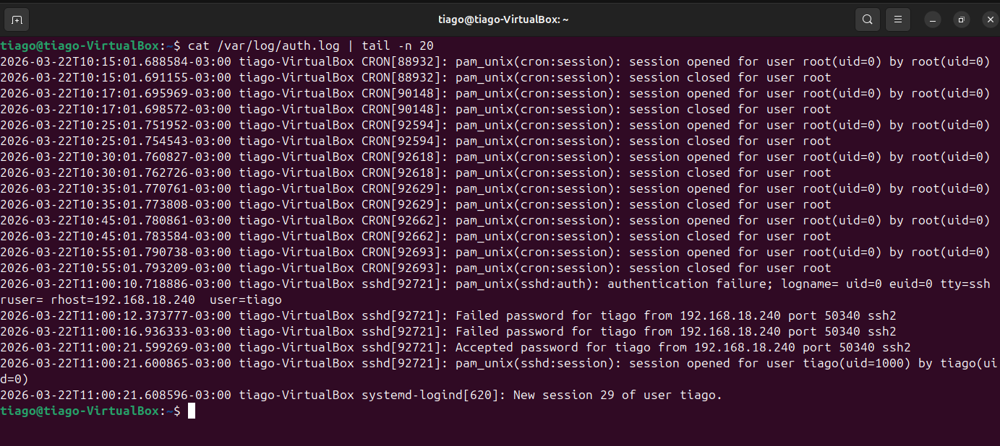
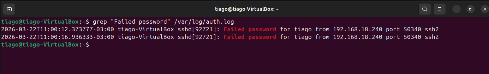
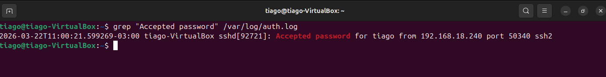
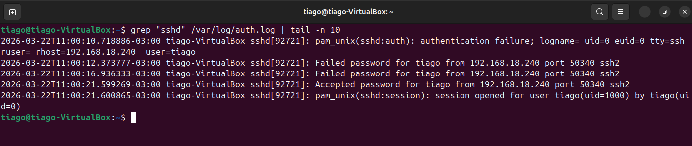
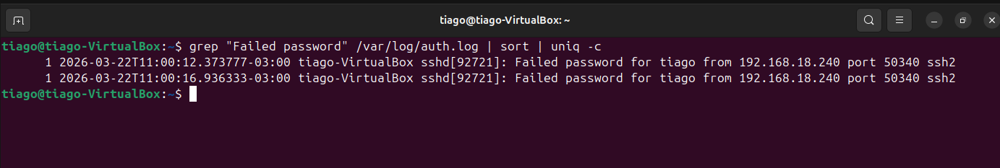
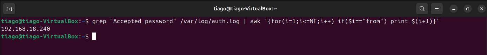

# 🔐 Lab 01 — Log Analysis Base (SSH Authentication)

## 🎯 Objective
### Analyze authentication logs to identify failed login attempts and detect a successful brute force attack.

---

## 🖥️ Lab Environment
- OS: Ubuntu (target)
- Log file: `/var/log/auth.log`
- Access method: SSH

---

## 🔍 Investigation

### 1. Viewing recent authentication logs
```
cat /var/log/auth.log | tail -n 20
```
### Breakdown
- **cat** → reads the file
- **/var/log/auth.log** → authentication log
- **|** → pipes output
- **tail** → shows end of file
- **-n 20** → last 20 lines

👉 Shows the most recent authentication events



---

## 2. Detecting failed login attempts

```
grep "Failed password" /var/log/auth.log
```
### Breakdown
- **grep** → searches text
- **"Failed password"** → failed login attempts
- **/var/log/auth.log** → log file

👉 Displays failed SSH logins



---

## 3. Detecting successful logins

```
grep "Accepted password" /var/log/auth.log
```
### Breakdown
- **grep** → filters text
- **"Accepted password"** → successful logins
- **/var/log/auth.log** → log file

👉 Shows successful authentication events



---

## 4. Reviewing SSH activity

```
grep "sshd" /var/log/auth.log | tail -n 10
```
### Breakdown
- **grep** "sshd" → SSH-related events
- **|** → pipeline
- **tail -n 10** → last 10 lines

👉 Displays recent SSH activity


---

## 5. Identifying repeated failed attempts
```
grep "Failed password" /var/log/auth.log | sort | uniq -c
```

## Breakdown
- **grep** → filters failed attempts
- **|** → pipeline
- **sort** → groups identical lines
- **uniq** → removes duplicates
- **-c** → counts occurrences

👉 Counts repeated failed login attempts



---

## 6. Extracting failed attempts by IP
```
grep "Failed password" /var/log/auth.log | awk '{for(i=1;i<=NF;i++) if($i=="from") print $(i+1)}' | sort | uniq -c
```
## Breakdown
- **grep** → filters failed logins
- **|** → pipeline
- **awk '{ ... }'** → processes each line
- **for(i=1;i<=NF;i++)** → loops through all fields
- **NF** → total number of fields
- **if($i=="from")** → finds keyword "from"
- **print $(i+1)** → prints next field → IP address
- **sort** → organizes IPs
- **uniq -c** → counts occurrences

👉 Counts failed attempts per IP (reliable method)



---

## 7. Extracting successful login IP
```
grep "Accepted password" /var/log/auth.log | awk '{for(i=1;i<=NF;i++) if($i=="from") print $(i+1)}'
```
## Breakdown
- **grep "Accepted password"** → filters successful login events
- **/var/log/auth.log** → authentication log file
- **|** → sends output to the next command
- **awk '{ ... }'** → processes each line
- **for(i=1;i<=NF;i++)** → loops through all fields
- **i=1** → starts from the first field
- **i<=NF** → goes until the last field
- **NF** → total number of fields in the line
- **if($i=="from")** → finds the keyword "from"
- **print $(i+1)** → prints the next field → IP address

👉 Result: IP that successfully logged in



---

## 🧠 Analysis
- Multiple failed login attempts detected from 192.168.18.240
- Followed by a successful login from the same IP
- Pattern indicates a brute force attack with successful authentication

---

## 🚨 Incident Classification

- Brute Force Successful Attack

---

## 🛡️ Mitigation
- Block attacker IP (Fail2ban / firewall)
- Reset compromised credentials
- Review user activity post-login
- Apply SSH hardening (disable password authentication, use SSH keys)

---

## 🎯 Skills Developed
- Log analysis (auth.log)
- SSH attack detection
- Event correlation
- Command-line investigation (grep, awk, sort, uniq)
- Incident classification (SOC mindset)


