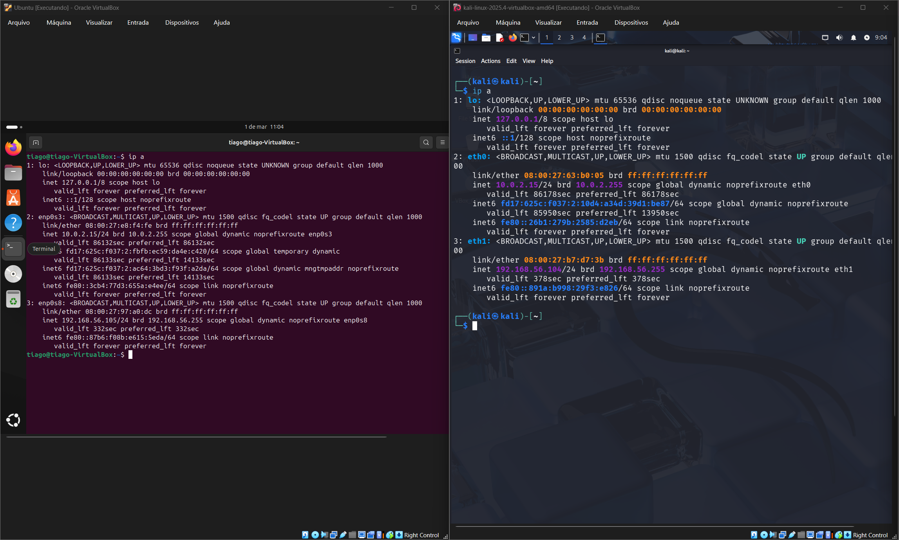
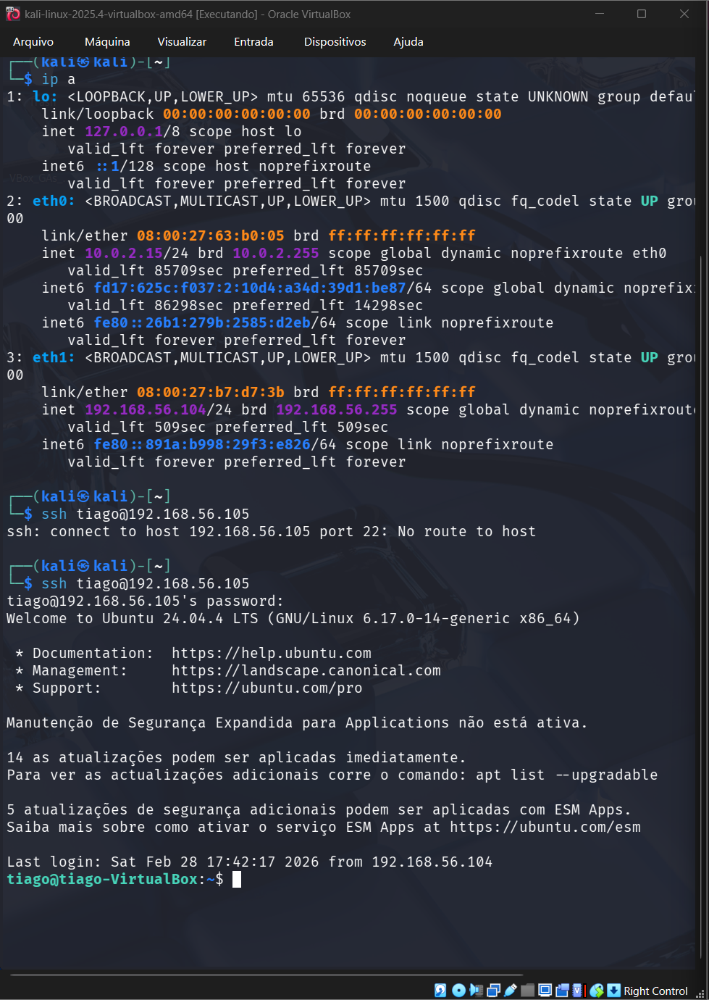
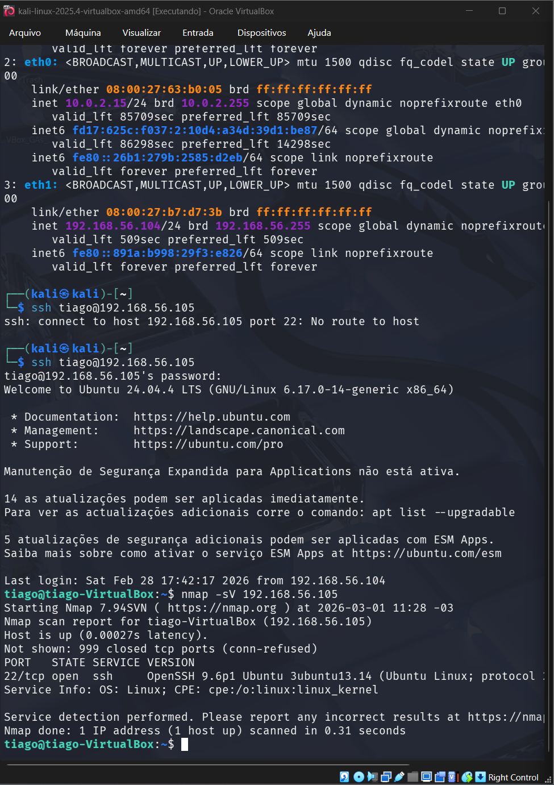
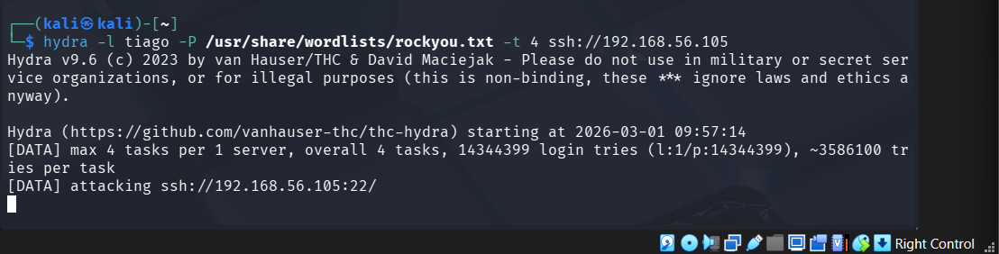
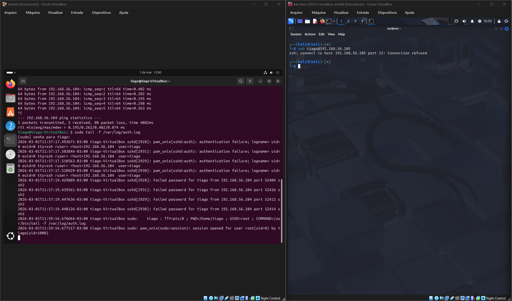
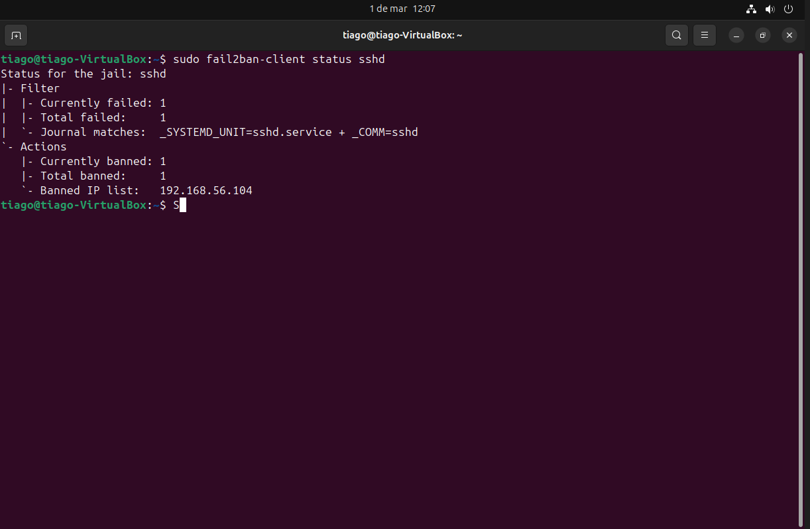

# SOC Lab — SSH Brute Force Detection

## Objetivo
Simular um ataque brute force via SSH, analisar logs de autenticação e aplicar mitigação utilizando Fail2ban.

---

## 1. Identificação das máquinas

Foi verificado o endereço IP das duas VMs para garantir comunicação na mesma rede interna.

### Comandos utilizados

```bash
ip a
```

- Kali Linux (atacante): 192.168.56.104
- Ubuntu Server (alvo): 192.168.56.105




---

## 2. Conexão SSH

A máquina Kali realizou conexão SSH com o servidor Ubuntu, validando o serviço ativo na porta 22.


### Comando utilizado
```bash
ssh tiago@192.168.56.105
```
Resultado: acesso remoto realizado com sucesso.


---

## 3. Scan de portas com Nmap

Foi realizado scan para identificar serviços expostos. A porta 22 (SSH) foi encontrada aberta.

### Comando utilizado
```bash
nmap -sV 192.168.56.105
```
Resultado: 
Porta 22/tcp aberta
Serviço identificado: OpenSSH


---

## 4. Ataque Brute Force com Hydra

Foi executado ataque de força bruta contra o serviço SSH utilizando a wordlist rockyou.txt.

### Preparação da wordlist (Kali)
```bash
sudo gzip -d /usr/share/wordlists/rockyou.txt.gz
```
### Comando do ataque:
```
hydra -l tiago -P /usr/share/wordlists/rockyou.txt -t 4 ssh://192.168.56.105
```
O Hydra iniciou múltiplas tentativas de autenticação contra o serviço SSH.




---

## 5. Análise de logs SSH

Os logs do sistema registraram múltiplas tentativas de autenticação falha originadas da máquina atacante.

### Comando utilizado
```bash
sudo tail -f /var/log/auth.log
```
Eventos observados:
Failed password
múltiplas tentativas do IP atacante 192.168.56.104



---

## 6. Mitigação com Fail2ban

O Fail2ban foi configurado para detectar tentativas repetidas e bloquear automaticamente o IP atacante.

### Verificação do status
```bash
sudo fail2ban-client status sshd
```
Resultado:
IP atacante bloqueado automaticamente.


---

## 7. Timeline do incidente

Sequência cronológica das ações observadas durante o laboratório:

1. Serviço SSH identificado como aberto através do Nmap.
2. Conexão SSH legítima validada a partir da máquina Kali.
3. Ataque brute force iniciado utilizando Hydra.
4. Múltiplas falhas de autenticação registradas em `/var/log/auth.log`.
5. Fail2ban identificou comportamento compatível com ataque brute force.
6. Endereço IP atacante (192.168.56.104) bloqueado automaticamente.

---

## 8. Conclusão

O laboratório demonstrou o ciclo completo de resposta a incidentes em ambiente SOC:

- Identificação de serviço exposto
- Simulação de ataque realista
- Detecção através de análise de logs
- Resposta automática defensiva utilizando Fail2ban
