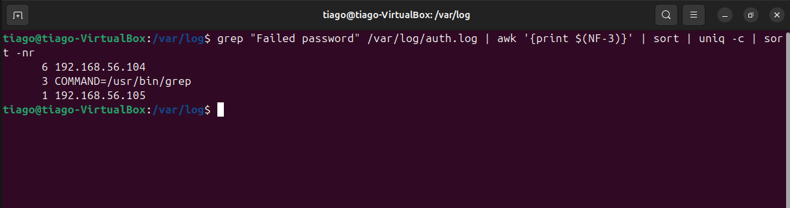
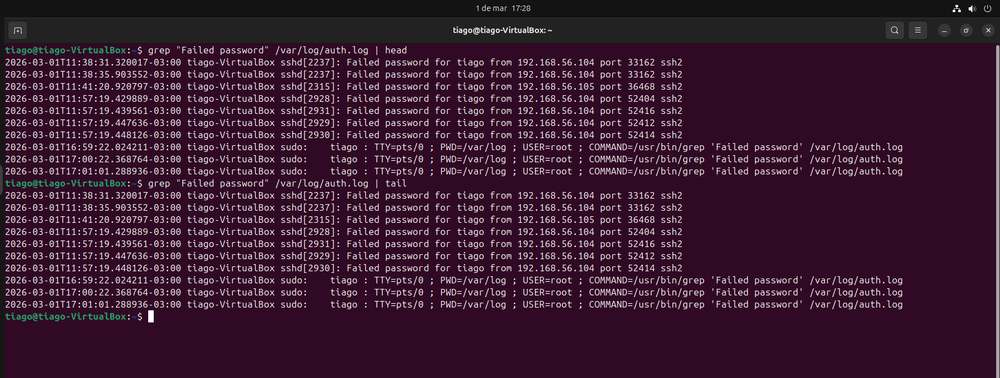
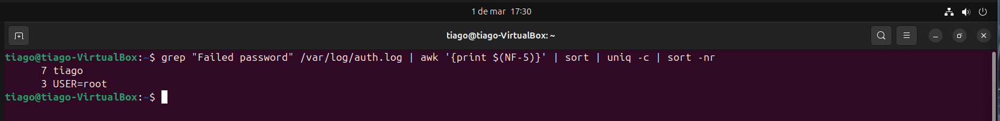
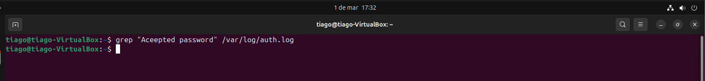

# Log Analysis — Investigation
**Tipo de incidente:** SSH Brute Force Attempt  
**Nível:** SOC Tier 1 Investigation

---
## Objetivo
Realizar uma investigação mais aprofundada do ataque de força bruta SSH identificado durante a análise inicial dos logs.

---

## Cenário
Foi realizada uma simulação de ataque brute force utilizando uma máquina Kali Linux contra um servidor Ubuntu com serviço SSH ativo.

O objetivo foi identificar o comportamento do atacante, o usuário alvo e o resultado final do ataque através da análise dos logs do sistema.

---

## Fonte dos Logs
```/var/log/auth.log```

Sistema analisado: Ubuntu Server 22.04 (ambiente virtualizado em VirtualBox).

Arquivo responsável por registrar eventos de autenticação do sistema Linux, incluindo tentativas de login SSH.

---

## Etapas da Investigação

### 1. Identificação do IP atacante

Comando utilizado:

```bash
grep "Failed password" /var/log/auth.log | awk '{print $(NF-3)}' | sort | uniq -c | sort -nr
````

Evidência:



Análise: Foi identificado um endereço IP responsável pela maior quantidade de tentativas de autenticação falhadas, indicando atividade automatizada típica de ataque brute force.

---

2. Timeline do ataque

Comandos utilizados:
```bash
grep "Failed password" /var/log/auth.log | head
```
```bash
grep "Failed password" /var/log/auth.log | tail
```
Evidência:



Análise: Os registros demonstram múltiplas tentativas consecutivas em curto intervalo de tempo, caracterizando comportamento contínuo de ataque.


---
3. Usuário alvo

Comando utilizado:
```bash
grep "Failed password" /var/log/auth.log | awk '{print $(NF-5)}' | sort | uniq -c | sort -nr
```
Evidência:



Análise: O atacante concentrou as tentativas em um usuário específico do sistema, indicando tentativa direcionada de acesso.

---

4. Resultado do ataque

Comando utilizado:
```bash
grep "Accepted password" /var/log/auth.log
```
Evidência:



Análise: Nenhum login bem-sucedido foi identificado, indicando que o ataque não comprometeu o sistema.

---

## Conclusão

A investigação confirmou a ocorrência de um ataque de força bruta SSH originado de um único endereço IP.

Foram registradas múltiplas tentativas de autenticação falhadas direcionadas a um usuário específico, porém sem sucesso de acesso.

O sistema permaneceu seguro durante todo o incidente.

---


