# SSH Brute Force Detection and Mitigation with Fail2Ban

## Cenário

Este laboratório simula um ataque de **brute force contra o serviço SSH** e demonstra como detectar o ataque através da análise de logs e como mitigá-lo automaticamente utilizando **Fail2Ban**.

O fluxo do laboratório segue o modelo utilizado em operações de **Security Operations Center (SOC)**:

Reconhecimento → Ataque → Detecção → Resposta

---

# Preparação do ambiente

## Criação das máquinas virtuais

Foram criadas duas máquinas virtuais no VirtualBox:

- Kali Linux (máquina atacante)
- Ubuntu Server (máquina alvo)

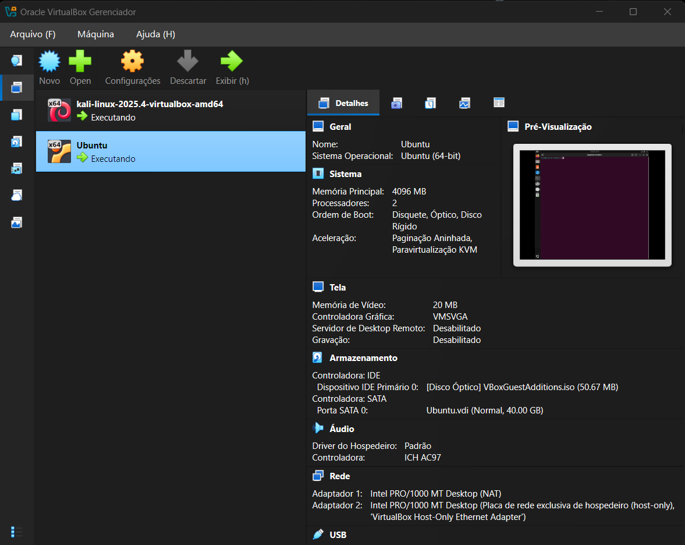

---

# Ambiente

Atacante: Kali Linux  
Servidor: Ubuntu Server  
Serviço atacado: SSH

---

# Ferramentas utilizadas

- Nmap
- Dirb
- Hydra
- Fail2Ban
- UFW
- Apache

---

# Passo a passo do laboratório

---

## 1 - Identificando o IP do servidor

No Ubuntu utilizamos o comando:
```bash
ip a
```

Esse comando permite identificar o endereço IP da máquina alvo.

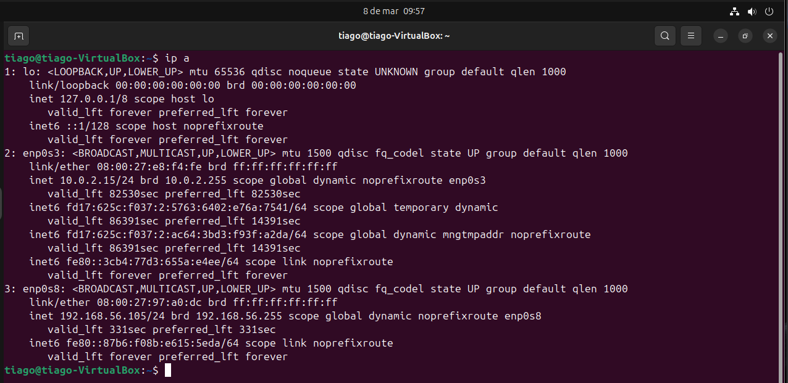

---

## 2 - Identificando o IP da máquina atacante

Também verificamos o IP da máquina Kali.

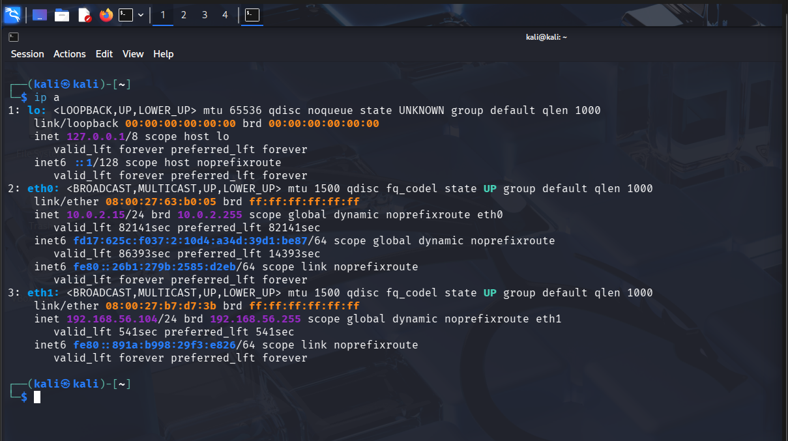

---

## 3 - Testando conectividade entre as máquinas

No Kali realizamos um teste de conectividade para verificar se as máquinas conseguem se comunicar.
```bash
ping 192.168.56.105
```

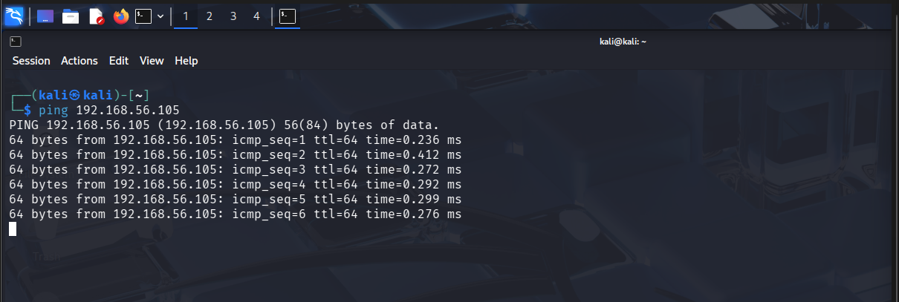

---

## 4 - Reconhecimento com Nmap

Foi realizado um scan para identificar portas abertas e serviços ativos no servidor.
```bash
nmap -sS -sV 192.168.56.105
```

O scan identificou o serviço **SSH ativo na porta 22**.

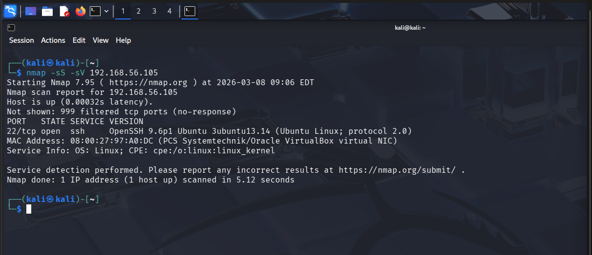

---

## 5 - Instalação e verificação do servidor web

No Ubuntu foi instalado o Apache para simular um servidor web.
```bash
sudo apt install apache2
```

Depois verificamos se o serviço está ativo.

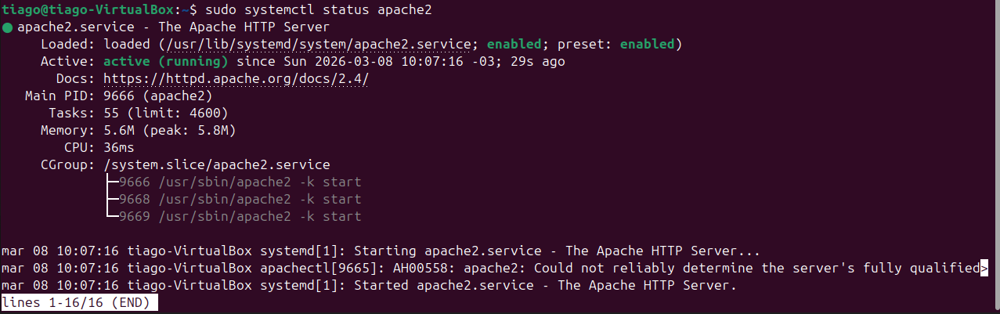

---

## 6 - Teste de acesso ao servidor web

Após iniciar o Apache, verificamos o acesso pelo navegador.

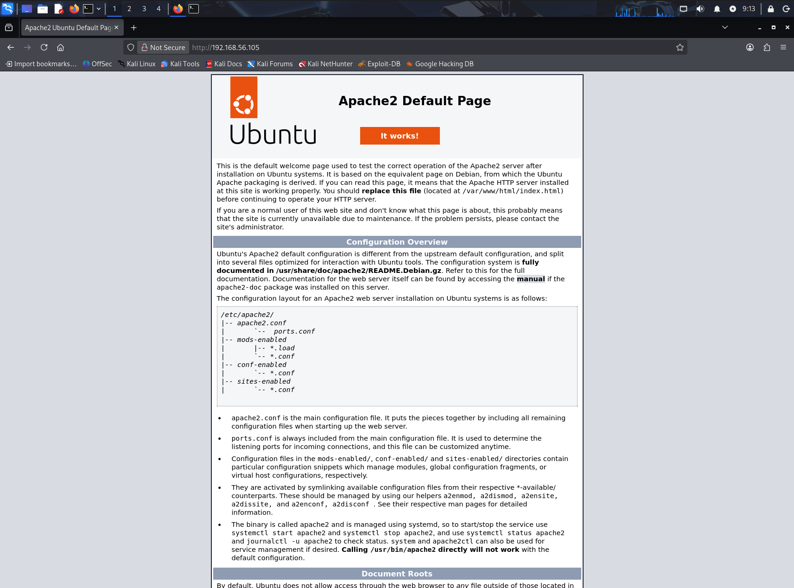

---

## 7 - Enumeração Web

No Kali utilizamos o Dirb para descobrir diretórios no servidor web.
```bash
dirb http://192.168.56.105
```

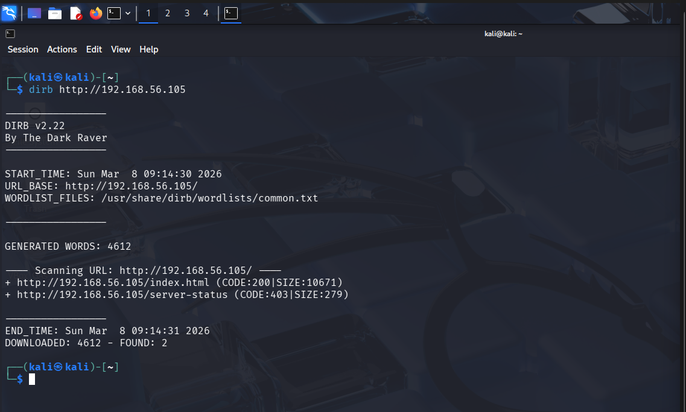

---

## 8 - Teste de acesso SSH

Antes do ataque confirmamos que o serviço SSH está acessível.
```bash
ssh tiago@192.168.56.105
```

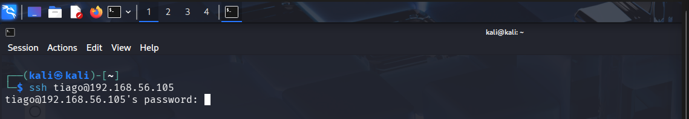

---

## 9 - Preparação da wordlist

Foi utilizada a wordlist **rockyou** para realizar o ataque de brute force.

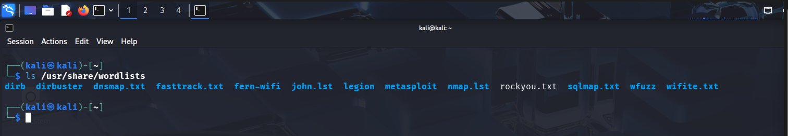

---

## 10 - Ataque brute force com Hydra

Foi realizado um ataque de brute force utilizando Hydra.
```bash
hydra -l tiago -P /usr/share/wordlists/rockyou.txt ssh://192.168.56.105
```

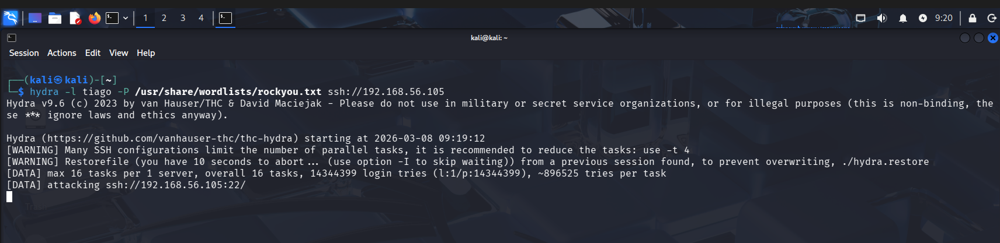

---

## 11 - Detecção através de análise de logs

Exemplo de log detectado:
```bash
Failed password for tiago from 192.168.56.104 port 45570 ssh2
```

Isso indica múltiplas tentativas de autenticação falhadas vindas do mesmo endereço IP.

As tentativas de login falhadas podem ser identificadas no arquivo:
```bash
/var/log/auth.log
```

Monitoramento em tempo real:
```bash
sudo tail -f /var/log/auth.log
```

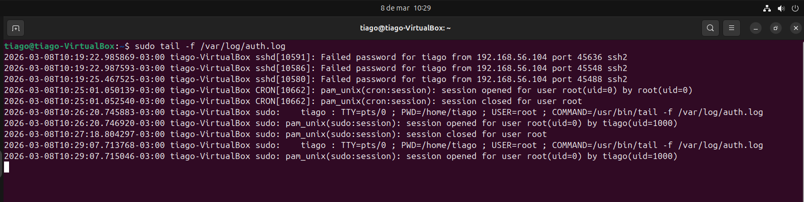

---

## 12 - Configuração do Fail2Ban

O Fail2Ban foi configurado para monitorar tentativas de login falhadas.

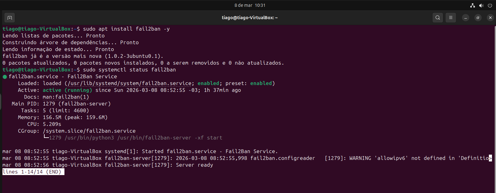

---

## 13 - Criação da jail SSH

Foi criada uma jail específica para proteger o serviço SSH.

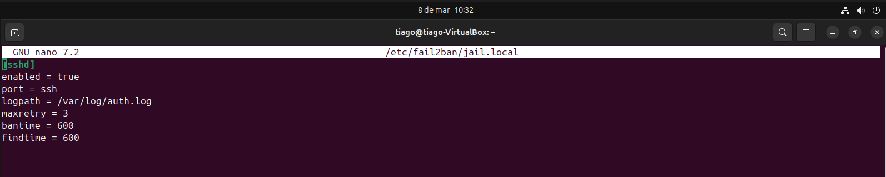

---

## 14 - Jail SSH ativa

Após a configuração, verificamos que a jail está ativa.

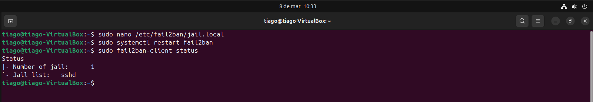

---

## 15 - Mitigação automática

Após múltiplas tentativas de ataque, o Fail2Ban bloqueou automaticamente o IP do atacante.

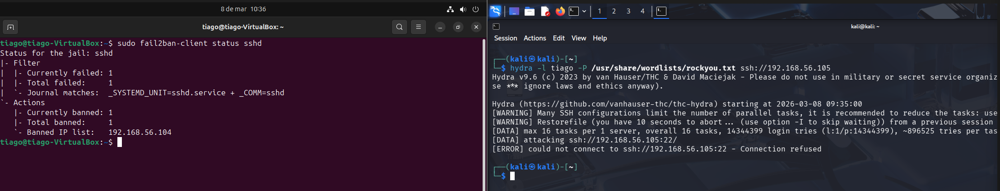

---

# Impacto do ataque

Ataques de brute force podem permitir acesso não autorizado a servidores expostos na internet.

Caso bem-sucedido, o atacante pode:

- obter acesso remoto ao sistema
- escalar privilégios
- instalar malware ou backdoors
- comprometer dados sensíveis

---

# Conclusão

Este laboratório demonstra um fluxo completo de análise de segurança utilizado em ambientes **SOC N1**:

- Reconhecimento de serviços expostos
- Simulação de ataque brute force
- Análise de logs de autenticação
- Detecção de comportamento malicioso
- Resposta automática utilizando Fail2Ban


