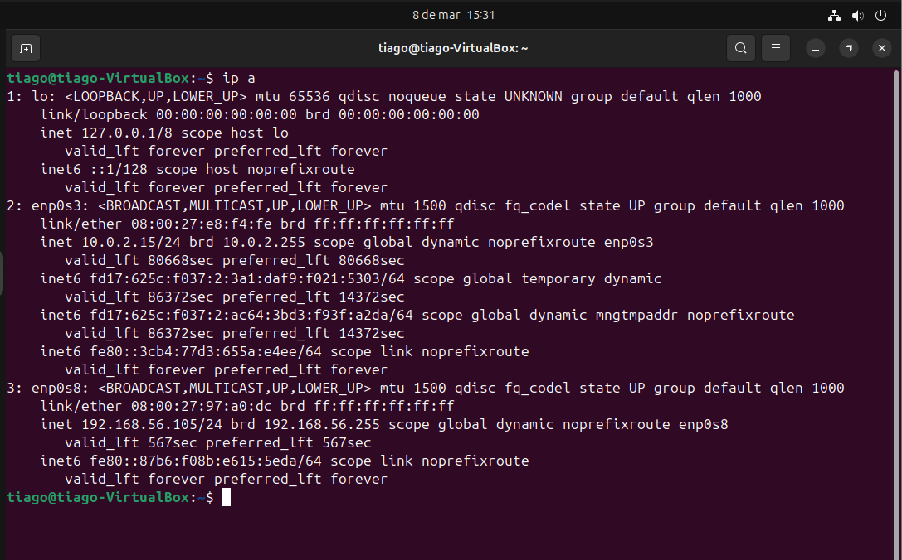
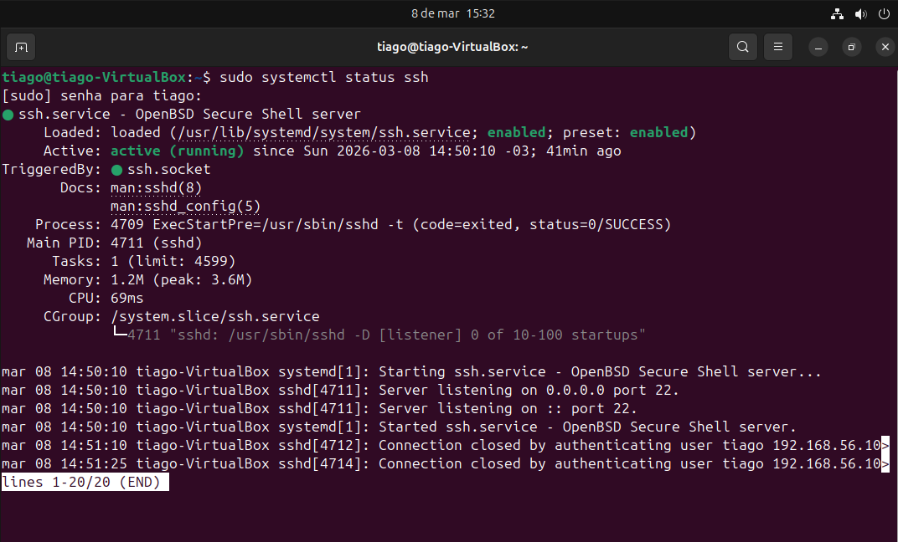
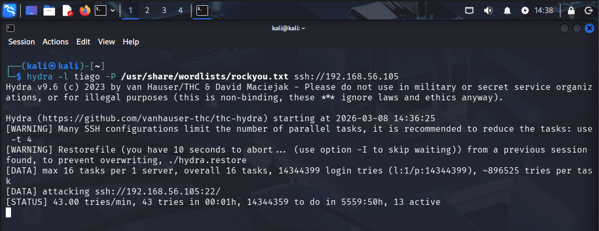
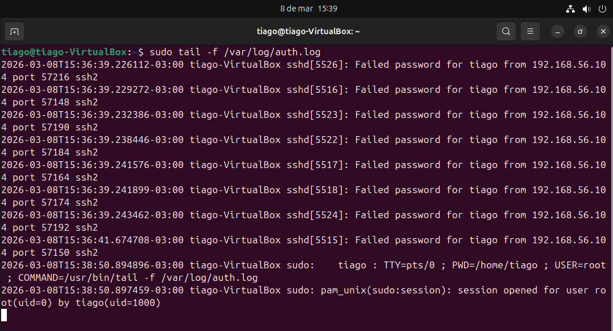
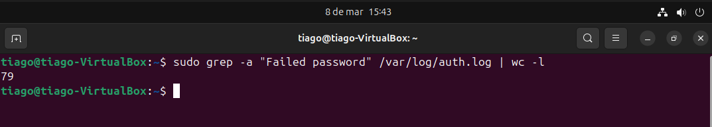
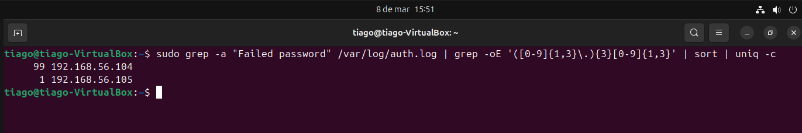
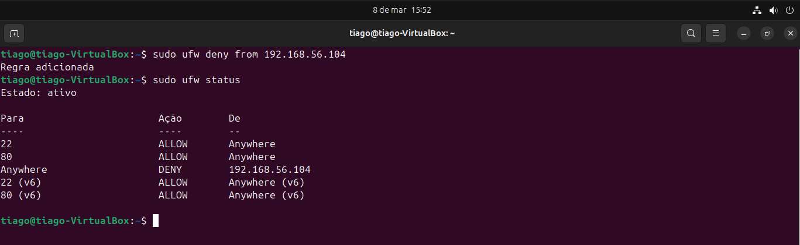

# Lab 06 — SSH Brute Force Incident Investigation

## Scenario

A SOC alert indicates possible brute force activity against an SSH service.

The objective is to investigate authentication logs and identify the attacker.

---

## Target Identification

Ubuntu server IP:

```
192.168.56.105
```



---

## Verify SSH Service

```
sudo systemctl status ssh
```



---

## Attack Simulation (Hydra Brute Force)

Brute force attack executed from Kali Linux using Hydra.

```
hydra -l tiago -P /usr/share/wordlists/rockyou.txt ssh://192.168.56.105
```



---

## Log Investigation

Monitoring SSH authentication logs.

```
sudo tail -f /var/log/auth.log
```

Detected multiple failed authentication attempts.



---

## Count Failed Attempts

```
sudo grep -a "Failed password" /var/log/auth.log | wc -l
```

Result:

```
79 failed login attempts detected
```



---

## Identify Attacker IP

```
sudo grep -a "Failed password" /var/log/auth.log | grep -oE '([0-9]{1,3}\.){3}[0-9]{1,3}' | sort | uniq -c
```

Result:

```
99 192.168.56.104
```



---

## Mitigation

Blocking attacker IP using UFW.

```
sudo ufw deny from 192.168.56.104
```



---

## Incident Summary

Type: SSH Brute Force Attack  
Target user: tiago  
Attacker IP: 192.168.56.104  
Attempts detected: 99  
Log source: /var/log/auth.log

---

## Conclusion

The incident was investigated through authentication log analysis and mitigated by blocking the attacker IP using the firewall.

