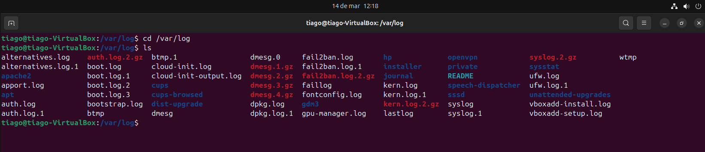

# Suspicious Privilege Escalation Investigation

## Objective
Investigate potential privilege escalation activity on a Linux system by analyzing authentication logs.

## Environment
- Ubuntu (target machine)
- Kali Linux (analyst machine)
- VirtualBox

## Log File Investigated
```bash
/var/log/auth.log
```

## Investigation Steps
### 1. Access log directory

Command:
```bash
cd /var/log
ls
```


---
## 2. Review authentication logs

Command:
```bash
cat auth.log
```


---
## 3. Identify root sessions

Command:
```bash
grep root auth.log
```

---
## 4. Check failed authentication attempts

Command:
```bash
grep "failed" auth.log
```


---
## 5. Investigate sudo command history

Command:
```bash
zgrep sudo auth.log.2.gz
```

---
## 6. Review login history

Command:
```bash
last
```

---
# Findings

- Root sessions were identified in the authentication logs.

- Sudo commands executed by user tiago were recorded.

- No failed authentication attempts were detected.

- Login history confirmed normal system usage.

---

# Conclusion

## The investigation identified legitimate administrative activity using sudo and scheduled cron jobs running as root, with no evidence of unauthorized privilege escalation.


