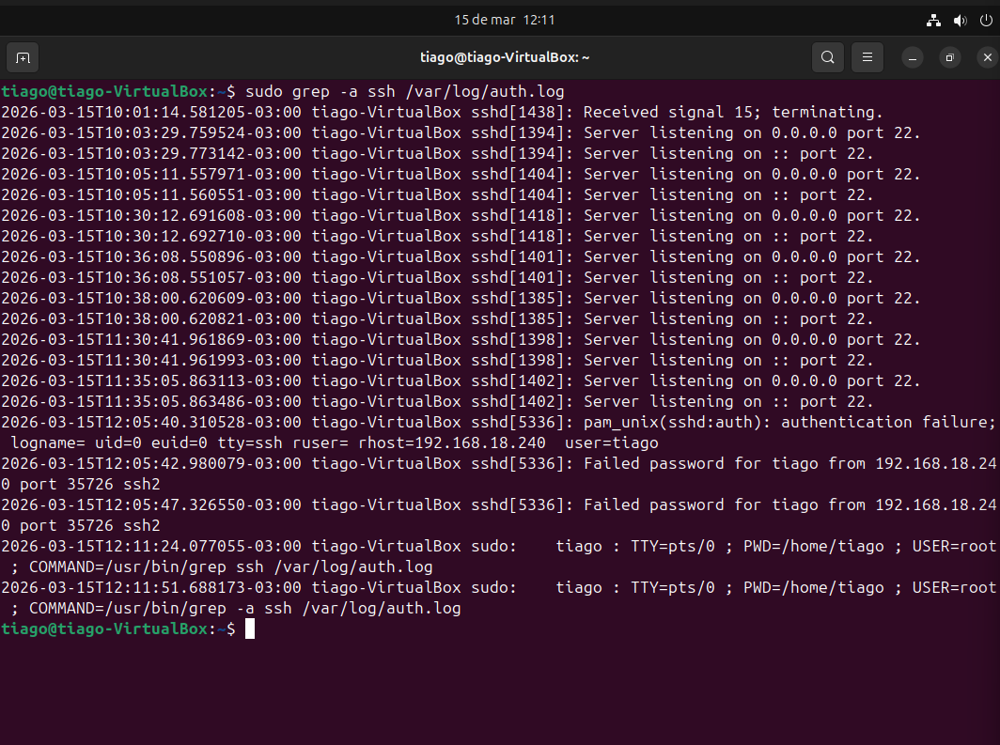
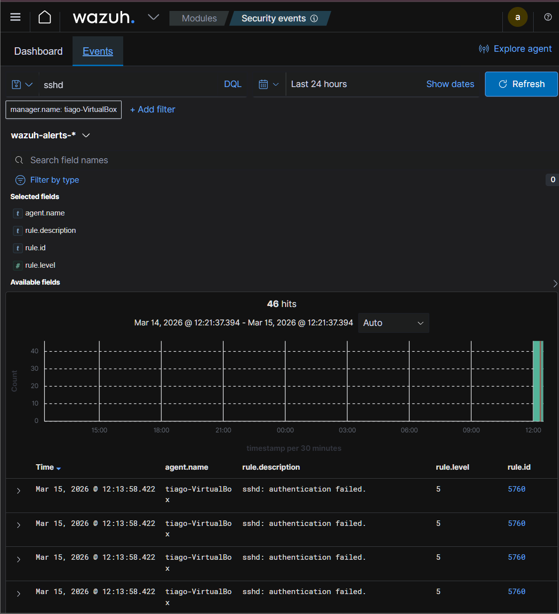
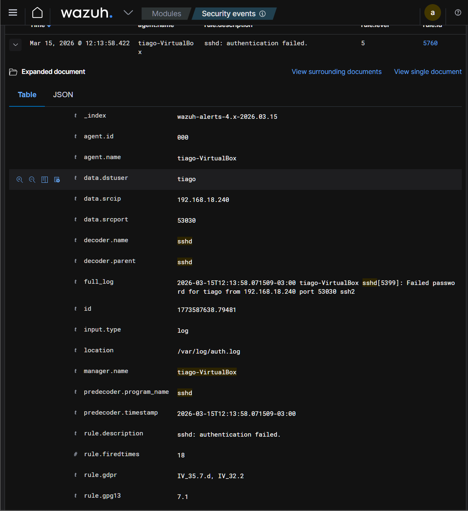
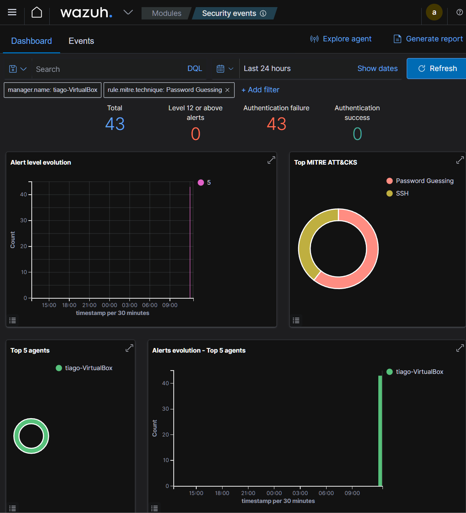
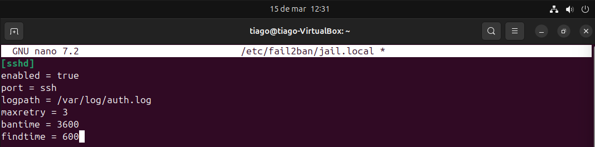
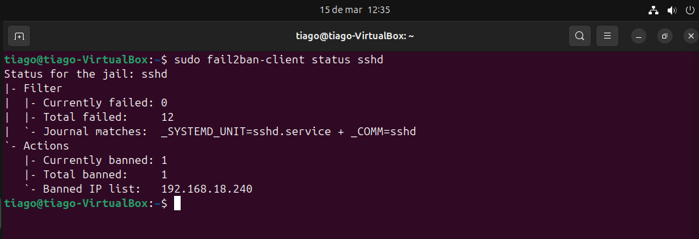

# SOC Lab — SSH Brute Force Detection with Wazuh SIEM + Fail2ban

## Overview

### This lab demonstrates the complete security monitoring cycle used in a SOC environment:

- Attack simulation

- Log generation

- SIEM detection

- MITRE ATT&CK classification

- Automated incident response

### The environment simulates a real brute force attack against an SSH service, detected by Wazuh SIEM and automatically mitigated using Fail2ban.

---

## Lab Architecture

Attacker: Kali Linux
Target: Ubuntu Server
SIEM: Wazuh Server

Attack Tool: Hydra
Defense Tool: Fail2ban

Kali (Attacker)
        │
        │ SSH Brute Force (Hydra)
        ▼
Ubuntu Server (Target)
        │
        │ Authentication logs
        ▼
/var/log/auth.log
        │
        ▼
Wazuh Agent
        │
        ▼
Wazuh SIEM
        │
        ▼
Alert + MITRE Classification
        │
        ▼
Fail2ban blocks attacker IP

---

## Attack Simulation

The attack was performed using Hydra, attempting a brute force login against the SSH service.
```bash
hydra -l tiago -P /usr/share/wordlists/rockyou.txt ssh://192.168.18.239
```
This generated multiple authentication failures in the system logs.

## Log Evidence

Ubuntu system logs captured the attack attempts:



### Example log entry:
```bash
Failed password for tiago from 192.168.18.240 port 53030 ssh2
```
---

## Detection in Wazuh SIEM

Wazuh detected the authentication failures and generated security alerts.



Alert details:

- Rule ID: 5760

- Service: sshd

- Log source: /var/log/auth.log



---

## MITRE ATT&CK Classification

The attack was mapped to the MITRE ATT&CK framework.

Technique:

T1110 — Brute Force



---

## Automated Response with Fail2ban

Fail2ban was configured to block IP addresses after 3 failed login attempts.

Configuration:
```bash
[sshd]
enabled = true
maxretry = 3
bantime = 3600
findtime = 600
```


---

## Attack Mitigation

After detecting multiple failed logins, Fail2ban automatically blocked the attacker IP.



Blocked IP:
```bash
192.168.18.240
```

---

## Security Monitoring Capabilities Demonstrated

✔ SSH brute force detection
✔ Log analysis
✔ SIEM alert investigation
✔ MITRE ATT&CK mapping
✔ Automated incident response
✔ Threat monitoring workflow

---

## Technologies Used

- Wazuh SIEM

- Ubuntu Server

- Kali Linux

- Hydra

- Fail2ban

- SSH

- MITRE ATT&CK Framework

---

## Skills Demonstrated

Security Monitoring
Log Analysis
Threat Detection
Incident Response
SIEM Investigation
Linux Security Hardening

---

## Author

### Tiago
Cybersecurity Student | SOC / Blue Team Focus


