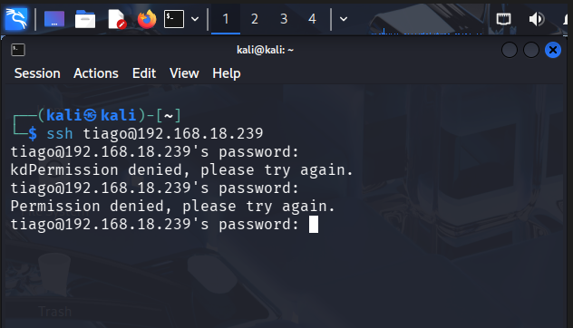
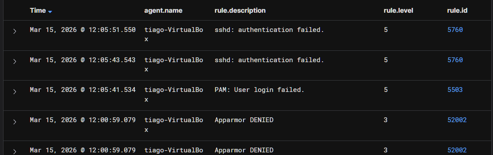
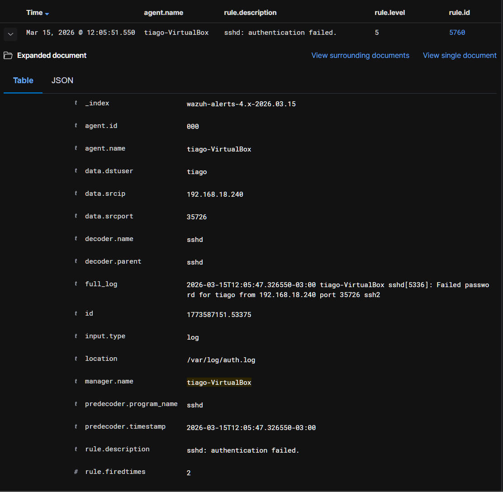
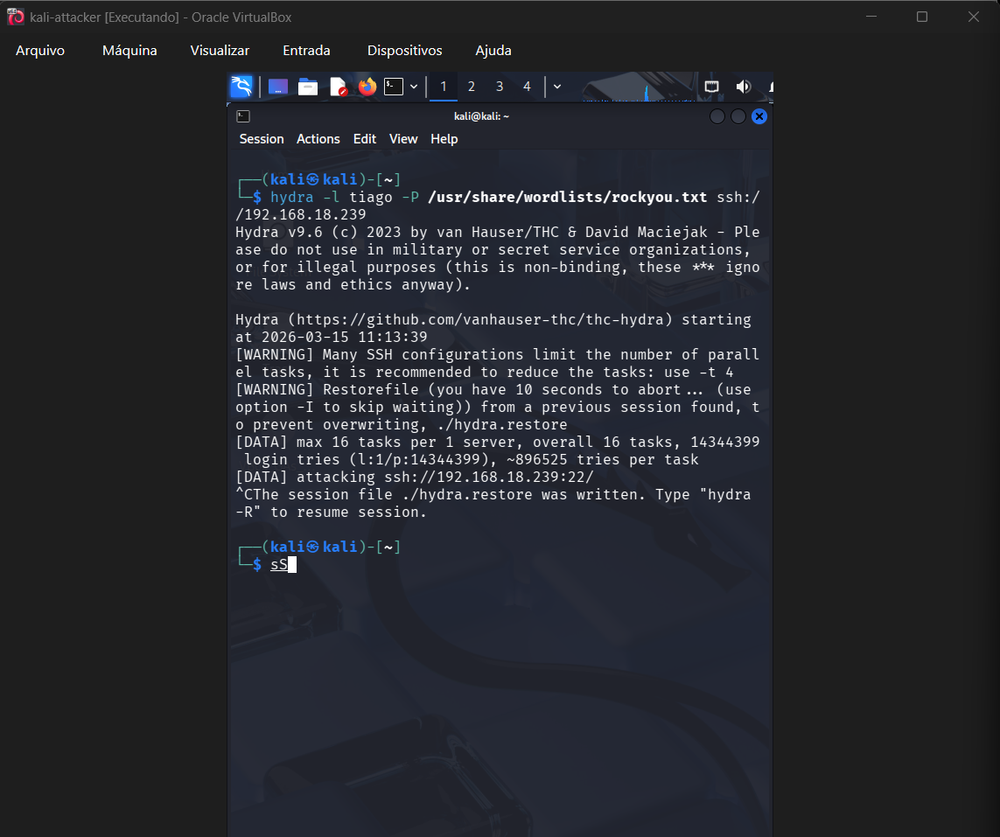
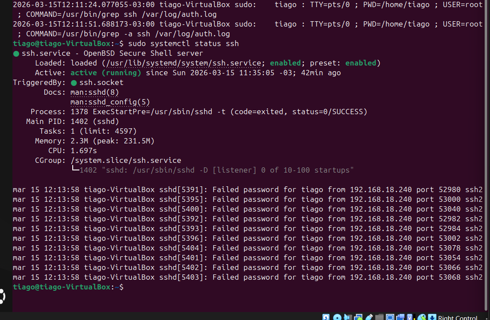
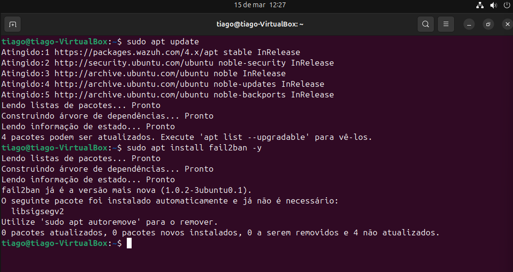
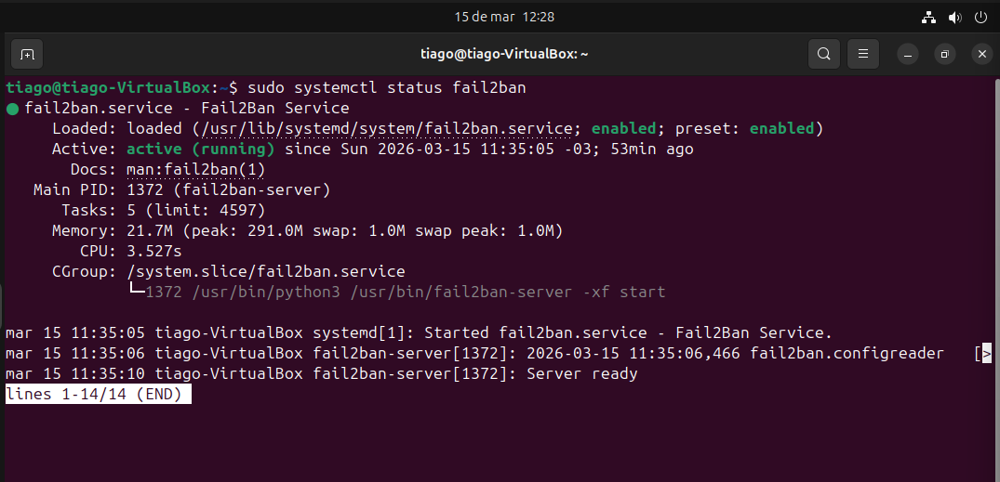
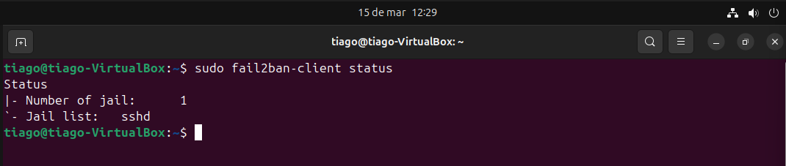
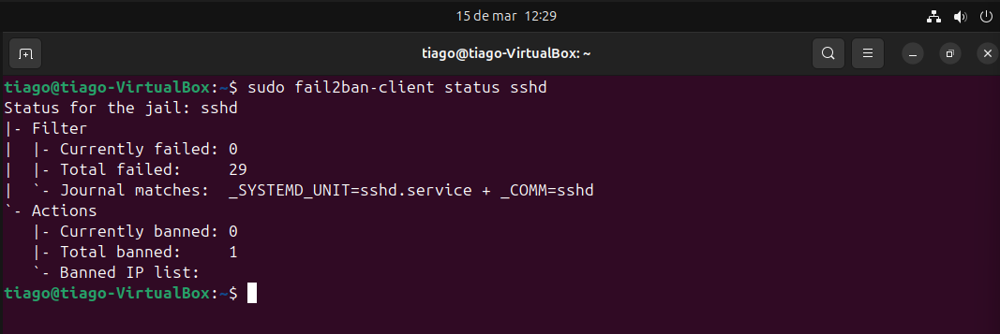
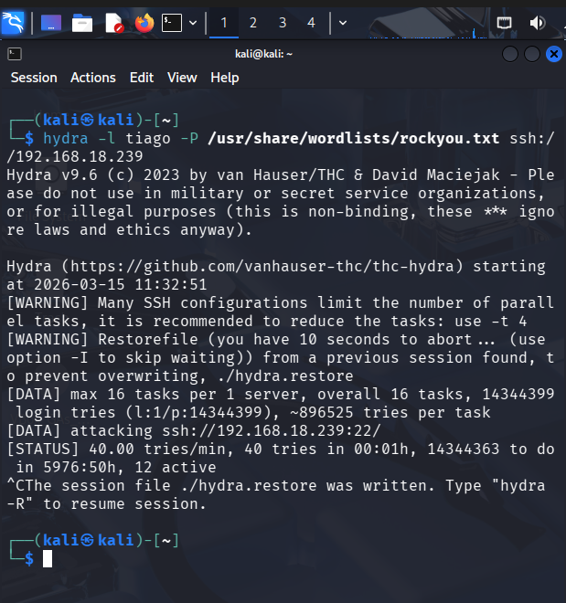

# 🚨 Detecção de Brute Force SSH com Wazuh + Resposta com Fail2ban

---

## 🎯 Cenário

Um servidor Linux foi alvo de tentativas de acesso não autorizado via SSH. O objetivo foi detectar o ataque utilizando Wazuh (SIEM) e implementar resposta automática com Fail2ban.

---

## 📊 Análise de Logs — Tentativas de Login

Foram identificadas falhas de autenticação no SSH:

Logs locais confirmam tentativas inválidas:

---

## 📡 Detecção no SIEM (Wazuh)

O Wazuh detectou eventos de autenticação falhada:

Detalhes do evento:

Múltiplos eventos correlacionados:

Alerta gerado:

Classificação MITRE no Wazuh:

---

## ⚔️ Simulação de Ataque

Foi executado brute force com Hydra:

Logs confirmam volume elevado de tentativas:

---

## 🧠 Análise SOC

O comportamento identificado caracteriza ataque de força bruta contra o serviço SSH.

Evidências:

- Múltiplas falhas consecutivas de login  
- Detecção correlacionada no SIEM (Wazuh)  
- Origem consistente (mesmo IP)  
- Padrão automatizado (Hydra)  

Correlação:

- auth.log (host)  
- alertas Wazuh (SIEM)  
- atividade do atacante (Kali)  

Impacto:

- Risco de comprometimento do sistema  
- Possibilidade de acesso não autorizado  

Objetivo do atacante:

- Descobrir credenciais válidas  
- Obter acesso inicial ao sistema  

Conclusão:

Atividade maliciosa confirmada.

---

## 🚨 Classificação

Malicioso — tentativa de brute force detectada.

---

## 🛡️ Resposta com Fail2ban

Instalação:

Serviço ativo:

Jail SSH configurada:

Bloqueio após múltiplas tentativas:

Configuração de limite:

Teste de ataque:

IP bloqueado:

---

## 🧬 MITRE ATT&CK

- T1110 — Brute Force  
- TA0001 — Initial Access  

---

## 🧠 Habilidades Demonstradas

- Análise de logs Linux (auth.log)  
- Monitoramento com SIEM (Wazuh)  
- Detecção de ataque brute force  
- Correlação de eventos  
- Implementação de resposta automática (Fail2ban)  
- Hardening de serviço SSH  

---

## 📌 Conclusão

O laboratório demonstrou a detecção eficaz de um ataque de brute force utilizando SIEM (Wazuh) e a implementação de uma resposta automatizada com Fail2ban.

A integração entre monitoramento e defesa permitiu identificar e bloquear o atacante rapidamente, reduzindo o risco de comprometimento.

---

## 📬 Contato

Aberto a oportunidades em SOC / NOC / Cybersecurity Jr.

- LinkedIn: https://www.linkedin.com/in/tiago-krysiaki  
- Email: t.krysiaki91@gmail.com  
