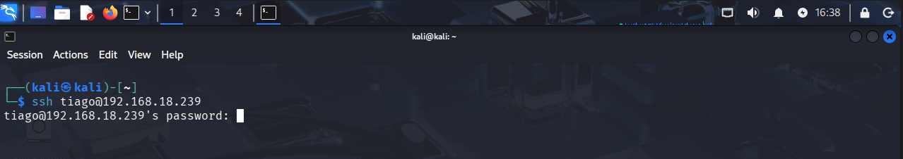
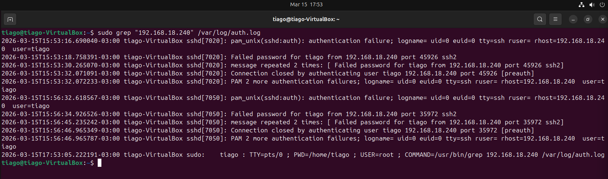
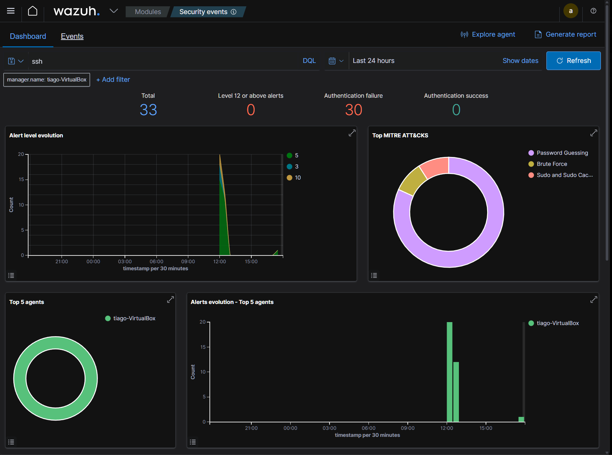
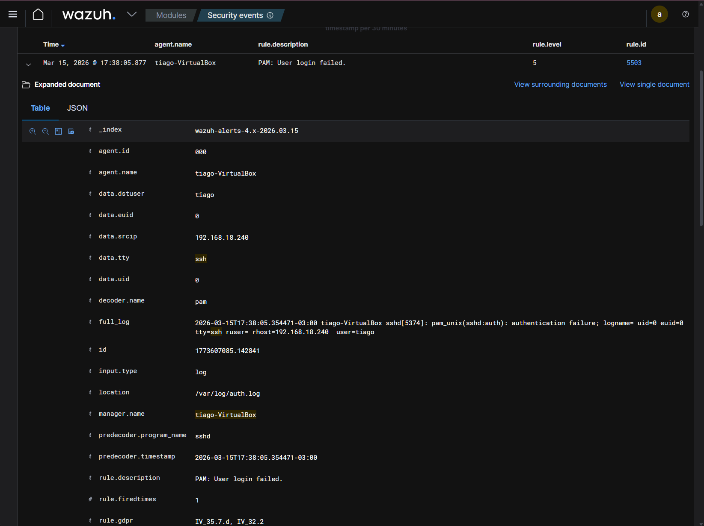
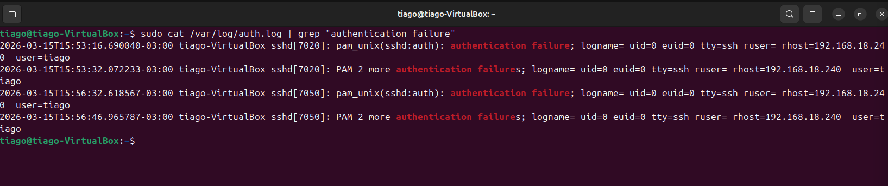
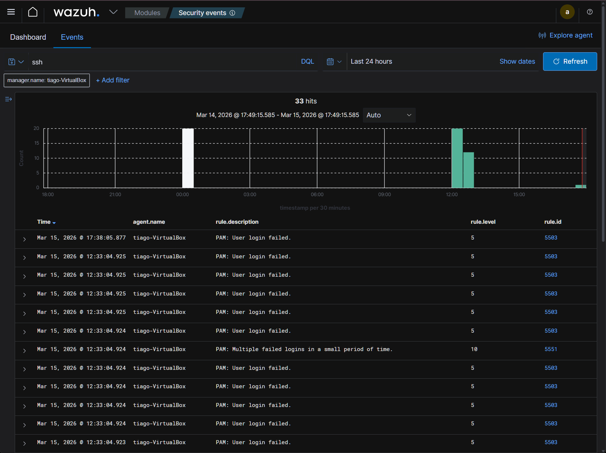

# Suspicious SSH Login Investigation (SOC Lab)

This lab simulates a suspicious SSH login attempt and demonstrates how a SOC analyst investigates authentication failures using Linux logs and Wazuh SIEM.

The goal is to identify the attacker, analyze security events, and reconstruct the attack timeline.

---

# Lab Environment

Kali Linux → Attacker  
Ubuntu Target → Victim machine  
Ubuntu Server → Wazuh SIEM

---

# Attack Simulation

The attacker attempts to access the target machine via SSH.

Command executed from Kali:

ssh tiago@192.168.18.239

---

# Authentication Failures Detected

Linux authentication logs recorded multiple failed login attempts.

Indicators identified:

- Failed password attempts
- Multiple authentication failures
- Connection closed events

---

# Detection in Wazuh SIEM

The Wazuh SIEM detected authentication failures and generated security events.

Security event details:

---

# Investigation Findings

The investigation identified:

Attacker IP: 192.168.18.240  
Target machine: Ubuntu Target  
Target user: tiago  
Service targeted: SSH (port 22)

All authentication attempts failed.

---

# Attack Timeline

| Time | Event |
|-----|------|
| 15:53 | First SSH authentication failure |
| 15:56 | Multiple failed login attempts |
| 15:56 | SSH connection closed |

Evidence collected from:

Linux logs:

Wazuh SIEM:

---

# MITRE ATT&CK Mapping

Technique: **T1110 - Brute Force**

Description:

Attackers attempt to gain access to systems by repeatedly trying different passwords.

Observed behavior:

Multiple SSH login attempts targeting the same user account.

---

# Impact Assessment

Risk level: Low

Reason:

The attacker failed to authenticate and no unauthorized access was obtained.

However, repeated login attempts indicate possible brute force activity.

---

# Mitigation Recommendations

Recommended defensive actions:

- Implement **Fail2ban**
- Restrict SSH access by IP
- Disable password authentication
- Use SSH key authentication
- Enable multi-factor authentication

---

# Skills Demonstrated

Linux log analysis  
SIEM investigation (Wazuh)  
SSH attack detection  
Incident investigation  
Security event correlation
