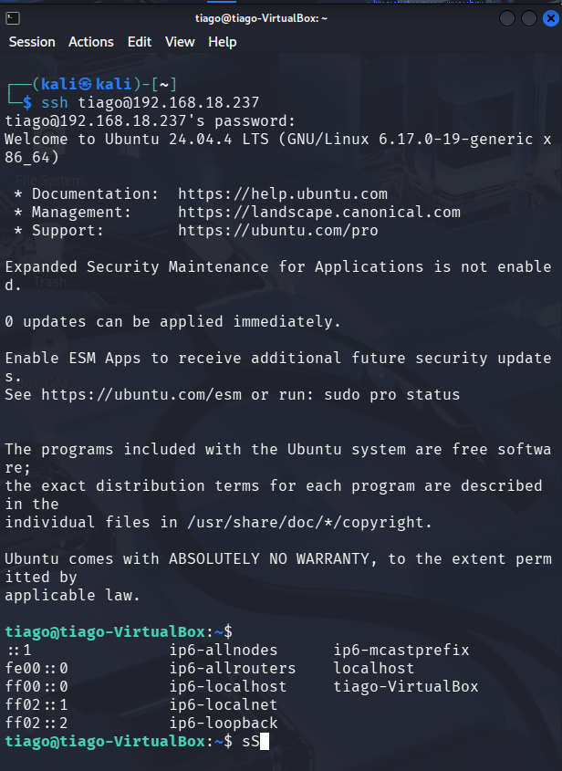
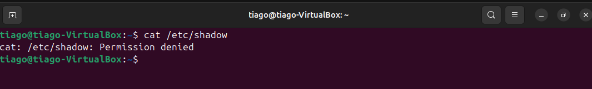
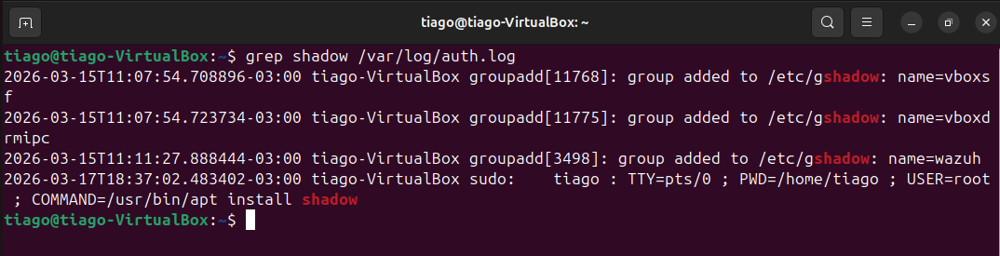
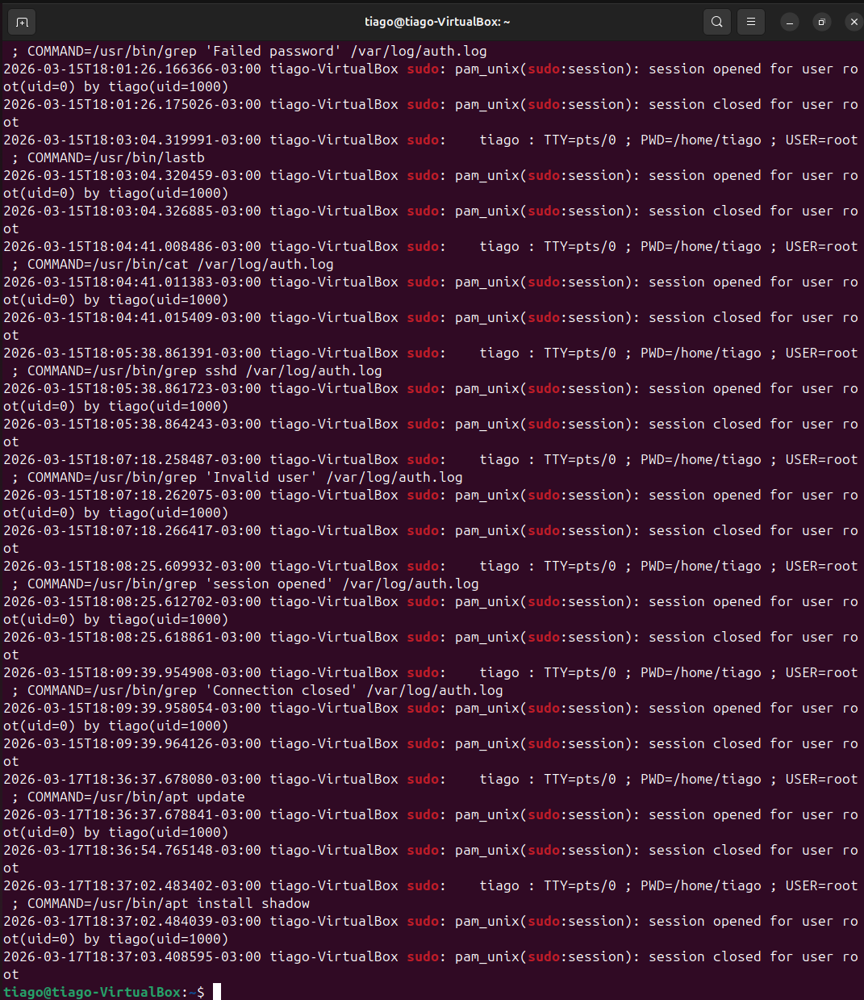
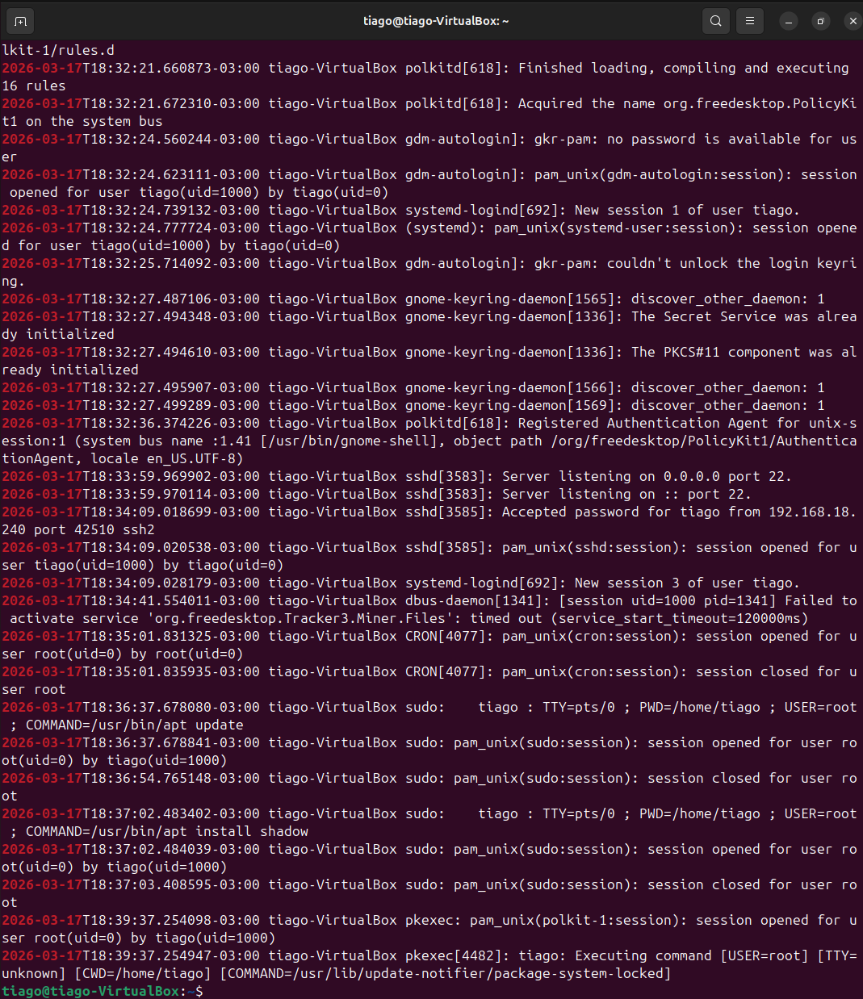

# 🔍 Lab 10 - Unauthorized File Access Investigation

## 🎯 Objective
Detect and investigate unauthorized access attempts to sensitive files in a Linux environment using log analysis.

---

## 🖥️ Lab Environment

- Attacker: Kali Linux
- Target: Ubuntu Server
- Access method: SSH
- Logs analyzed: /var/log/auth.log

---

## ⚔️ Attack Simulation

### SSH access from attacker machine:
```
ssh tiago@192.168.18.237
```
This command establishes an SSH connection from the attacker machine to the target system.

> Analysis:
> SSH access represents an initial access vector.
> A successful login may indicate unauthorized access or the use of valid credentials by an attacker.



---


### Attempt to access sensitive file:
```
cat /etc/shadow
```
This command attempts to access the sensitive file **/etc/shadow**, which contains hashed user credentials.

> **Analysis:**
> 
> Access to this file is restricted to privileged users.  
> Any attempt to read it may indicate **credential access attempts** or **privilege escalation activity**.



---

## 🔎 Investigation

### Search for sensitive file access:
```
grep shadow /var/log/auth.log
```
> **Analysis:**
> 
> This command filters authentication logs looking for references to **/etc/shadow**, a sensitive file related to user credentials.  
> Any interaction may indicate **suspicious activity or credential access attempts**.



---

### Search for privilege escalation:
```
grep sudo /var/log/auth.log
```
This command filters authentication logs to identify actions executed with sudo, which indicates privilege escalation.
> Analysis:
> The use of sudo represents a privilege escalation event, allowing execution of commands as root.
> Monitoring these actions is critical, as attackers often leverage elevated privileges to modify the system or access sensitive data.

 

---

### Build attack timeline:
```
grep "2026-03-17" /var/log/auth.log
```
This command filters authentication logs to display events from a specific date, enabling timeline analysis of the activity.

> Analysis:
> Creating a timeline is essential in SOC investigations to correlate events and understand attack progression.
> It allows identification of key actions such as initial access, privilege escalation, and suspicious commands execution.



---

## 🕒 Timeline of Events

- Successful SSH login detected
- Session opened for user
- Execution of sudo commands
- Suspicious command executed:
  - apt install shadow

 ---

## 🚨 Findings

- Attempt to access sensitive file (/etc/shadow)
- Use of privilege escalation via sudo
- Execution of commands related to authentication system
- Indicators of suspicious activity

---

## 🧠 Conclusion

### Suspicious activity was identified following SSH access, including privilege escalation and interaction with sensitive system components.
The behavior suggests a potential attempt to access or manipulate authentication data.

---

## 🛡️ Mitigation

- Restrict sudo privileges
- Monitor access to sensitive files
- Implement alerting for suspicious commands
- Review authentication logs regularly

---

## 🧰 Skills Demonstrated

- Linux Log Analysis
- SSH Investigation
- Privilege Escalation Detection
- Threat Analysis
- Timeline Correlation


