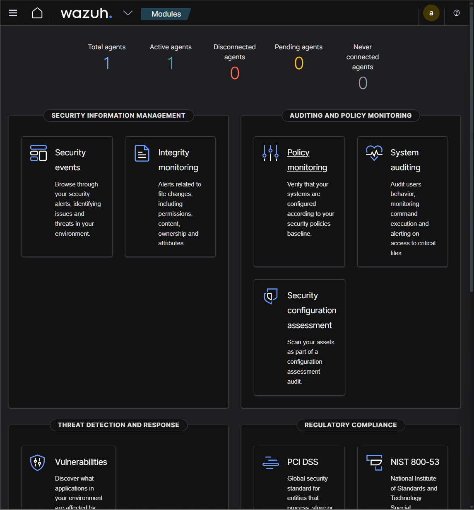

# Lab 11 - Suspicious File Modification Investigation

## 🎯 Objective
Detect and analyze unauthorized modification of `/etc/passwd` using Wazuh.

---

## 🖥️ Lab Environment

- Attacker: Kali Linux
- Target: Ubuntu 24.04 (Wazuh Agent)
- SIEM: Wazuh

---

## 🚨 Attack Simulation

### Command (Ubuntu - Target)
```
echo 'hacker:x:0:0::/root:/bin/bash' | sudo tee -a /etc/passwd
```
### Short explanation (what + why)

> Adds a malicious user to /etc/passwd with root privileges.

### Analysis (SOC)

>Direct modification of a critical system file → strong indicator of persistence and potential privilege escalation.

### Screenshot


### Command breakdown

- **echo** → generates malicious content
- **'hacker:x:0:0::/root:/bin/bash'** → creates a user with UID 0 (root privileges)
- **tee -a** → appends content to a critical system file
- **/etc/passwd** → critical file responsible for user account management

---

## 🔍 Verification
### Command (Ubuntu - Target)
```bash
tail -n 5 /etc/passwd
```
### Short explanation (what + why)

> Displays the last lines to confirm the modification.

### Analysis (SOC)

> Confirms that the backdoor was persisted in the system.

### Screenshot


### Command breakdown

- **tail** → > shows the end of the file

- **-n 5**  → last 5 lines

- **/etc/passwd** → analyzed file

---

## 🕒 Timeline Reference
### Command (Ubuntu - Target)
```
date
```
### Short explanation (what + why)

> Retrieves current system time for log correlation.

### Analysis (SOC)

> Allows correlation between the event and SIEM logs.

### Screenshot


### Command breakdown

- **date** → displays system date and time

---

## 🧠 Wazuh - Access
### Short explanation (what + why)

> Access the dashboard to analyze events.

### Analysis (SOC)

### Confirms that the agent is sending logs correctly.

### Screenshot


## 📈 Events Analysis
### Short explanation (what + why)

> Analyze security events related to unauthorized modification of /etc/passwd

## Analysis (SOC)

### Identification of suspicious activity in the system.

### Screenshot


---

## 🚨 Detection

### Short explanation (what + why)
> Investigate alerts triggered by Wazuh for suspicious activity.

> Events indicate sudo usage followed by modification of a critical system file, suggesting possible privilege escalation and persistence.

### Analysis (SOC)

> Indicates potential privilege escalation followed by persistence attempt through modification of a critical system file.

### Screenshot


---

## 🔬 File Integrity Monitoring (FIM)
### Short explanation (what + why)

> File Integrity Monitoring detects unauthorized changes to /etc/passwd.

> Hash changes confirm unauthorized modification of a critical file, indicating high-risk activity and potential system compromise.

### Analysis (SOC)

> Hash change confirms real modification → high severity.

### Screenshot


---

## 🧭 Timeline

- Initial execution of privileged command (sudo)
  
- Unauthorized modification of /etc/passwd
  
- Detection by Wazuh (FIM)
  
- Alert generation and investigation

---

## 🧠 MITRE ATT&CK

- T1548.003 → Abuse Elevation Control Mechanism (sudo)
  - Used to execute commands with elevated privileges

- T1565.001 → Data Manipulation
  - Modification of critical system file for persistence

---

## 🛡️ Mitigation

- Restrict sudo access
  
- Monitor critical files
  
- Implement File Integrity Monitoring (FIM)
  
- Apply the principle of least privilege

---

🧰 Skills Developed

- Log analysis

- SIEM investigation and analysis

- File Integrity Monitoring

- Incident response

- MITRE mapping


