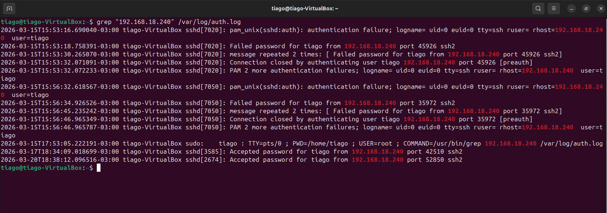
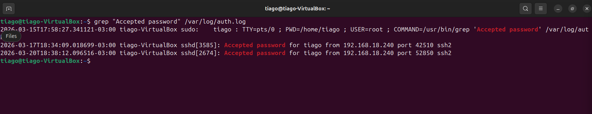
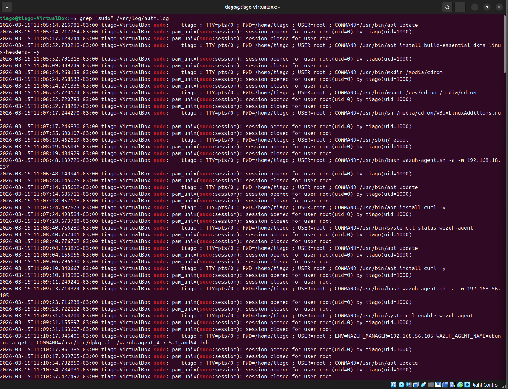
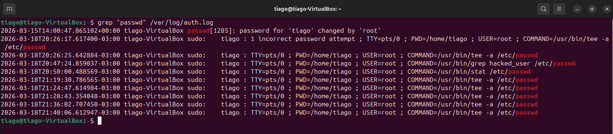
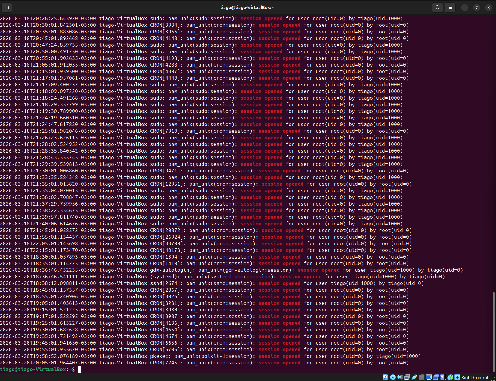

# 🔐 SSH Compromise Attack Chain Analysis
## 📌 Lab Overview

### This lab demonstrates a full attack lifecycle involving SSH brute force, successful authentication, privilege escalation, and persistence through password modification.

---

## 🖥️ Lab Environment
- Attacker: Kali Linux
- Target: Ubuntu
- Log source: /var/log/auth.log

---

## 🚨 Attack Investigation

## 🔹 Step 1 — Brute Force Detection

### Command:
```
grep "Failed password" /var/log/auth.log
```
## 🔹 Step 1 — Failed Password
- **grep** → searches for text inside files
- **"Failed password"** → filters failed login attempts
- **/var/log/auth.log** → system authentication log

## What + Why:

- Identifies failed authentication attempts
- Used to detect brute force activity

## Analysis (SOC):

- Multiple failed login attempts targeting user tiago
- Same source IP: 192.168.18.240
- Clear brute force pattern

## Screenshot:


---

## 🔹 Step 2 — Attack Correlation by IP

### Command:
```
grep "192.168.18.240" /var/log/auth.log
```
## 🔹 Step 2 — IP Correlation
- **grep** → searches for text
- **"192.168.18.240"** → filters events from a specific IP address
- **/var/log/auth.log** → log source

## What + Why:

- Filters all activity related to attacker IP
- Used to build attack timeline

## Analysis (SOC):

- Repeated authentication failures
- Persistent connection attempts
- Transition from failed to successful login

Screenshot:


---

## 🔹 Step 3 — Successful Compromise

### Command:
```
grep "Accepted password" /var/log/auth.log
```
## 🔹 Step 3 — Accepted Password
- **grep** → searches for text
- **"Accepted password"** → filters successful login attempts
- **/var/log/auth.log** → authentication log

## What + Why:

- Detects successful authentication events

## Analysis (SOC):

- Successful login for user tiago
- Same IP used in brute force
- Confirms attacker gained access

## Screenshot:


---

## 🔹 Step 4 — Privilege Escalation

### Command:

```
grep "sudo" /var/log/auth.log
```
## 🔹 Step 4 — Sudo Activity
- **grep** → searches for text
- **"sudo"** → filters privileged command execution
- **/var/log/auth.log** → records administrative actions

## What + Why:

- Detects commands executed with elevated privileges

## Analysis (SOC):

- User tiago executed commands as root
- Indicates privilege escalation after compromise

## Screenshot:



---

## 🔹 Step 5 — Persistence Mechanism

### Command:

```
grep "passwd" /var/log/auth.log
```
## 🔹 Step 5 — Password Change
- **grep** → searches for text
- **"passwd"** → filters password change events
- **/var/log/auth.log** → records account modifications

## What + Why:

- Detects password changes

## Analysis (SOC):

- Password for user tiago changed by root
- Strong indicator of persistence attempt

## Screenshot:



---

## 🔹 Step 6 — Session Context

### Command:
```
grep "session opened" /var/log/auth.log
```
## 🔹 Step 6 — Session Opened
- **grep** → searches for text
- **"session opened"** → filters session creation events
- **/var/log/auth.log** → shows user login sessions

## What + Why:

- Shows session creation events

## Analysis (SOC):

- Session opened for user tiago with root privileges
- Confirms active compromised session

## Screenshot:



---

## 🧠 Attack Timeline

1. Multiple failed SSH login attempts (brute force)
2. Persistent attack from single IP
3. Successful login achieved
4. Privilege escalation via sudo
5. Password changed (persistence)
6. Active session established

---

## 🎯 MITRE ATT&CK Mapping
- T1110 — Brute Force
- T1078 — Valid Accounts
- T1548 — Abuse Elevation Control Mechanism
- T1098 — Account Manipulation

---

## 🛡️ Mitigation
- Implement Fail2ban
- Disable password authentication (SSH keys only)
- Restrict root login
- Monitor authentication logs continuously
- Use SIEM (Wazuh) for detection

---


## 📊 Final SOC Analysis
- Brute force attack detected
- Successful unauthorized access confirmed
- Privilege escalation observed
- Persistence mechanism identified

### 👉 Final Classification: COMPROMISED SYSTEM

---

## 🧩 Skills Demonstrated
- Log analysis
- Threat detection
- Attack correlation
- Incident investigation
- SOC-level reasoning
- MITRE ATT&CK mapping


