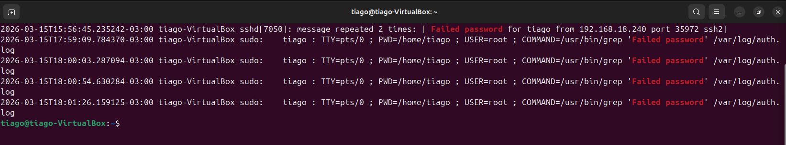

# 🔐 SSH Compromise Attack Chain Analysis
## 📌 Lab Overview

### This lab demonstrates a full attack lifecycle involving SSH brute force, successful authentication, privilege escalation, and persistence through password modification.

---

## 🖥️ Lab Environment
>Attacker: Kali Linux
>Target: Ubuntu
>Log source: /var/log/auth.log

---

## 🚨 Attack Investigation

## 🔹 Step 1 — Brute Force Detection

### Command:
```
grep "Failed password" /var/log/auth.log
```

## What + Why:

- Identifies failed authentication attempts
- Used to detect brute force activity

## Analysis (SOC):

- Multiple failed login attempts targeting user tiago
- Same source IP: 192.168.18.240
- Clear brute force pattern

## Screenshot:


---


