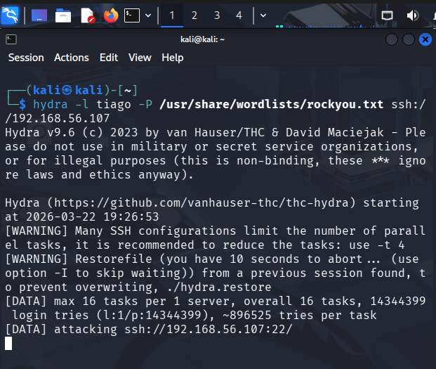
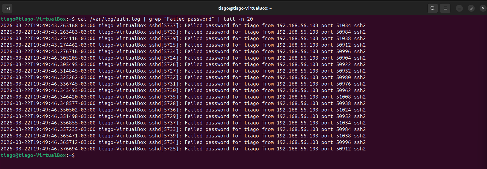
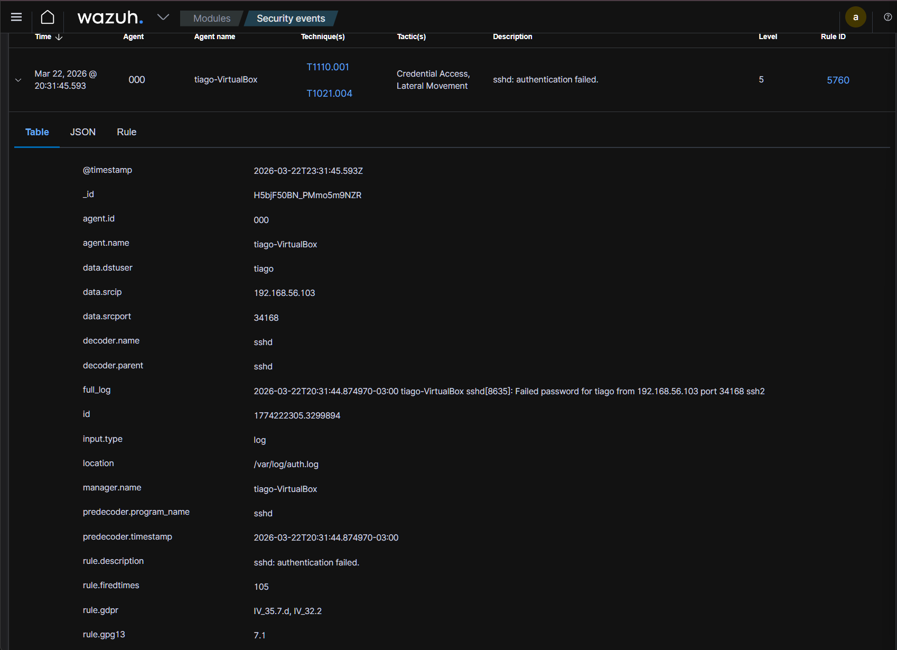
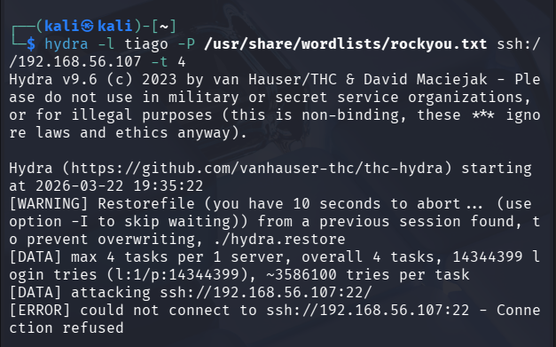
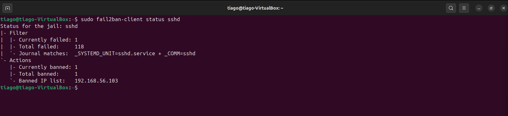

# 🔐 Lab 13 — Detecção e Resposta a Brute Force SSH com Wazuh + Fail2ban


## ⚠️ Impacto

Se não mitigado, ataques de força bruta podem resultar em acesso não autorizado e comprometimento do sistema.

## 📌 Objetivo

### Simular um ataque real de força bruta em SSH utilizando Hydra, detectar o ataque com Wazuh (SIEM) e aplicar resposta automática com Fail2ban, bloqueando o atacante.

---

## 🧱 Ambiente do Lab

- Kali Linux → Atacante  
- Ubuntu → Alvo (logs + Fail2ban + Wazuh Agent)  
- Wazuh Server → SIEM (detecção e correlação)  

---

## ⚔️ Simulação de Ataque (Hydra)

### 📍 Onde executar: Kali

```
hydra -l tiago -P /usr/share/wordlists/rockyou.txt ssh://192.168.56.107 -t 4
```

## 📖 Explicação do comando
- **hydra** → ferramenta de brute force
- **-l tiago** → usuário alvo
- **-P rockyou.txt** → lista de senhas
- **ssh://IP** → serviço alvo (SSH)
- **-t 4** → número de tentativas simultâneas


## 🧠 Análise SOC
- Tipo: Brute Force
- Objetivo: acesso não autorizado
- Comportamento: múltiplas tentativas de login
  


---

## 🔍 Análise de Logs (Linux)

### 📍 Onde executar: Ubuntu (alvo)
```
cat /var/log/auth.log | grep "Failed password" | tail -n 20
```

## 📖 Explicação do comando
- **cat** → lê o arquivo de log
- **/var/log/auth.log** → log de autenticação
- **grep "Failed password"** → filtra falhas de login
- **tail -n 20** → mostra últimas 20 linhas


## 🧠 Análise SOC
- Várias tentativas de login falhadas
- Mesmo IP repetindo → padrão de ataque
- Evidência clara de brute force


---

## 📊 Detecção com Wazuh (SIEM)

### 🔍 Evento detectado
- Regra: sshd: authentication failed
- Rule ID: 5760
- Nível: 5
- MITRE ATT&CK:
  - T1110.001 → Password Guessing
  - T1021.004 → SSH
 
## 📖 Campos importantes
- **srcip** → IP do atacante
- **dstuser** → usuário alvo
- **full_log** → log bruto

## 🧠 Análise SOC
- Alto volume de falhas (rule.firedtimes)
- Mesmo IP e usuário → padrão malicioso
- Classificação: **Ataque real (Brute Force)**


---

## 🛡️ Resposta — Fail2ban

### 📍 Configuração
```
sudo nano /etc/fail2ban/jail.local
```
```
[sshd]
enabled = true
port = ssh
logpath = /var/log/auth.log
maxretry = 5
bantime = 600
findtime = 600
```

## 📖 Explicação
- **enabled** → ativa proteção
- **maxretry** → tentativas antes do bloqueio
- **bantime** → tempo de bloqueio (segundos)
- **findtime** → janela de tempo

## 🧠 Análise SOC
- Resposta automática ao ataque
- Redução de superfície de ataque
- Mitigação em tempo real

---

## 🚀 Aplicar configuração
```
sudo systemctl restart fail2ban
```

## ❌ Ataque Bloqueado

### Após executar novamente o Hydra:
- Conexão recusada
- Ataque interrompido automaticamente


---

## 🔎 Validação do Bloqueio
```
sudo fail2ban-client status sshd
```

## 📖 Análise da saída
- **Total failed** → total de tentativas
- **Banned IP list** → IP bloqueado


---

## 🧠 Análise Final (SOC)

### 🔁 Cadeia do ataque
- Atacante → Hydra (força bruta)
- Logs → **/var/log/auth.log**
- Detecção → Wazuh
- Correlação → Regra + MITRE
- Resposta → Fail2ban

## 🎯 Conclusão

### Este laboratório demonstra um fluxo completo de um SOC:
- Detecção (SIEM)
- Análise (logs + correlação)
- Resposta (bloqueio automático)

## 🧪 Habilidades desenvolvidas
- Análise de logs Linux
- SIEM (Wazuh)
- Detecção de ameaças
- MITRE ATT&CK
- Resposta a incidentes
- Segurança defensiva (Fail2ban)


