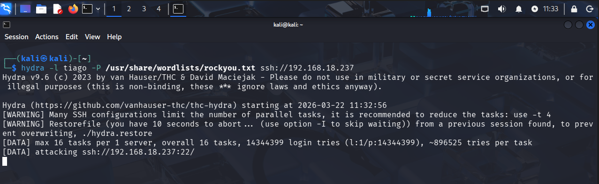
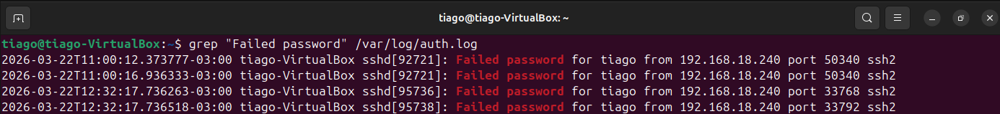

# 🔐 SSH Brute Force Detection & Active Response
## 📌 Lab Overview

### Este laboratório simula um ataque de brute force via SSH, com foco em:
- Geração de logs reais (auth.log)
- Detecção de comportamento malicioso
- Implementação de resposta automática com bloqueio de IP (Fail2ban)

O objetivo é reproduzir um cenário real de SOC: ataque → detecção → resposta → contenção

---

## 🖥️ Lab Environment
- Attacker: Kali Linux (192.168.56.103)
- Target: Ubuntu (192.168.56.107)
- SIEM: Wazuh
- Rede:
  - Host-only → comunicação entre máquinas
  - NAT → acesso à internet

 ---

 ## ⚔️ Attack Simulation
- Onde executar: Kali
```
hydra -l tiago -P /usr/share/wordlists/rockyou.txt ssh://192.168.56.107 -t 2 -W 3 -V
```
### Explicação (o que + por quê)

Simula um ataque de força bruta tentando múltiplas senhas contra o usuário tiago via SSH.

## - Análise SOC
- Múltiplas tentativas de autenticação falhadas
- Comportamento automatizado
- Tentativa de acesso não autorizado



---

## 🔍 Log Analysis (Target)
- Onde executar: Ubuntu
```
sudo tail -f /var/log/auth.log | grep "Failed password"
```

### Explicação (o que + por quê)

Monitora em tempo real falhas de autenticação SSH para identificar atividade suspeita.

- Análise SOC
Diversas falhas consecutivas
Mesmo IP de origem
Indício claro de brute force



