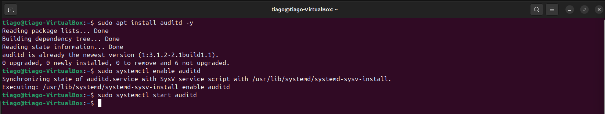
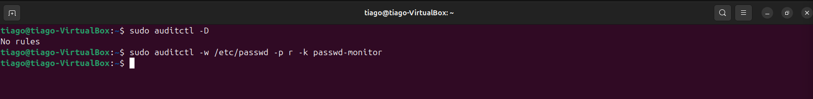
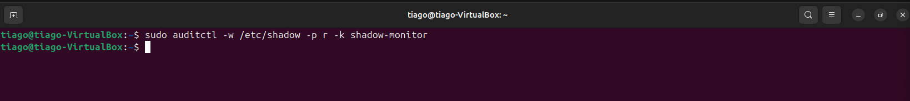
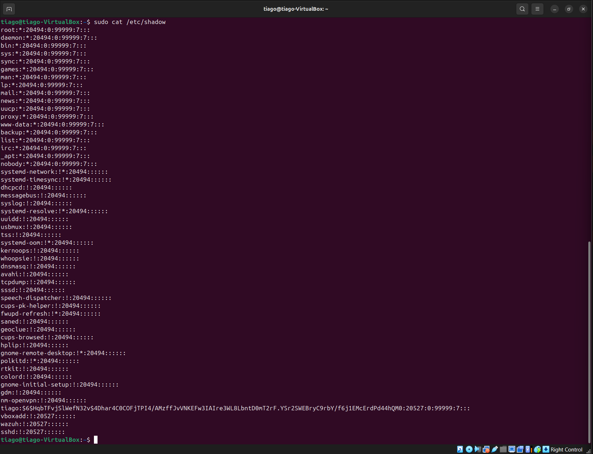
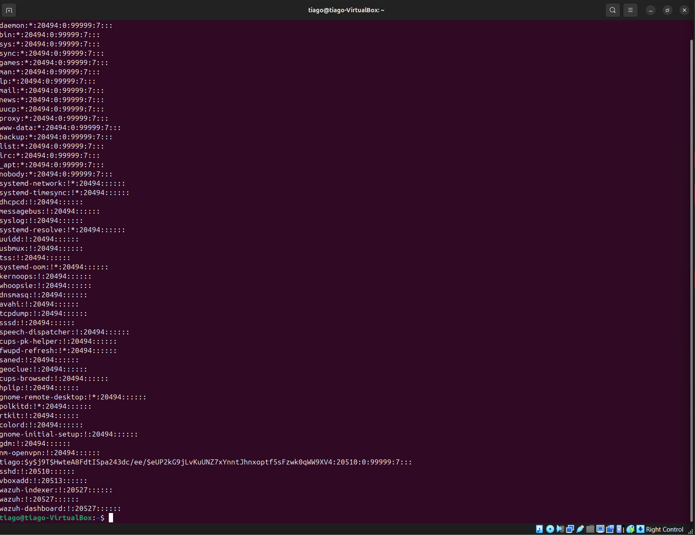
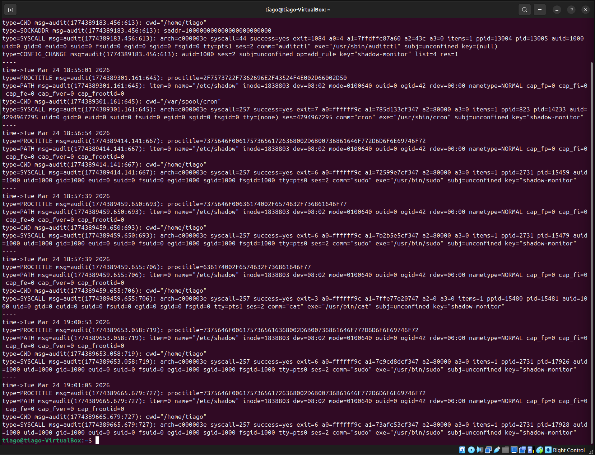
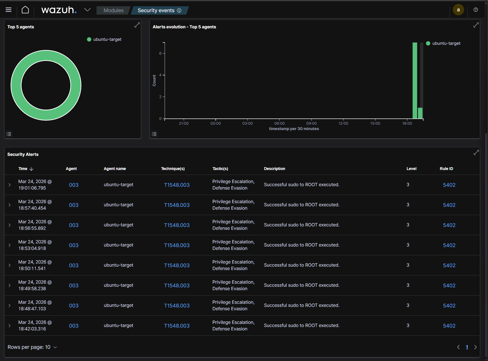
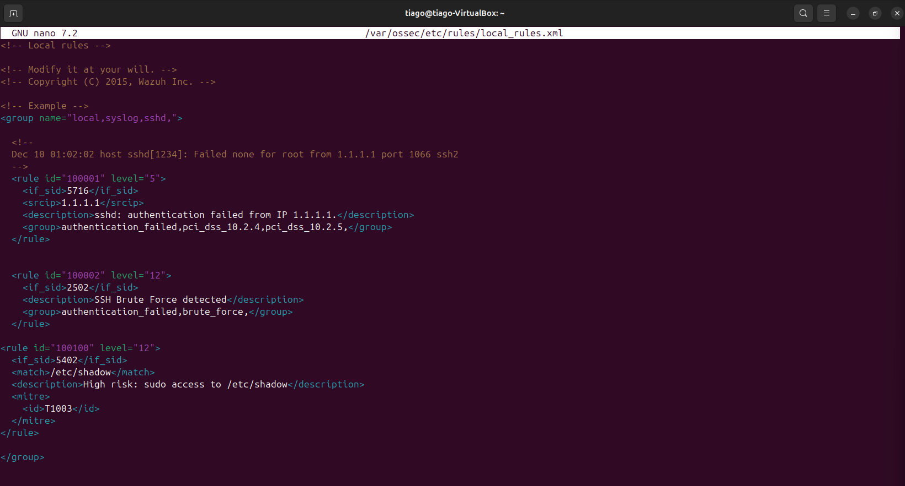
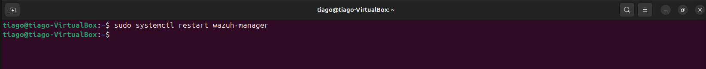
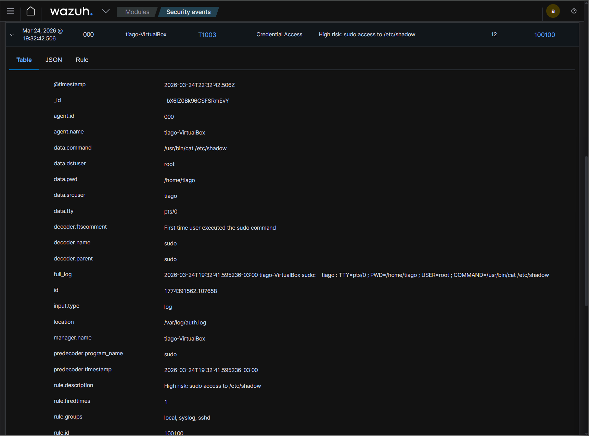

# 🧠 LAB 14 — Monitoramento e Detecção de Acesso a Arquivos Sensíveis (auditd + Wazuh)

---

## 🎯 Objetivo

Monitorar, detectar e investigar acessos a arquivos sensíveis no Linux (`/etc/passwd` e `/etc/shadow`) utilizando **auditd** e **Wazuh**, evoluindo até detecção customizada **(Detection Engineering)**.

---

## 🧪 Ambiente
- Kali Linux (ataque)
- Ubuntu (alvo)
- Wazuh (SIEM)

---

## 📖 Cenário

Usuário `tiago` eleva privilégio com `sudo` e acessa `/etc/shadow`, simulando coleta de credenciais.

---

## ⚙️ Etapa 1 — Instalação do auditd
```
sudo apt install auditd -y
```


### 🔎 Explicação
- `apt install` → instala pacote
- `auditd` → serviço de auditoria
- `-y` → confirma automaticamente

📌 Função: registrar eventos de segurança no sistema

```
sudo systemctl enable auditd
```
```
sudo systemctl start auditd
```

### 🔎 Explicação
- `systemctl` → gerencia serviços
- `enable` → inicia no boot
- `start` → inicia agora

📌 Sem isso, não há logs



---

## ⚙️ Etapa 2 — Criar regras de monitoramento
```
sudo auditctl -D
```

### 🔎 Explicação
- `auditctl` → gerencia regras
- `-D` → deleta todas as regras

📌 Garante ambiente limpo


```
sudo auditctl -w /etc/passwd -p r -k passwd-monitor
```

### 🔎 Explicação detalhada
- `-w /etc/passwd` → monitora arquivo
- `-p r` → captura leitura
- `-k passwd-monitor` → chave para busca

📌 Detecta enumeração de usuários

```
sudo auditctl -w /etc/shadow -p r -k shadow-monitor
```

### 🔎 Explicação detalhada
- Monitora arquivo de credenciais
- Acesso aqui = alto risco
- 



---

## ⚙️ Etapa 3 — Gerar evento
```
sudo cat /etc/shadow
```

### 🔎 Explicação
- `cat` → lê conteúdo do arquivo
- `sudo` → executa como root

📌 Simula atacante acessando credenciais




---

## ⚙️ Etapa 4 — Analisar logs
```
sudo ausearch -k shadow-monitor
```

### 🔎 Explicação
- `ausearch` → busca eventos do auditd
- `-k` → filtra pela chave definida

### 📌 Retorna:

- usuário
- comando
- arquivo acessado
- timestamp



---

## 🔗 Etapa 5 — Wazuh (detecção inicial)



### 🔎 Análise
- Regra 5402 → apenas detecta sudo
- ❌ Baixo valor (não contextual)

---

## 🔧 Etapa 6 — Detection Engineering
### 📍 Editar regra
```
sudo nano /var/ossec/etc/rules/local_rules.xml
```

### 🔎 Explicação
- `nano` → editor
- arquivo → regras customizadas do Wazuh

### 📍 Regra criada
```
<rule id="100100" level="12">
  <if_sid>5402</if_sid>
  <match>/etc/shadow</match>
  <description>Alto risco: acesso ao /etc/shadow via sudo</description>
  <mitre>
    <id>T1003</id>
  </mitre>
</rule>
```

### 🔎 Explicação
- `if_sid 5402` → evento base (sudo)
- `match /etc/shadow` → filtra alvo crítico
- `level 12` → alerta alto
- MITRE → credential dumping

📌 Agora a detecção é contextual



### 📍 Reiniciar serviço
```
sudo systemctl restart wazuh-manager
```

### 🔎 Explicação
- recarrega regras
- obrigatório após alteração



---

## ⚙️ Etapa 7 — Teste da regra
```
sudo cat /etc/shadow
```

📌 Gera novo evento para validar regra

### 🔥 Resultado final no Wazuh



### 📊 Timeline
```bash
18:55 → auditd iniciado  
18:56 → regras criadas  
18:57 → acesso ao shadow  
19:01 → alerta padrão  
19:32 → alerta customizado (alto risco)
```


## 🔍 Análise SOC
- Usuário: tiago
- Ação: leitura de credencial
- Método: sudo + cat
- Resultado: sucesso

➡️ Comportamento suspeito real

---

## ⚖️ Classificação

**True Positive — Atividade Suspeita**

---

## 💥 Impacto
- Exposição de hashes
- Possível quebra de senha
- Escalada de privilégio
- Movimento lateral

---

## 🧬 MITRE ATT&CK
- T1003 → Credential Dumping
- T1548.003 → Sudo abuse
- T1078 → Valid accounts

---

## 🚨 Resposta
- Revisar sudo
- Monitorar usuário
- Hardening
- Melhorar regras

---

## 🧠 Conclusão

Este lab demonstra a evolução de um evento simples para uma detecção de alto valor, através de correlação e criação de regra customizada.

---

🎯 Habilidades Demonstradas
- Linux
- auditd
- Wazuh
- Log Analysis
- Correlação
- MITRE
- Detection Engineering

---

## 🔥 Resultado Final

👉 Fluxo completo de SOC
👉 Detecção + investigação + melhoria


