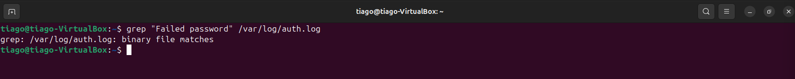
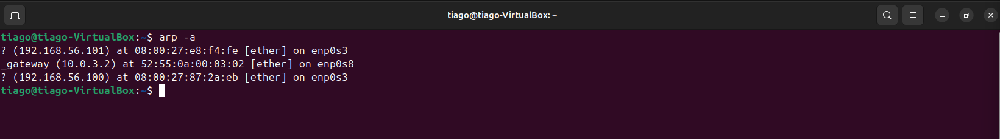

# 🚨 Hardening SSH após Tentativa de Brute Force (SOC Analysis)

---

## 🎯 Cenário

Um servidor Linux apresentou múltiplas tentativas de acesso via SSH sem sucesso. A análise focou na identificação do comportamento e aplicação de medidas de hardening para prevenir futuros ataques.

---

## 📊 Análise de Logs — Tentativas de Ataque

Logs indicam falhas de autenticação:

Tentativas repetidas de brute force:

Sem sucesso de login:

---

## 📈 Análise de Comportamento

Linha do tempo do ataque:

Contagem de tentativas:

Análise:

- Alto volume de tentativas  
- Intervalos curtos  
- Padrão automatizado  

---

## 🌐 Análise de Origem

Tabela ARP analisada:

👉 Identificação da origem do ataque dentro da rede

---

## 🧠 Análise SOC

O comportamento caracteriza tentativa de brute force contra o serviço SSH.

Evidências:

- Múltiplas falhas consecutivas  
- Alta frequência de tentativas  
- Padrão automatizado  

Impacto:

- Risco de comprometimento do sistema  
- Possível acesso não autorizado  

Objetivo do atacante:

- Descobrir credenciais válidas  
- Obter acesso inicial  

Conclusão:

Atividade maliciosa confirmada, exigindo medidas preventivas.

---

## 🛡️ Hardening do Serviço SSH

Desativação de login root via SSH:

Reinício do serviço:

---

## 🚨 Classificação

Malicioso — tentativa de brute force bloqueada sem comprometimento.

---

## 🧬 MITRE ATT&CK

- T1110 — Brute Force  
- TA0001 — Initial Access  

---

## 🧠 Habilidades Demonstradas

- Análise de logs SSH  
- Identificação de brute force  
- Análise de comportamento de ataque  
- Investigação de origem (ARP)  
- Hardening de serviço SSH  
- Prevenção de incidentes  

---

## 📌 Conclusão

O laboratório demonstrou a identificação de um ataque de brute force e a aplicação de medidas de hardening para mitigar riscos.

A desativação do login root reduz significativamente a superfície de ataque e aumenta a segurança do ambiente.

---

## 📬 Contato

Aberto a oportunidades em SOC / NOC / Cybersecurity Jr.

- LinkedIn: https://www.linkedin.com/in/tiago-krysiaki  
- Email: t.krysiaki91@gmail.com  
