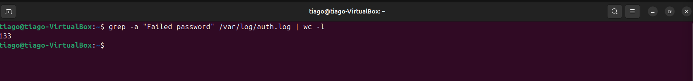
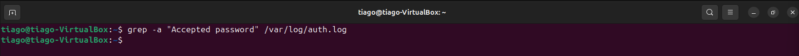
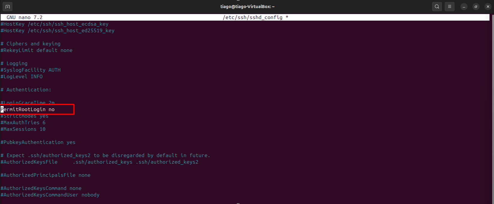
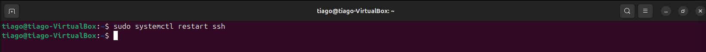

# 🔥 Lab 15 — Detecção de Brute Force em SSH e Hardening

## 📌 Objetivo
Detectar, analisar e responder a uma tentativa de acesso não autorizado via brute force no serviço SSH, utilizando logs do sistema e aplicando medidas reais de mitigação.

---

## 🧪 Ambiente do Lab
- Atacante: Kali Linux
- Alvo: Ubuntu Server
- Fonte de logs: `/var/log/auth.log`

---

## 🚨 Cenário do Ataque
Foi identificado um comportamento anômalo no serviço SSH, caracterizado por múltiplas tentativas de autenticação falhadas em curto intervalo de tempo, indicando possível ataque automatizado de força bruta.

---

## 🔍 Detecção — Tentativas Falhadas

### Comando
```
grep -a "Failed password" /var/log/auth.log
```

## Explicação
- `grep` → ferramenta de busca por padrões em arquivos
- `-a` → força leitura do arquivo como texto, evitando problemas com encoding/binário
- `"Failed password"` → identifica eventos de falha de autenticação SSH
- `/var/log/auth.log` → arquivo de log responsável por eventos de autenticação no sistema

### Análise
Foram identificadas múltiplas tentativas consecutivas de login falhadas, provenientes do mesmo endereço IP e direcionadas ao mesmo usuário.
Esse padrão é consistente com ataque de brute force automatizado, com objetivo de descoberta de credenciais válidas.


---

## 📊 Análise de Timeline — Início do Ataque
### Comando
```
grep -a "Failed password" /var/log/auth.log | head
```
### Explicação
- `grep` → filtra eventos de interesse
- `head` → exibe as primeiras ocorrências, permitindo identificar o início do ataque

### Análise
O ataque teve início em:

`2026-03-22 20:01:31`

Os eventos ocorrem em alta frequência, com múltiplas tentativas por segundo, indicando execução automatizada (script/ferramenta).


---

## 🔢 Volume do Ataque
### Comando
```
grep -a "Failed password" /var/log/auth.log | wc -l
```

### Explicação
- `wc -l` → conta o número total de linhas retornadas
- cada linha representa uma tentativa de login falhada

### Resultado
- 133 tentativas de autenticação falhadas

### Análise
O volume elevado em curto intervalo de tempo reforça a caracterização de brute force automatizado, descartando comportamento humano ou erro pontual.



---

## 🔐 Verificação de Sucesso de Login
### Comando
```
grep -a "Accepted password" /var/log/auth.log
```
### Explicação
- `"Accepted password"` → identifica autenticações bem-sucedidas no SSH

### Análise
Não foram identificados eventos de login bem-sucedido, indicando que o atacante não obteve credenciais válidas.
Apesar disso, a continuidade do ataque representa risco ativo ao ambiente.



---

## 🌐 Identificação da Origem
- IP de origem: `192.168.56.103`
- Tipo: Endereço IP privado (rede interna)

### Análise
A origem interna do ataque indica possibilidade de:

- movimentação lateral a partir de máquina comprometida
- ambiente de teste (Kali) simulando atacante
- ameaça interna

Esse fator eleva a criticidade, pois o atacante já está dentro da rede.

### 🧠 Classificação do Incidente
- Tipo: Tentativa de acesso não autorizado (Brute Force)
- Técnica: Tentativa repetitiva de autenticação
- Status: Sem sucesso
- Severidade: Média → Alta
- Confiança: Alta

### 💥 Avaliação de Impacto
- Nenhum acesso não autorizado confirmado
- Credenciais não comprometidas
- Serviço SSH permaneceu operacional
- Risco contínuo caso não mitigado

---

## 🛡️ Resposta — Hardening do SSH
### Etapa 1 — Acesso ao arquivo de configuração
```
sudo nano /etc/ssh/sshd_config
```

### Explicação
Permite modificar parâmetros de segurança do serviço SSH.

### Etapa 2 — Desabilitar login direto como root
`PermitRootLogin no`

### Explicação
Bloqueia autenticação direta do usuário root, obrigando uso de contas intermediárias com privilégios controlados (sudo).

### Análise
Essa medida reduz significativamente o impacto de ataques de brute force, eliminando um dos principais alvos de exploração.




### Etapa 3 — Aplicar as alterações
```
sudo systemctl restart ssh
```

### Explicação
Reinicia o serviço SSH para carregar a nova configuração.

### Análise
Garante que a política de segurança aplicada esteja ativa no ambiente.



---

## 🚨 Resposta do Incidente

- Monitoramento contínuo do usuário alvo para identificar novas tentativas de acesso  
- Identificação e análise do IP de origem do ataque (rede interna)  
- Aplicação de hardening no serviço SSH (desativação de login root)  
- Reforço na detecção de tentativas de brute force via análise de logs

---

## 🎯 Conclusão
Foi identificada atividade maliciosa compatível com ataque de brute force contra o serviço SSH.
A análise dos logs permitiu confirmar o padrão do ataque, sua origem e ausência de comprometimento.

Medidas de hardening foram aplicadas para reduzir a superfície de ataque e mitigar tentativas futuras, elevando o nível de segurança do sistema.

---

## 🧠 Habilidades Demonstradas
- Análise de logs de autenticação
- Detecção de brute force
- Correlação de eventos
- Análise temporal (timeline)
- Classificação de incidente
- Avaliação de impacto
- Resposta a incidente
- Hardening de serviço

---

## 🔗 MITRE ATT&CK
- T1110 — Brute Force
- T1078 — Valid Accounts (tentativa)


