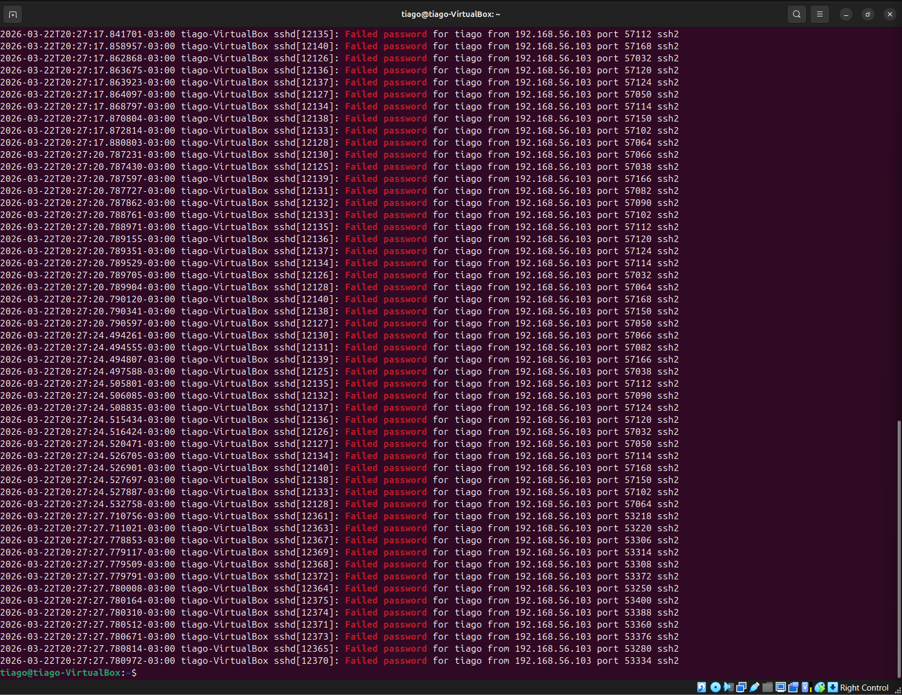
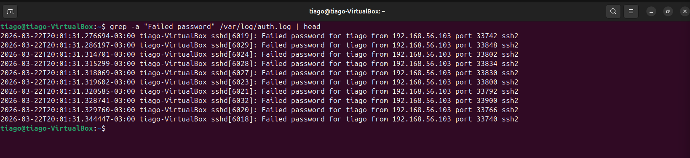

# 🔥 Lab 15 — Detecção de Brute Force em SSH e Hardening

## 📌 Objetivo
Detectar, analisar e responder a um ataque de brute force no serviço SSH, aplicando um fluxo real de investigação SOC.

---

## 🧪 Ambiente do Lab

- Atacante: Kali Linux
- Alvo: Ubuntu Server
- Logs analisados: `/var/log/auth.log`

---

## 🚨 Cenário do Ataque

Foi realizado um ataque de força bruta contra o serviço SSH, gerando múltiplas tentativas de login falhadas contra um usuário válido.

---

## 🔍 Detecção — Tentativas Falhadas

### Comando
```
grep -a "Failed password" /var/log/auth.log
```

## Explicação
- `grep` → busca padrões dentro do log
- `-a` → força leitura como texto (evita erro de binário)
- `"Failed password"` → tentativas falhadas de login SSH
- `/var/log/auth.log` → log de autenticação

## Análise

### Foram identificadas múltiplas tentativas falhadas, caracterizando ataque de brute force.



---

## 📊 Análise de Timeline — Início do Ataque

# Comando
```
grep -a "Failed password" /var/log/auth.log | head
```
# Explicação
- `grep` → filtra tentativas falhadas

- `head` → mostra as primeiras ocorrências


## Análise

### O ataque iniciou em:

- `2026-03-22 20:01:31`

### Eventos em alta frequência indicam automação.




---


