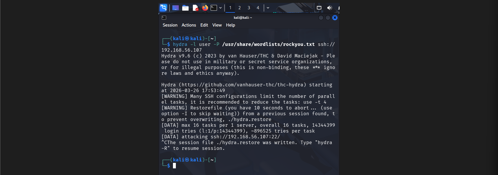
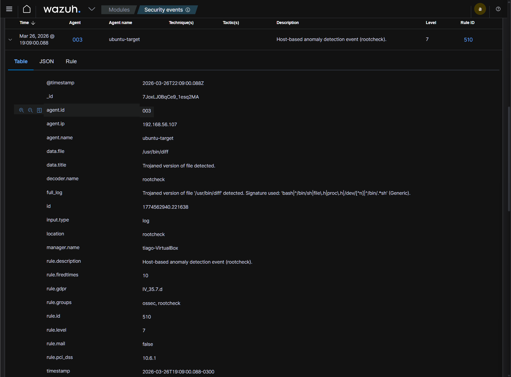
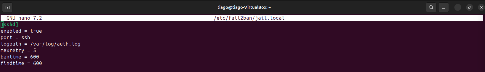
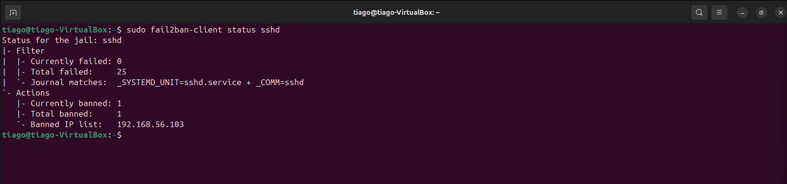
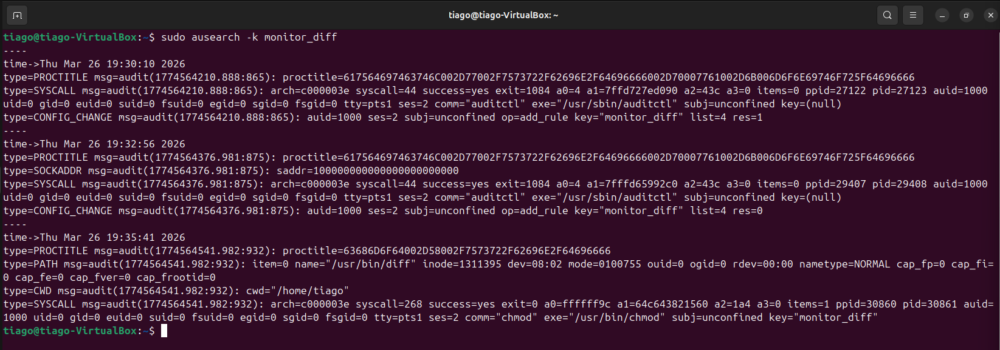

# 🔥 Lab 16 — SSH Brute Force + Compromise + Incident Response

## 📌 Scenario

Um servidor Linux foi alvo de múltiplas tentativas de login via SSH, indicando possível ataque de brute force.

Durante a investigação, foi identificado:
- Alto volume de tentativas de login
- Comportamento automatizado
- Possível comprometimento de integridade de arquivo crítico

O objetivo foi conduzir a investigação como um analista SOC, identificando, classificando e respondendo ao incidente.

---

## 🏢 Lab Environment

- Kali Linux (Atacante)
- Ubuntu Server (Alvo)
- Wazuh SIEM
- Fail2ban (Intrusion Prevention)
- auditd (Host Forensics)

---

## 🧨 Attack Simulation

Foi realizado um ataque de brute force contra o serviço SSH utilizando wordlist.

---

## 🔍 Log Analysis (SSH)

Análise do `/var/log/auth.log` revelou múltiplas tentativas de autenticação falhas:

### 📊 Evidências

- Múltiplas falhas consecutivas
- Mesmo IP repetido
- Intervalo curto entre tentativas

👉 Caracteriza ataque automatizado (Brute Force) :contentReference[oaicite:0]{index=0}

---

## 🧠 Initial Analysis

- IP atacante identificado
- Usuário alvo identificado
- Nenhum login bem-sucedido inicialmente

👉 Classificação inicial: **Malicious Activity (Brute Force)**

---

## 🚨 SIEM Detection (Wazuh)

O SIEM identificou comportamento suspeito e integridade comprometida:

### 📊 Evidência crítica

- Arquivo comprometido: `/usr/bin/diff`
- Tipo: Trojaned file

👉 Indica possível modificação maliciosa no sistema

---

## 🛡️ Incident Response (Fail2ban)

Inicialmente o sistema estava sem proteção contra brute force.

Após configuração do Fail2ban:

Validação do bloqueio:

### 📊 Resultado

- IP atacante bloqueado automaticamente
- Ataque interrompido

👉 Fail2ban atua como IPS bloqueando IPs após múltiplas falhas :contentReference[oaicite:1]{index=1}

---

## 🔬 Forensic Analysis (auditd)

Monitoramento de integridade foi configurado para arquivo comprometido.

Evento capturado:

### 📊 Evidência forense

- Usuário: tiago (uid=1000)
- Comando: chmod
- Arquivo: /usr/bin/diff
- Resultado: success=yes
- Diretório: /home/tiago

👉 Confirma alteração real no sistema

---

## 🧠 Timeline

1. Início do brute force (Hydra)
2. Múltiplas falhas de autenticação
3. Análise dos logs (auth.log)
4. Detecção no SIEM (Wazuh)
5. Identificação de arquivo comprometido
6. Ativação do Fail2ban
7. Bloqueio do IP atacante
8. Investigação forense com auditd

---

## 🎯 MITRE ATT&CK

- T1110 — Brute Force  
- T1078 — Valid Accounts (tentativa)  
- T1059 — Command Execution  
- T1547 — Persistence (indicativo)  

---

## ⚠️ Impact

- Tentativa de acesso não autorizado
- Sistema inicialmente vulnerável
- Indício de modificação maliciosa em binário crítico

---

## 🛠️ Mitigation

- Implementação de Fail2ban
- Monitoramento com auditd
- Correlação via SIEM (Wazuh)
- Monitoramento contínuo de logs

---

## 💡 Skills Demonstrated

- Log Analysis (Linux)
- Incident Investigation
- Event Correlation
- SIEM (Wazuh)
- Intrusion Prevention (Fail2ban)
- Host Forensics (auditd)
- Incident Response

---

## 🏁 Conclusion

Este laboratório simula um cenário real de SOC, cobrindo todo o ciclo de resposta a incidentes:

- Detecção  
- Investigação  
- Correlação  
- Resposta  
- Forense  

A análise foi conduzida com base em evidências reais, demonstrando habilidades práticas de um analista SOC.

---

🔗 GitHub: https://github.com/TKrysiaki/lab-soc-linux.git
