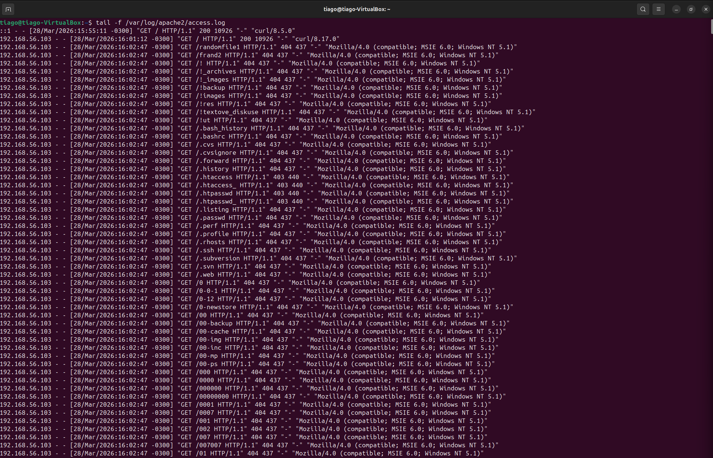
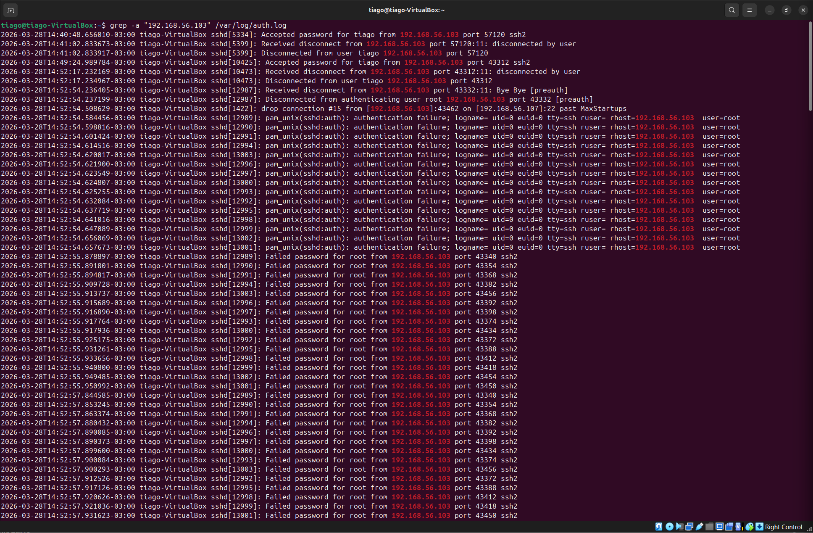
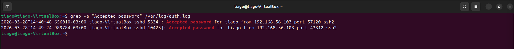
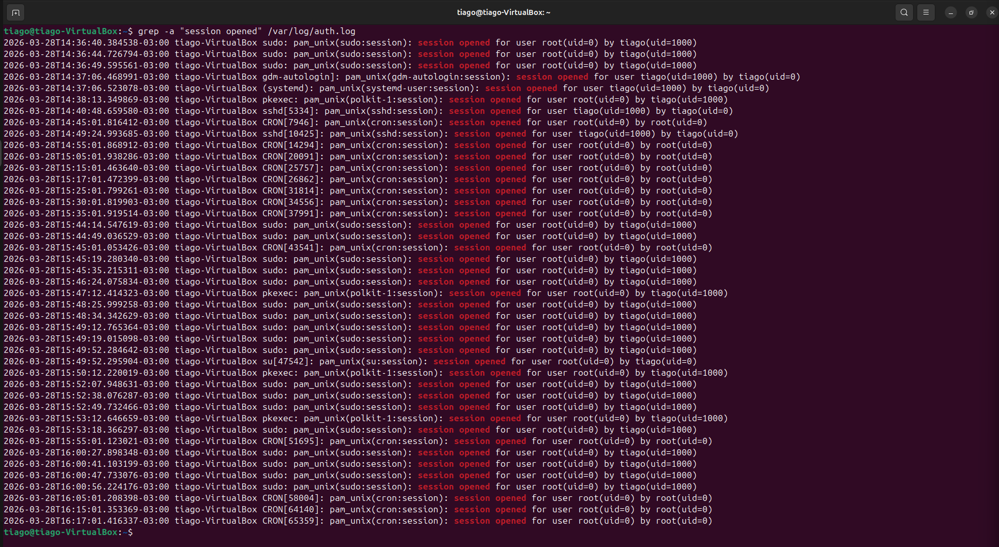
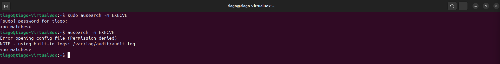
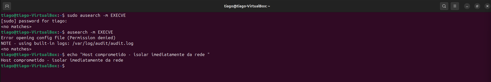
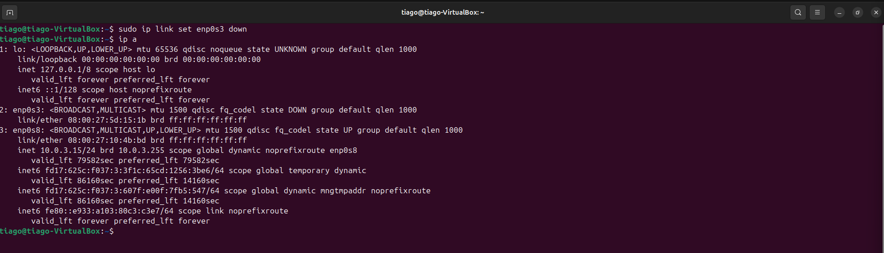

# 🔴 Lab 17 — Ataque Multi-Vetor → Comprometimento Total → Resposta a Incidente

**Simulação de incidente real de SOC envolvendo ataque em múltiplas etapas, comprometimento de credenciais e controle total do sistema.**

---

## 📌 Cenário

Um servidor Linux foi alvo de um ataque multi-vetor originado de um único IP atacante.

O atacante executou:
- Enumeração web (reconhecimento)
- Brute force SSH (acesso inicial)
- Autenticação bem-sucedida
- Escalada de privilégio para root

O objetivo foi detectar, correlacionar e responder ao incidente utilizando a abordagem de um analista SOC.

---

## 🖥️ Ambiente do Laboratório

- Atacante: Kali Linux
- Alvo: Ubuntu Server
- SIEM: Wazuh
- Fontes de log:
  - `/var/log/apache2/access.log`
  - `/var/log/auth.log`
  - auditd (EXECVE)

---

## 🌐 Simulação do Ataque

### Web Enumeration
```
dirb http://192.168.56.107 /usr/share/wordlists/dirb/big.txt
```

- Geração de múltiplas requisições HTTP
- Identificação de diretórios e arquivos

---

## 🔍 Detecção e Investigação

### 1. Monitoramento de logs web
```
tail -f /var/log/apache2/access.log
```

- Alto volume de requisições
- Múltiplos códigos 404/403
- Padrão automatizado (não humano)



---

### 2. Correlação com logs SSH
```
grep -a "192.168.56.103" /var/log/auth.log
```

- Tentativas repetidas de login
- Ataque de brute force identificado



---

### 3. Confirmação de comprometimento
```
grep -a "Accepted password" /var/log/auth.log
```

- Login bem-sucedido detectado
- Conta comprometida



---

### 4. Análise pós-login
```
grep -a "session opened" /var/log/auth.log
```

- Sessões abertas
- Uso de sudo → acesso root



---

### 5. Análise de execução de comandos
```
ausearch -m EXECVE
```

- Nenhum comando registrado
- Falha de visibilidade (auditd não configurado)



---

## 🧠 Linha do Tempo

1. Reconhecimento web (dirb)
2. Enumeração de diretórios
3. Brute force SSH
4. Login bem-sucedido
5. Escalada de privilégio (sudo → root)
6. Atividade pós-comprometimento (sem visibilidade)

---

## 🔍 Principais Achados

- Um único IP realizou ataque multi-vetor
- Comprometimento de credenciais confirmado
- Escalada de privilégio para root identificada
- Falha de visibilidade devido à ausência de configuração do auditd

---

## 🧬 MITRE ATT&CK

- T1046 — Descoberta de Serviços de Rede (Network Service Discovery)  
- T1083 — Descoberta de Arquivos e Diretórios (File and Directory Discovery)  
- T1110 — Força Bruta (Brute Force)  
- T1078 — Contas Válidas (Valid Accounts)  
- T1068 — Escalada de Privilégio (Privilege Escalation)  
- T1059 — Execução de Comandos (Command Execution)  

---

## 🚨 Classificação do Incidente

**Critical — Full System Compromise**

- Acesso inicial obtido
- Escalada de privilégio confirmada
- Falta de visibilidade pós-comprometimento

---

## 🛡️ Resposta ao Incidente

### Decisão SOC
```echo "Host comprometido - isolar imediatamente da rede"```



---

### Contenção
```
sudo ip link set enp0s3 down
```

- Interface de rede desativada
- Comunicação com atacante interrompida



---

## ⚠️ Análise de Impacto

- Comprometimento total do host
- Acesso root obtido
- Possível persistência e movimentação lateral
- Falha de logging (auditd)

---

## 🔧 Mitigação e Recomendações

- Bloqueio de IP atacante
- Reset de credenciais
- Hardening SSH (fail2ban, disable root login)
- Configuração de auditd
- Monitoramento contínuo via SIEM

---

## 🎯 Habilidades Demonstradas

- Log Analysis (Apache + SSH)
- Attack Correlation
- Incident Detection
- Timeline Reconstruction
- MITRE ATT&CK Mapping
- Incident Response (Containment)
- SOC Analyst Mindset

---

## 📎 Contato

- LinkedIn: https://www.linkedin.com/in/tiago-krysiaki-b3322b2a7/
- Email: t.krysiaki91@gmail.com


