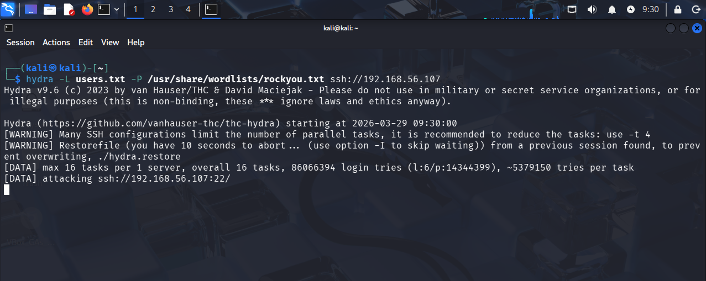
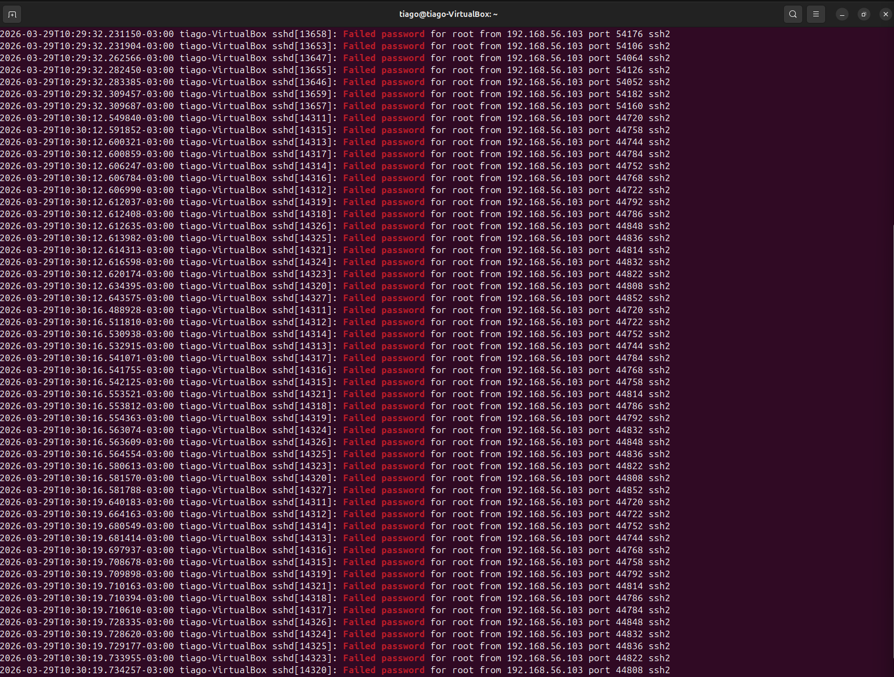
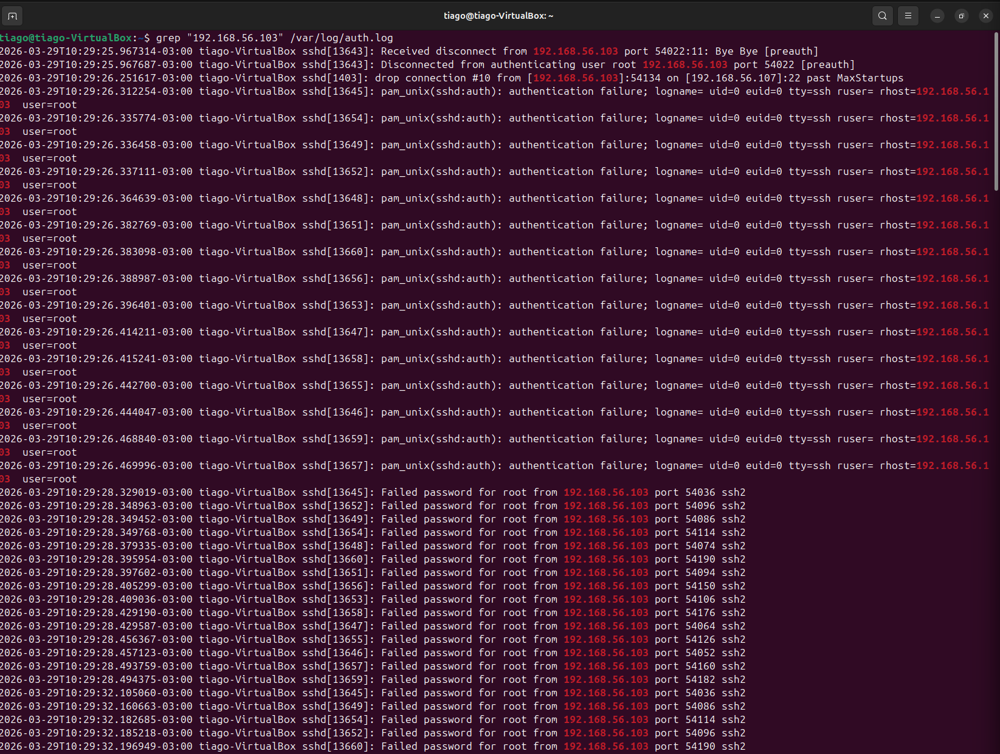
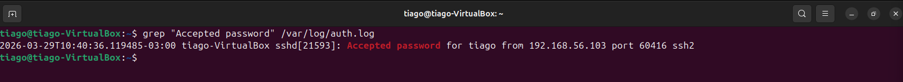
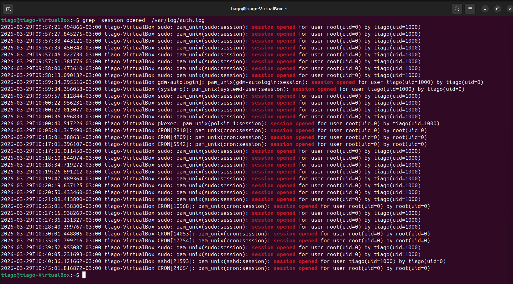
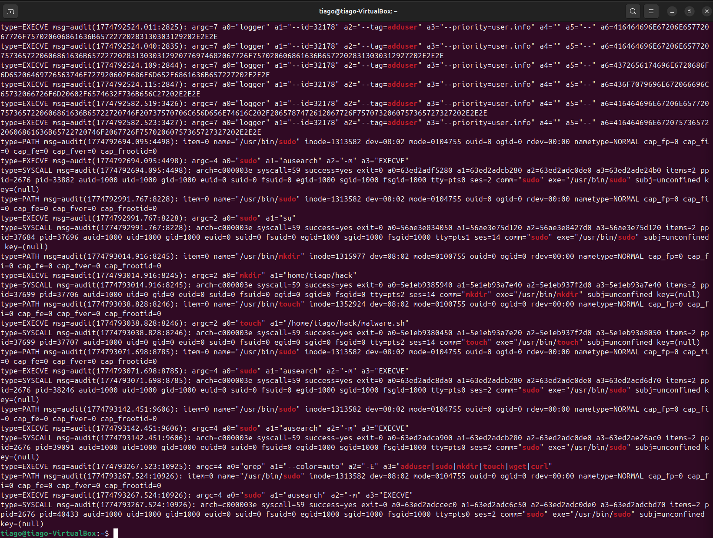
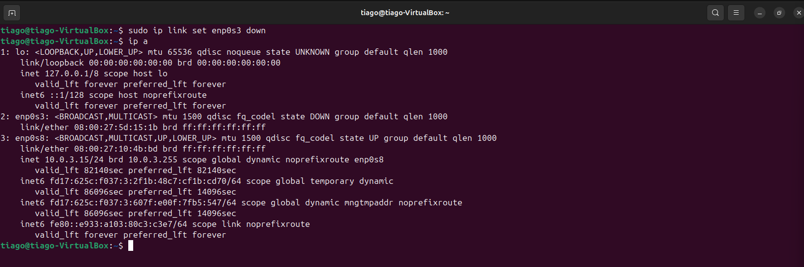
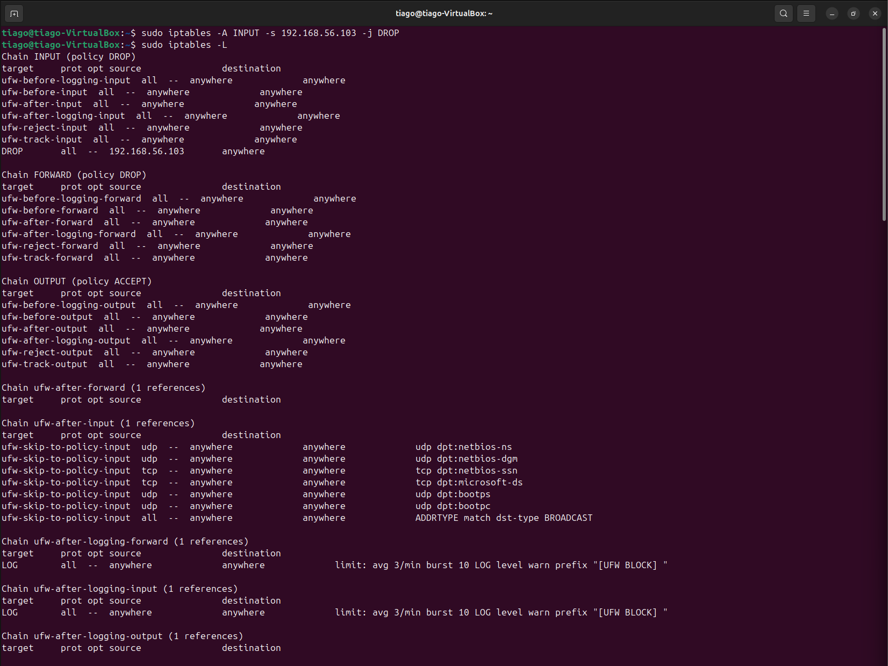

# 🛡️ LAB 18 — SSH Brute Force Incident → Compromise → Containment (Auditd)

## 📌 Cenário

Ataque de força bruta via SSH resultou em acesso não autorizado, escalonamento de privilégio e execução de comandos maliciosos no host alvo.

---
## 🧱 Ambiente do Laboratório
- Atacante: Kali Linux  
- Alvo: Ubuntu  
- Logs:
  - /var/log/auth.log  
  - auditd (EXECVE)
 
---

## ⚔️ Simulação de Ataque
### 🔐 1. Ataque SSH (Kali)
```
hydra -L users.txt -P /usr/share/wordlists/rockyou.txt ssh://192.168.56.107
```
- O que faz: brute force SSH
- Uso SOC: simulação de ataque real


---

## 💥 Impacto
- Acesso não autorizado ao sistema
- Execução de comandos com privilégio elevado
- Criação de artefatos suspeitos no sistema

---

## 🔍 Investigação
### 🔎 2. Falhas de login (Target)
> Correlação de eventos por IP, usuário e linha do tempo do ataque.
```
grep "Failed password" /var/log/auth.log
```
- O que faz: falhas de login
- Uso SOC: detectar ataque


---

## 🔎 3. IP atacante
```
grep "192.168.56.103" /var/log/auth.log
```
- O que faz: filtra IP atacante
- Uso SOC: correlação


---

## 🔎 4. Login com sucesso
```
grep "Accepted password" /var/log/auth.log
```
- O que faz: login bem-sucedido
- Uso SOC: confirmar comprometimento


---

## 🔎 5. Sessão aberta
```
grep "session opened" /var/log/auth.log
```
- O que faz: sessão iniciada
- Uso SOC: atividade pós-login


---

## 🧬 6. Análise auditd
```
sudo ausearch -m EXECVE
```
- O que faz: comandos executados
- Uso SOC: análise do atacante
```
sudo ausearch -m EXECVE | grep -E "sudo|mkdir|touch|adduser"
```
- O que faz: filtra comandos suspeitos
- Uso SOC: foco no ataque


---

## 🚨 Classificação

Malicioso — Comprometimento Confirmado

---

## 🛡️ Resposta

### 🛡️ 7. Isolamento
```
sudo ip link set enp0s3 down
```
- O que faz: isola host
- Uso SOC: conter ataque
```
ip a
```
- O que faz: verifica interface
- Uso SOC: validar isolamento


---

## 🚫 8. Bloqueio do atacante
```
sudo iptables -A INPUT -s 192.168.56.103 -j DROP
```
- O que faz: bloqueia IP
- Uso SOC: contenção
```
sudo iptables -L
```
- O que faz: valida regra
- Uso SOC: confirmação


---

## 🧠 MITRE ATT&CK
- T1110 — Força Bruta  
- T1078 — Contas Válidas  
- T1059 — Execução de Comandos  
- T1098 — Manipulação de Conta
- T1068 — Escalonamento de Privilégio

---

## 💡 Principais Aprendizados
- Correlação de logs é essencial  
- auditd aumenta a visibilidade  
- Fluxo real: detecção → análise → resposta  

---

🔗 Contato

LinkedIn: https://www.linkedin.com/in/tiago-krysiaki-b3322b2a7/

Email: t.krysiaki91@gmail.com


