# 🚨 Detecção de Brute Force SSH com Falha de Defesa e Pós-Exploração (SOC Analysis)

---

## 🎯 Cenário

Um servidor Linux exposto via SSH apresentou comportamento suspeito, indicando tentativa de acesso não autorizado. Durante a análise, foi identificado que o mecanismo de defesa (Fail2ban) estava inativo, aumentando o risco de comprometimento.

---

## 🛠️ Validação do Ambiente

Verificação dos serviços de monitoramento e segurança:

- auditd ativo (coleta de eventos)
- Wazuh agent ativo (envio para SIEM)
- Serviço SSH ativo

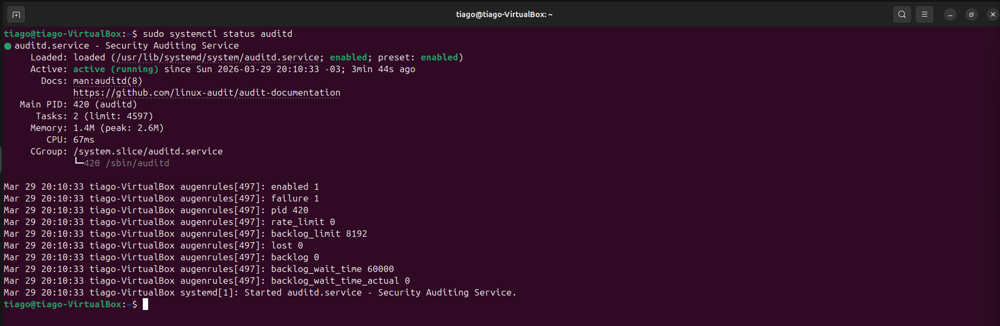
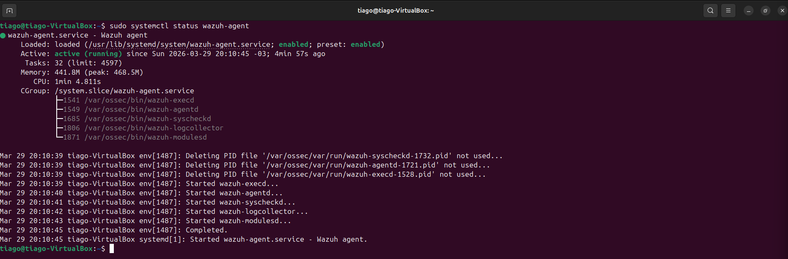
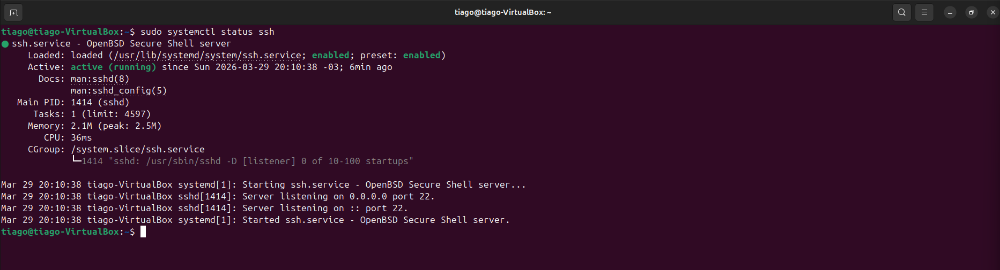

---

## ⚔️ Ataque Detectado

O SIEM identificou tentativa de brute force contra o serviço SSH.

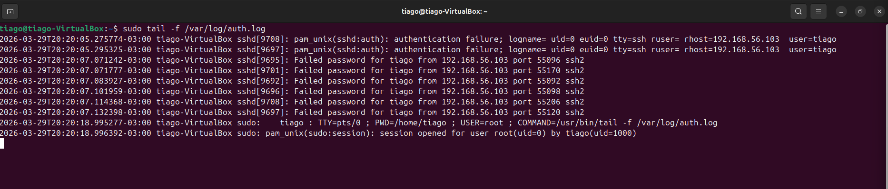

---

## 📊 Análise de Logs

Inicialmente, não houve sucesso nas tentativas de login:

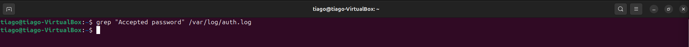

Porém, foi identificado um fator crítico:

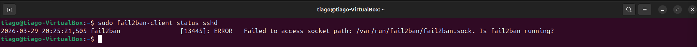

👉 Fail2ban inativo = ausência de bloqueio automático

Isso permite continuidade do ataque.

---

## 🚨 Comprometimento

Após múltiplas tentativas, o atacante conseguiu acesso válido ao sistema:

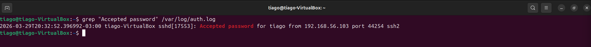

Isso confirma comprometimento do host.

---

## 🧠 Pós-Exploração (Auditd)

Eventos do auditd mostram execução de comandos após o acesso:

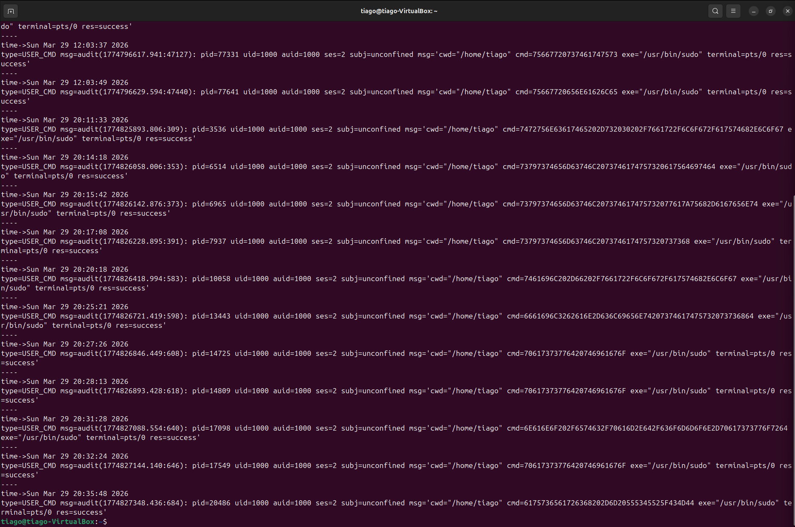

Decodificação dos comandos executados:

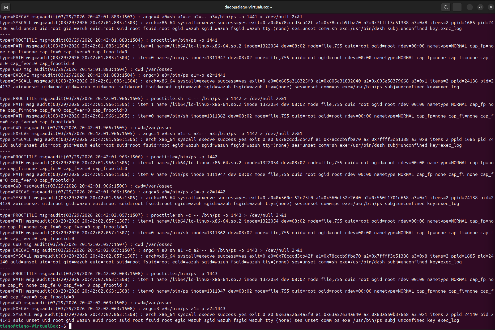

Comandos detectados:

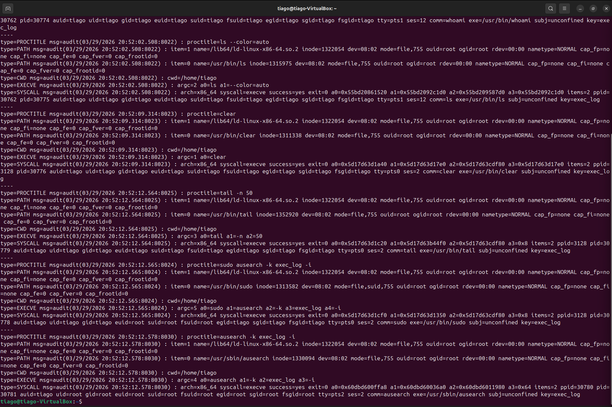

Análise:

- Enumeração do sistema
- Possível reconhecimento interno
- Preparação para persistência ou movimentação lateral

---

## 📡 Correlação no SIEM (Wazuh)

Detalhes do evento no Wazuh:

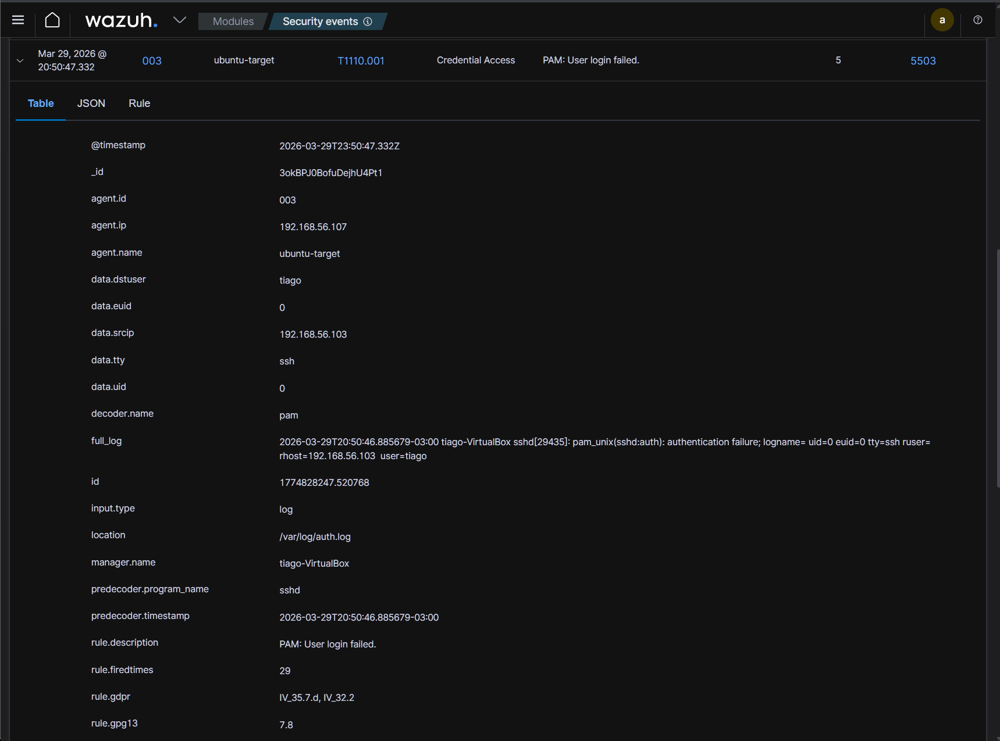

Correlação:

- Tentativas de brute force
- Login bem-sucedido
- Execução de comandos

---

## 🧠 Análise SOC

O incidente evidencia uma cadeia completa de ataque:

1. Tentativa de brute force  
2. Falha no mecanismo de defesa (Fail2ban inativo)  
3. Acesso inicial obtido  
4. Execução de comandos no sistema  
5. Atividade pós-comprometimento  

Fatores críticos:

- Defesa inativa permitiu sucesso do ataque  
- Atacante conseguiu acesso legítimo (valid account)  
- Execução de comandos indica controle do sistema  

Impacto:

- Comprometimento total do host  
- Risco de movimentação lateral  
- Possível exfiltração de dados  

Objetivo do atacante:

- Obter acesso inicial  
- Explorar o sistema internamente  

Conclusão:

Incidente crítico com falha de defesa e comprometimento confirmado.

---

## 🚨 Classificação

Malicioso — acesso não autorizado com execução de comandos no sistema.

---

## 🛡️ Mitigação

Ações recomendadas:

- Ativar e configurar Fail2ban  
- Bloquear IP atacante  
- Resetar credenciais comprometidas  
- Implementar autenticação por chave SSH  
- Monitoramento contínuo via SIEM  

---

## 🧬 MITRE ATT&CK

- T1110 — Brute Force  
- T1078 — Valid Accounts  
- T1059 — Command Execution  
- TA0001 — Initial Access  
- TA0002 — Execution  

---

## 🧠 Habilidades Demonstradas

- Análise de logs Linux (auth.log, auditd)  
- Detecção de brute force  
- Identificação de falha de defesa  
- Correlação de eventos (SIEM + host)  
- Investigação de pós-exploração  
- Classificação de incidente  
- Resposta a incidente  

---

## 📌 Conclusão

Este laboratório demonstra um cenário realista onde uma falha de configuração de segurança (Fail2ban inativo) permitiu a evolução de um ataque de brute force até o comprometimento completo do sistema.

A análise reforça a importância de:

- Controles de defesa ativos  
- Monitoramento contínuo  
- Correlação de eventos  
- Resposta rápida a incidentes  

---

## 📬 Contato

Aberto a oportunidades em SOC / NOC / Cybersecurity Jr.

- LinkedIn: https://www.linkedin.com/in/tiago-krysiaki  
- Email: t.krysiaki91@gmail.com  
