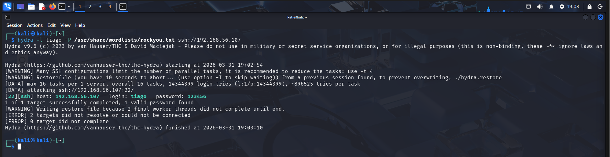
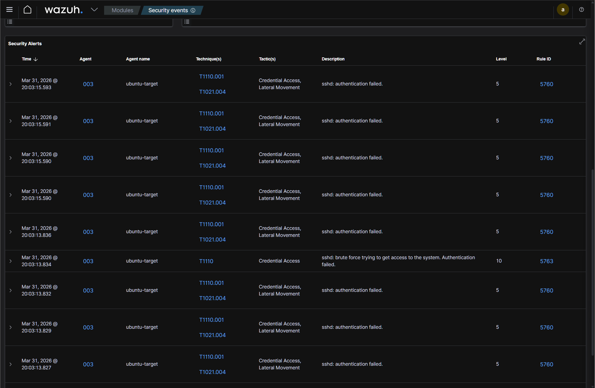
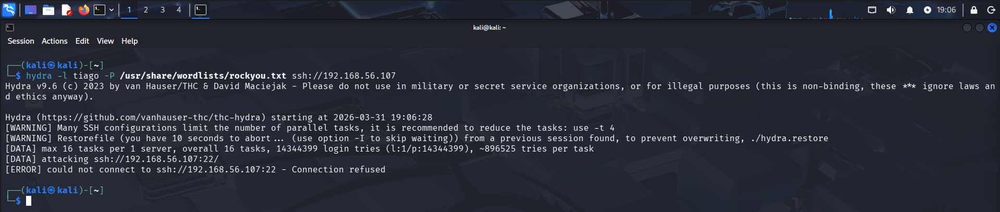

# 🔥 SSH Brute Force Detection & Response (Wazuh + Fail2ban)

---

## 📌 Visão Geral

Este laboratório simula um **ataque real de força bruta via SSH** e demonstra o fluxo completo de um SOC:

- Simulação de ataque com Hydra  
- Coleta e análise de logs via Wazuh (SIEM)  
- Detecção de múltiplas falhas de autenticação  
- Comprometimento de credenciais  
- Resposta automática com Fail2ban (bloqueio de IP)  

---

## 🧪 Ambiente do Lab

- Atacante: Kali Linux (`kali-attacker`)  
- Alvo: Ubuntu (`ubuntu-target`)  
- SIEM: Wazuh (`wazuh-siem`)  

---

## 🚨 Simulação de Ataque

Foi executado um ataque de brute force utilizando Hydra:
```
hydra -l tiago -P /usr/share/wordlists/rockyou.txt ssh://192.168.56.107
```

---

## 🔎 Resultado do Ataque

O ataque realizou diversas tentativas até encontrar uma credencial válida:

```
login: tiago password: 123456
```

---

## 🔎 Resultado do Ataque

O ataque realizou diversas tentativas até encontrar uma credencial válida:

```login: tiago password: 123456```


👉 O atacante obteve acesso válido ao sistema.

---

## 🚨 Comprometimento Identificado

O ataque foi bem-sucedido, resultando na descoberta de credenciais válidas:

- Usuário: tiago
- Senha: 123456

👉 Isso caracteriza acesso não autorizado ao sistema.

---

## 🔍 Detecção no SIEM (Wazuh)

O Wazuh detectou múltiplas falhas de autenticação:

- sshd: authentication failed
- Correlação de eventos de brute force
- Alerta crítico disparado (Level 10)



---

## 🔗 Correlação de Eventos
- Hydra executa múltiplas tentativas de login
- auth.log registra falhas consecutivas
- Wazuh correlaciona eventos e gera alerta
- Credencial válida é identificada
- Fail2ban bloqueia o IP atacante

👉 Cadeia completa: ataque → detecção → comprometimento → resposta

---

## 🧠 Análise SOC

O padrão de autenticação indica um ataque automatizado de brute force, caracterizado por múltiplas tentativas de login em curto intervalo de tempo.

A sequência dos eventos demonstra:

- Tentativas consecutivas de autenticação falhada (auth.log)
- Correlação e geração de alerta no Wazuh (Level 10)
- Identificação de comportamento anômalo baseado em volume e frequência
- Sucesso na autenticação com credencial válida

Impacto:

O ataque resultou em acesso não autorizado ao sistema, permitindo potencial execução de comandos, persistência e movimentação lateral.

Conclusão:

👉 Ataque de brute force bem-sucedido, com comprometimento confirmado do sistema.

---

## 🧬 MITRE ATT&CK
- T1110 — Brute Force
- T1021.004 — Remote Services (SSH)

---

## 🛡️ Resposta a Incidente

Ações executadas:
- Bloqueio automático do IP atacante (Fail2ban)
- Interrupção imediata do ataque
- Redução da superfície de ataque

Ações recomendadas:
- Reset da credencial comprometida
- Implementação de autenticação por chave SSH
- Desativação de login por senha
- Monitoramento contínuo via SIEM

---

🚫 Resultado da Mitigação

Após nova tentativa de ataque:

```Connection refused```
👉 O IP atacante foi bloqueado na camada de rede.



---

## 🔎 Interpretação Técnica

- Antes: tentativas atingiam o serviço SSH (application layer)
- Depois: conexão bloqueada antes do serviço (network layer)

👉 Indica atuação efetiva de mecanismo de defesa (IPS)

---

⚠️ Classificação do Incidente

- Tipo: Brute Force Attack
- Severidade: Alta
- Impacto: Comprometimento de credenciais
- Status: Mitigado automaticamente

---

## 🔐 Medidas de Segurança
- Implementação de Fail2ban
- Limitação de tentativas de login
- Uso de autenticação por chave SSH
- Restrição de acesso por IP

---

## 🧠 Habilidades Demonstradas

- Análise de logs Linux (auth.log)
- Monitoramento com SIEM (Wazuh)
- Detecção de ataques brute force
- Correlação de eventos
- Investigação de incidente
- Resposta automatizada (Fail2ban)
- Hardening de serviços

---

## 📌 Conclusão

O laboratório demonstra um cenário realista onde um ataque de brute force evolui até o comprometimento do sistema.

A análise evidencia a importância de:

- Monitoramento contínuo
- Correlação de eventos
- Resposta automatizada
- Controles de autenticação robustos

---

📬 Contato

Aberto a oportunidades em SOC / NOC / Cybersecurity Jr.

- LinkedIn: https://www.linkedin.com/in/tiago-krysiaki
- Email: t.krysiaki91@gmail.com


