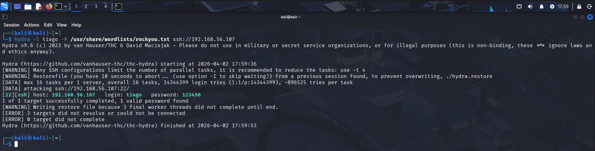
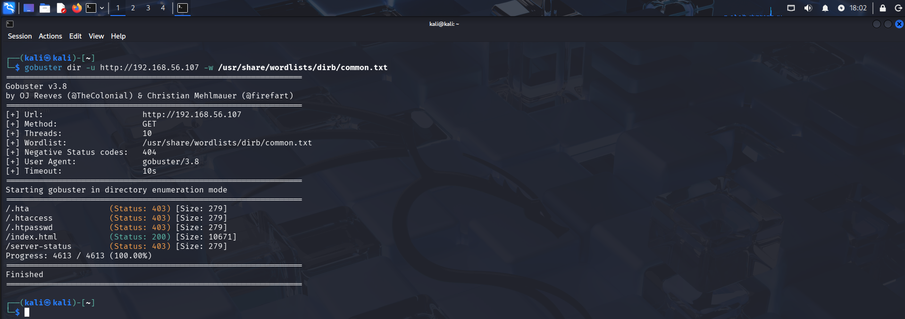
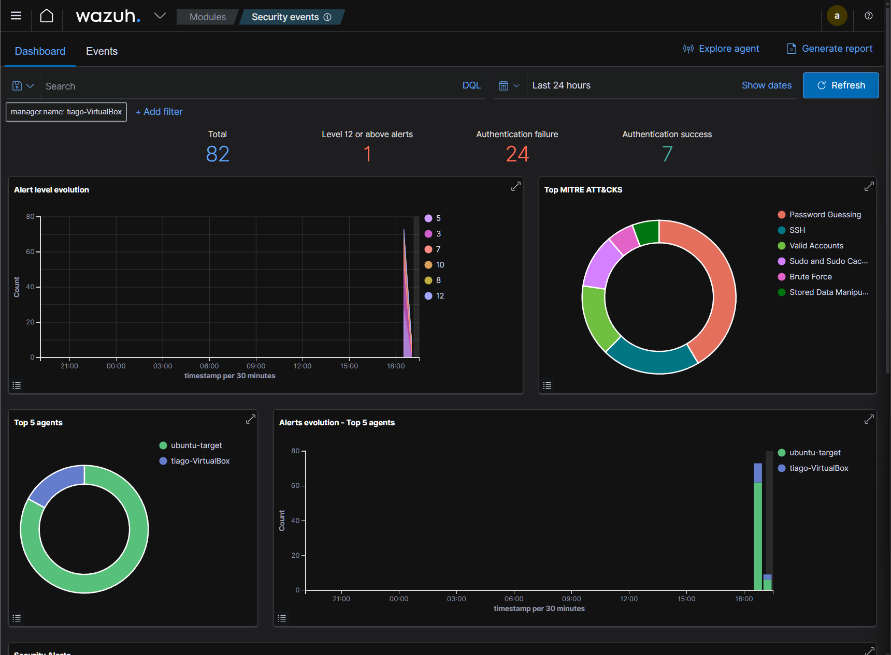
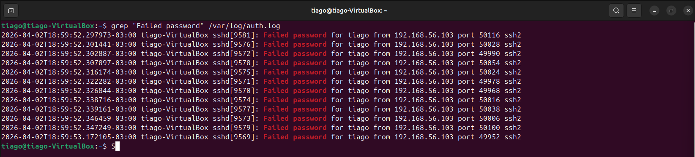
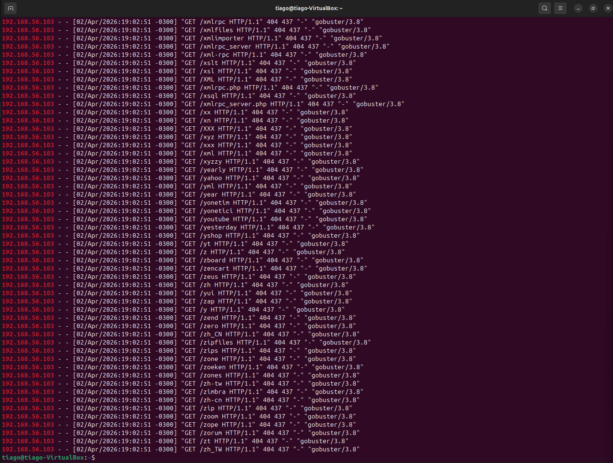
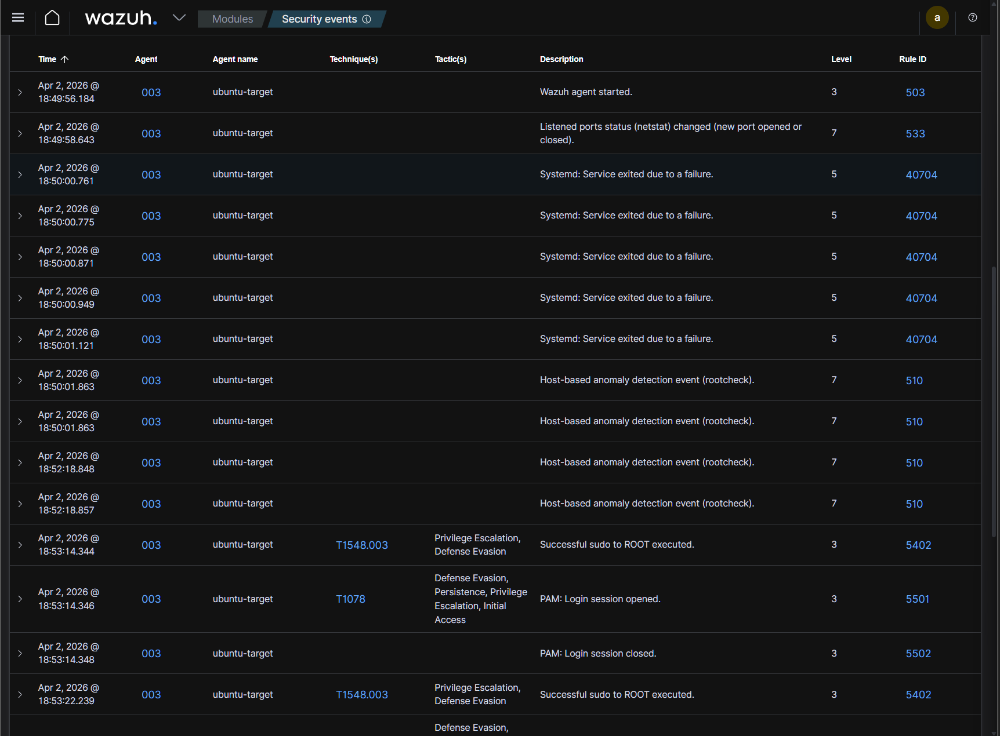
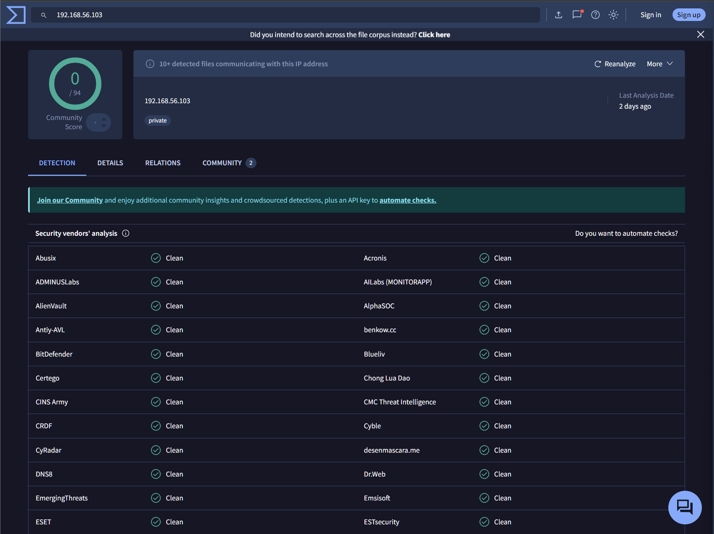
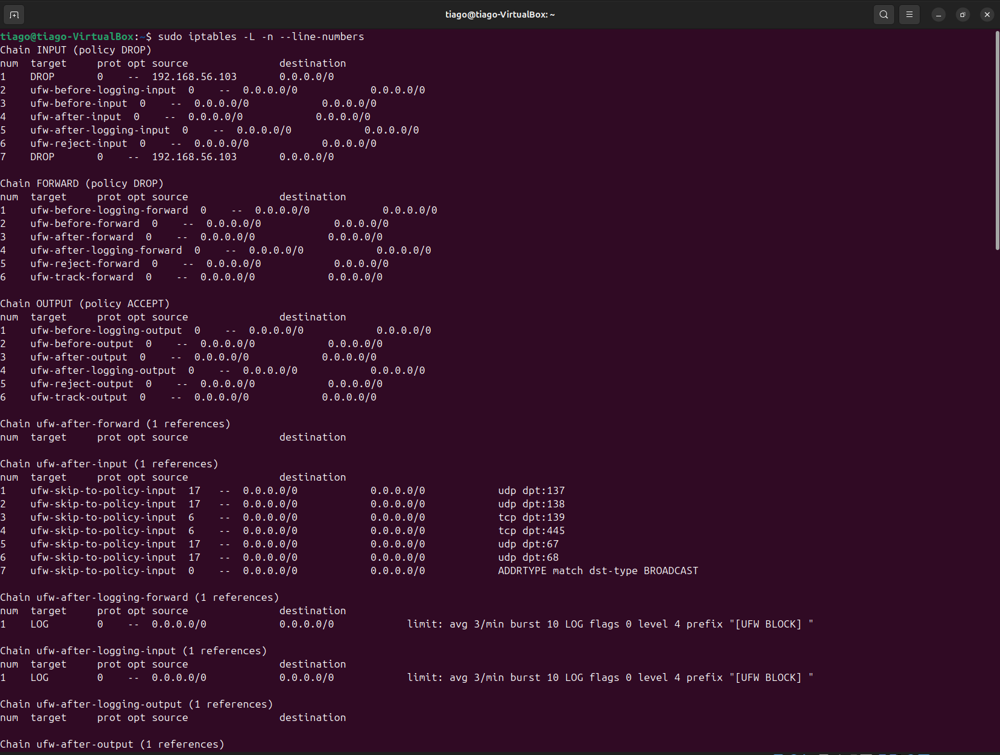
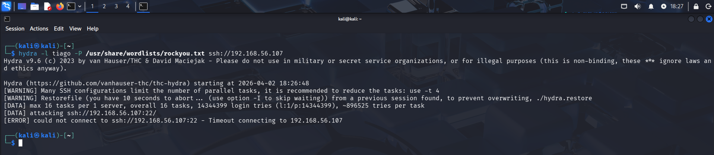
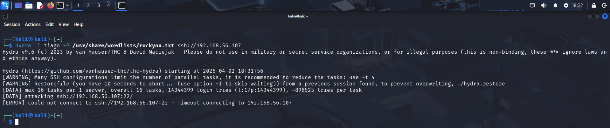

# 🔥 Lab 21 — Detecção, Correlação e Resposta Automática a Ataque SSH + Recon Web com Wazuh

---

## 📌 Resumo Executivo

Foi identificado um ataque coordenado originado do IP **192.168.56.103**, combinando brute force SSH e enumeração web.  
A correlação de eventos permitiu identificar comportamento malicioso e aplicar bloqueio automático via Wazuh, interrompendo o ataque em tempo real.

---

## 🎯 Visão Geral

Este laboratório simula um cenário real de SOC, onde um atacante tenta:

- Obter acesso via força bruta (SSH)
- Mapear a aplicação web (recon)

O objetivo é executar o ciclo completo de resposta a incidente:
**Detecção → Investigação → Correlação → Resposta**

---

## 🧱 Ambiente

| Máquina | Função |
|--------|--------|
| Kali   | Atacante |
| Ubuntu | Alvo |
| Wazuh  | SIEM |

---

## 🚨 Ataque

### 🔴 Hydra (Brute Force SSH)

```
hydra -l tiago -P /usr/share/wordlists/rockyou.txt ssh://192.168.56.107
```
### 📌 O que aconteceu:

- Tentativas massivas de login
- Alto volume em curto tempo
- Padrão claro de brute force


---

## 🔴 Gobuster (Recon Web)
```
gobuster dir -u http://192.168.56.107 -w /usr/share/wordlists/dirb/common.txt
```

### 📌 O que aconteceu:

- Requisições automatizadas
- Múltiplos caminhos testados
- Respostas 404 em sequência


---

## 🔍 Detecção (Wazuh)

O Wazuh identificou:

- Falhas de autenticação SSH
- Tentativas repetidas
- Eventos anômalos de acesso web


### 📌 Análise SOC:

- Volume + repetição = ataque automatizado
- Regra de brute force acionada

---

## 🕵️ Investigação
### 🔹 SSH (auth.log)
```
sudo grep "Failed password" /var/log/auth.log
```


### 📌 Análise:

- Campo "from" revela IP atacante
- Padrão repetitivo confirma brute force

### ➡️ IP: 192.168.56.103

### 🔹 Web (access.log)
```
sudo cat /var/log/apache2/access.log | grep 192.168.56.103
```


### 📌 Análise:

- User-Agent: gobuster
- Muitas requisições em sequência
- Enumeração automatizada

---

## 🔗 Correlação

Mesmo IP em:

- SSH brute force
- Web recon

### 📌 Conclusão:
➡️ Ataque coordenado multi-vetor

---

## 🧠 Timeline


### 📌 Interpretação:

1. Falhas SSH iniciam
2. Volume aumenta
3. Recon web começa
4. Login ocorre
5. Uso de sudo
6. Bloqueio

➡️ Ataque evoluiu até acesso

---

## 🧪 Enriquecimento


### 📌 Resultado:

- IP privado
- Sem reputação externa

### ➡️ Conclusão:
Malicioso no contexto interno

---

## 🎯 Classificação
- Tipo: Brute Force + Recon + Initial Access
- Severidade: Média

### MITRE:

- T1110
- T1046
- T1078

---

## ⚠️ Impacto
- Comprometimento de credenciais
- Acesso inicial ao sistema
- Possível escalonamento
- Risco lateral

--- 

## 🧠 Decisão do Analista

Diante da correlação:

- Ataque confirmado
- Alto risco de persistência

### ➡️ Ação:
**bloqueio imediato do IP**

---

## 🛡️ Resposta
### 🔹 Manual
```
sudo iptables -I INPUT 1 -s 192.168.56.103 -j DROP
```


### 📌 Análise:

- Regra no topo = prioridade máxima

### 🔹 Validação
```
hydra -l tiago -P /usr/share/wordlists/rockyou.txt ssh://192.168.56.107
```


### 📌 Resultado:

- Timeout
- Conexão negada

### ➡️ Ataque contido

### 🔹 Automação (Wazuh)
```
<active-response>
  <command>firewall-drop</command>
  <location>local</location>
  <level>10</level>
</active-response>

```

### 📌 Resultado:

- Bloqueio automático
- Sem intervenção humana

---

## 🔐 Melhorias
- pfSense (bloqueio na rede)
- MFA SSH
- Hardening SSH
- Regras customizadas
- Threat Intel

---

## 📊 Conclusão

Este lab reproduz um cenário real de SOC:

✔️ Detecção
✔️ Investigação
✔️ Correlação
✔️ Resposta
✔️ Automação

### ➡️ Nível profissional real

---

## 🧠 Skills
- Análise de logs
- SIEM (Wazuh)
- Incident response
- Correlação
- Firewall
- Detection engineering

---

📬 Contato

LinkedIn: https://www.linkedin.com/in/tiago-krysiaki

Email: t.krysiaki91@gmail.com


