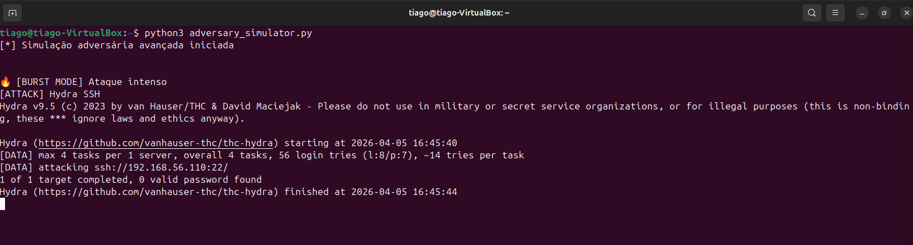
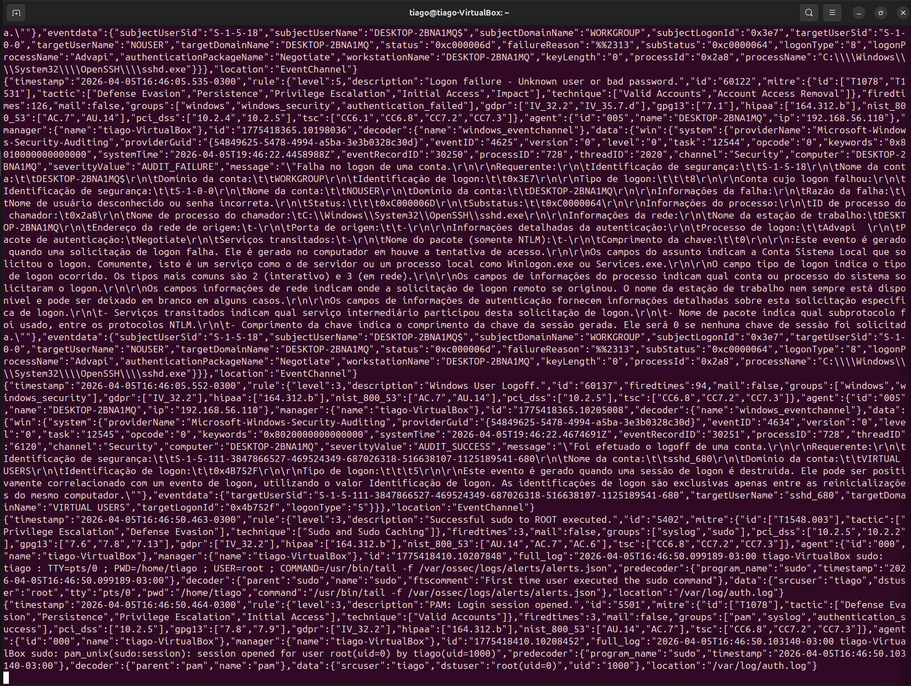
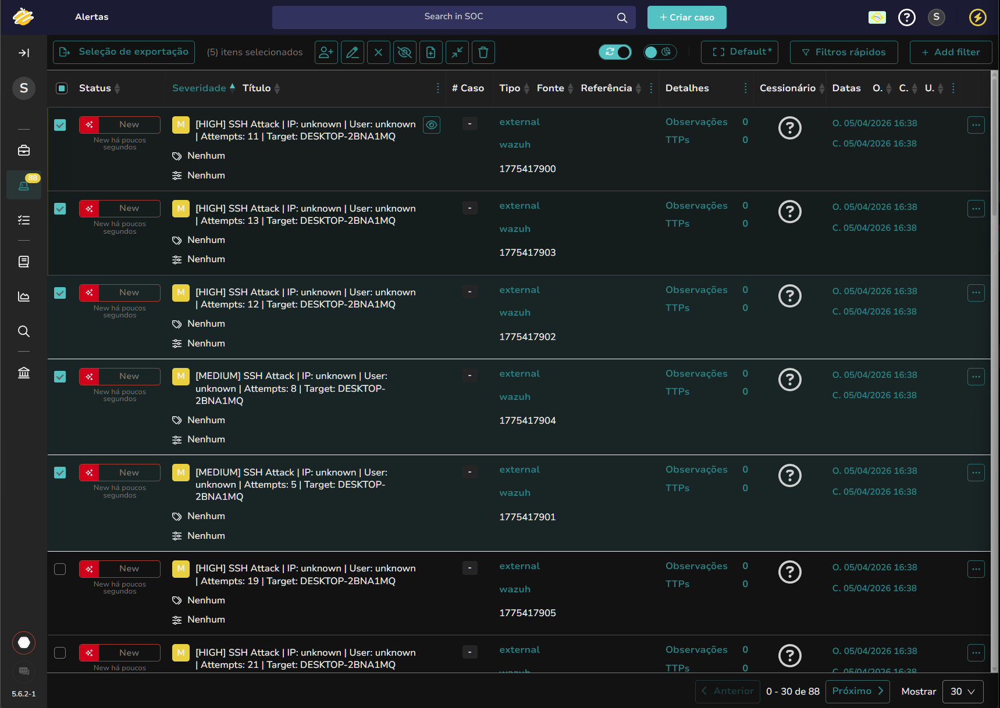
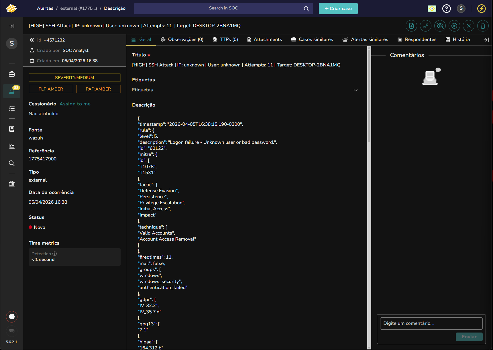
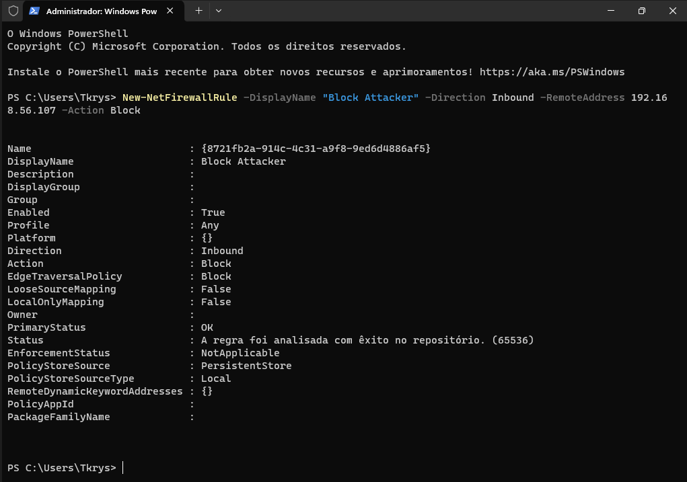
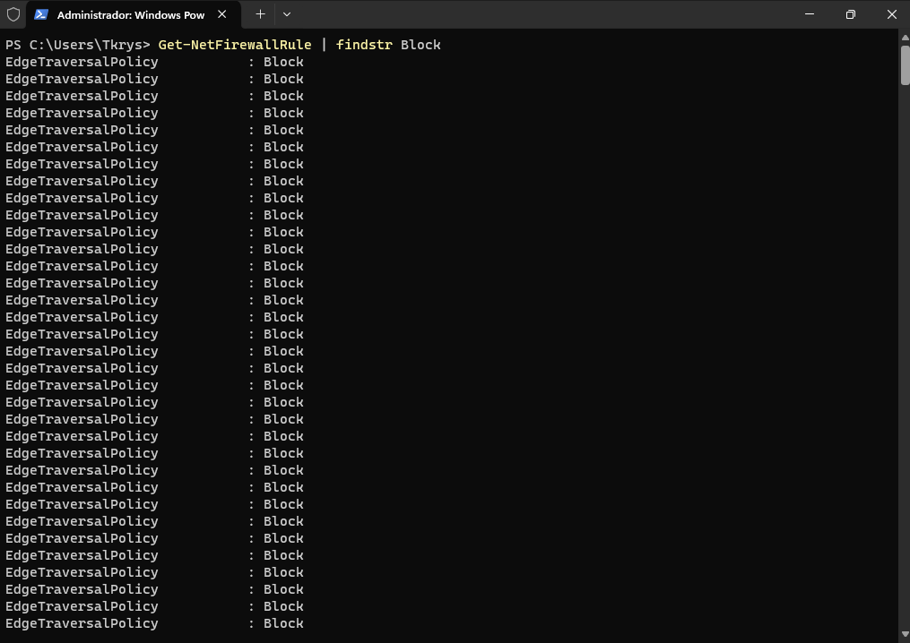
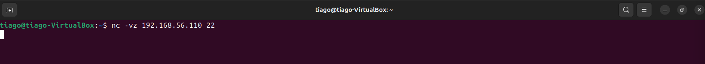

# 🔐 Lab SOC - Detecção e Resposta a Brute Force SSH (Wazuh + TheHive)

---

## 📌 Visão Geral

Este laboratório simula um cenário real de SOC (Security Operations Center), onde um ataque de força bruta via SSH é executado, detectado, analisado e mitigado.

## Fluxo completo:

Ataque → Detecção → Alerta → Análise → Resposta → Validação


---

## 🖥️ Ambiente do Laboratório

| Componente | Função |
|-----------|--------|
| Ubuntu (Attacker) | Execução do ataque automatizado |
| Windows (Target) | Máquina alvo com SSH habilitado |
| Wazuh Server | SIEM (detecção e correlação) |
| TheHive | Gestão de incidentes |

---

## ⚔️ Simulação de Ataque

Foi utilizado um script automatizado simulando comportamento real de atacante:

- Hydra (Brute Force SSH)
- Nmap (Recon)
- Feroxbuster (Web enum)
- Netcat (Banner grabbing)
- Modos: Burst + Stealth

### Execução do ataque

```
python3 adversary_simulator.py
```


### Análise SOC

Múltiplas tentativas de login em curto intervalo indicam automação e possível brute force.

---

## 🔎 Detecção (Wazuh)

O Wazuh identificou eventos de falha de autenticação:

- Event ID: 4625
- Regra: authentication_failed
- Frequência elevada (firedtimes)



### Análise SOC
- Diversas falhas consecutivas
- Usuário inválido
- Padrão repetitivo

➡️ Indício claro de brute force

---

## 🚨 Alerta (TheHive)

O alerta foi automaticamente enviado ao TheHive:

- Severidade: HIGH
- Fonte: Wazuh
- Tipo: SSH Attack


---

## 🧠 Análise do Alerta

Detalhamento do evento:



Classificação
- Tipo: Brute Force SSH
- Severidade: HIGH
- Status: Malicioso


MITRE ATT&CK
- T1078 – Valid Accounts

Evidências
- Attempts > 10
- Falha de autenticação
- Comportamento automatizado

---

## 🛡️ Resposta (Containment)

Bloqueio do IP atacante no Windows:
```
New-NetFirewallRule -DisplayName "Block Attacker" -Direction Inbound -RemoteAddress 192.168.56.110 -Action Block
```


### Análise SOC

Ação de contenção aplicada para interromper tentativa de acesso não autorizado.

---

## 📋 Verificação da Regra

Confirmação da regra no firewall:
```
Get-NetFirewallRule | findstr Block
```


---

## ✅ Validação

Teste de conectividade após bloqueio:
```
nc -vz 192.168.56.110 22
```


Resultado
- Timeout na conexão
- Firewall realizando DROP

➡️ Contenção validada com sucesso

---

## 🧠 Conclusão

Este laboratório demonstra um ciclo completo de resposta a incidentes em um ambiente SOC:

- Detecção de ataque real
- Correlação de eventos
- Análise baseada em evidências
- Resposta ativa
- Validação técnica

---

## 🚀 Skills Desenvolvidas

- Análise de logs (Windows / SSH)
- SIEM (Wazuh)
- Incident Response (TheHive)
- Detecção de brute force
- Firewall (Windows)
- Validação de contenção

---

📬 Contato

LinkedIn: https://www.linkedin.com/in/tiago-krysiaki

Email: t.krysiaki91@gmail.com


