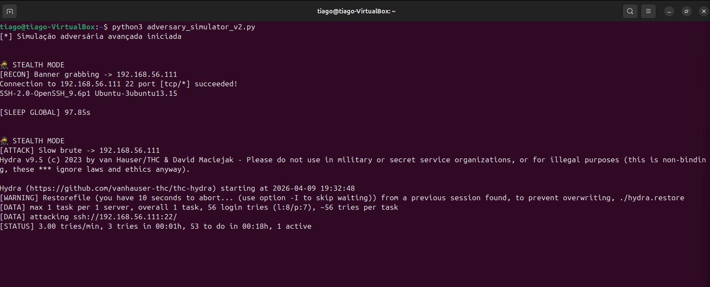
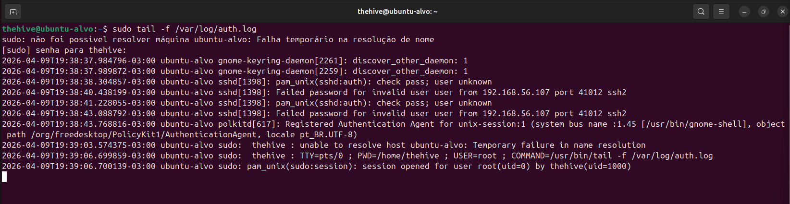
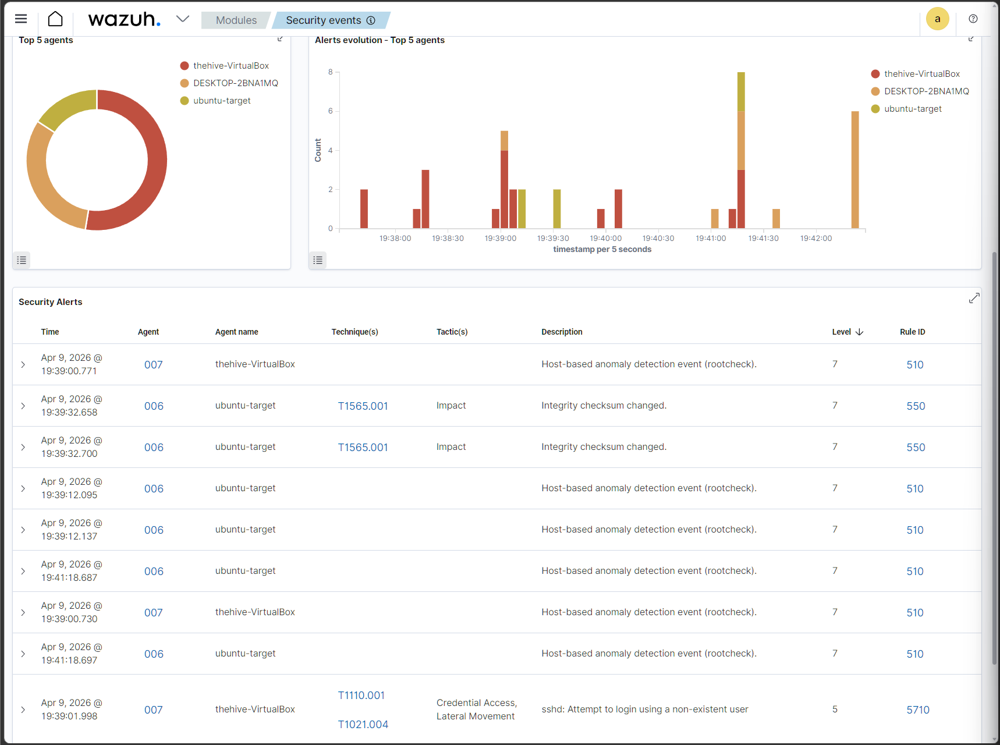
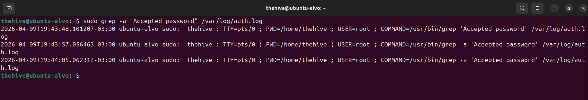
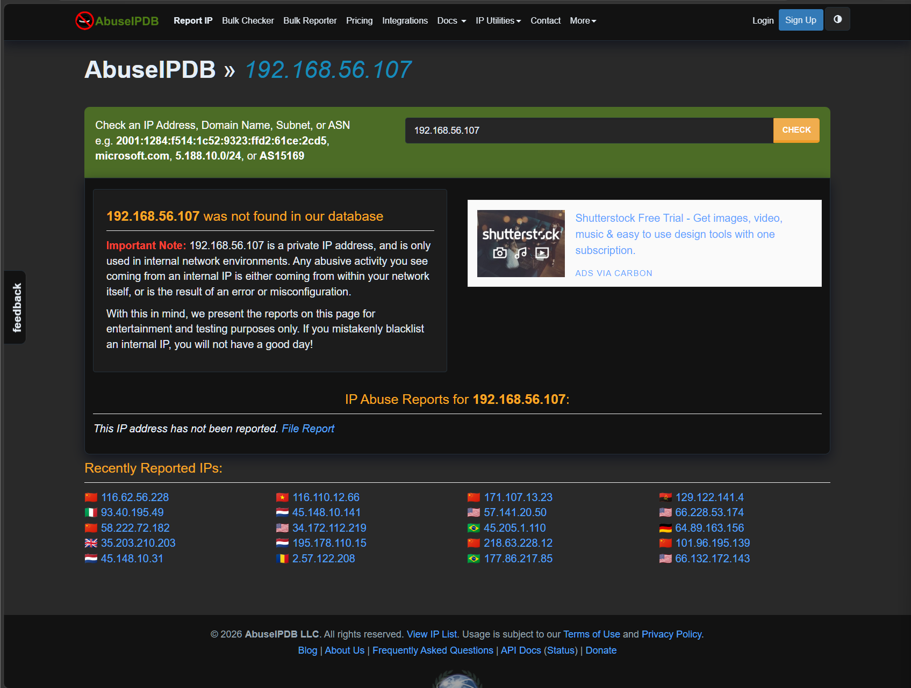
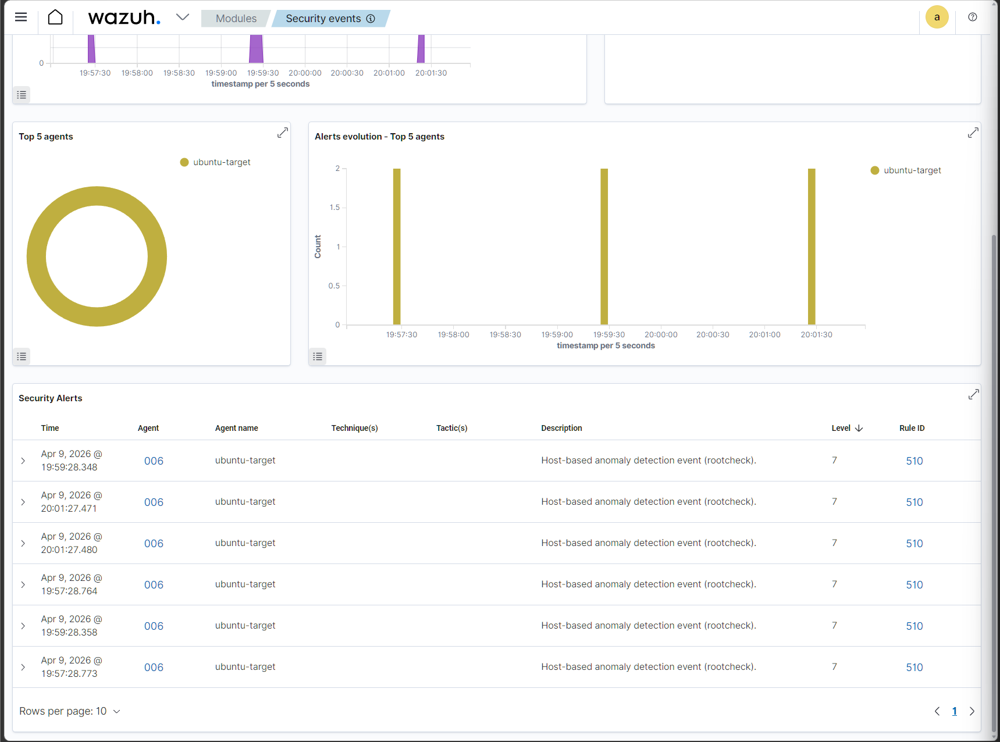
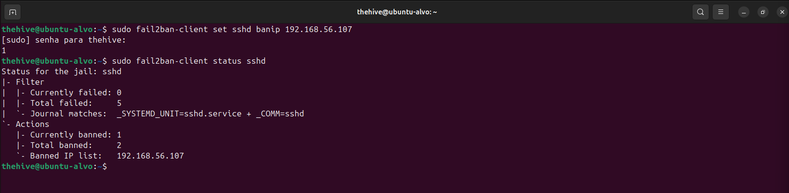
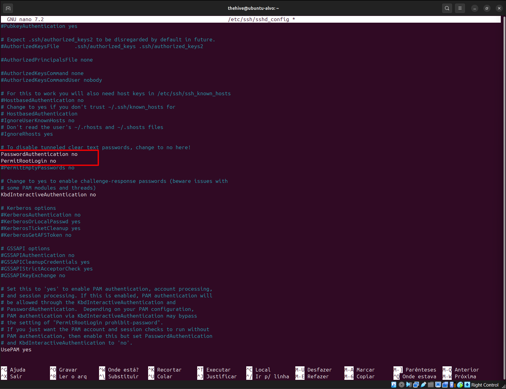

# 🚨 Detecção e Resposta a Brute Force SSH com Correlação e Threat Intelligence

## 📌 Visão Geral

Este laboratório simula um ataque real de brute force SSH em ambiente interno, seguido de investigação completa em um cenário SOC, incluindo:

- Detecção via logs e SIEM (Wazuh)
- Correlação de eventos
- Enriquecimento com Threat Intelligence
- Classificação do incidente
- Resposta e mitigação

---

## 🧪 Lab Environment
- Atacante: Ubuntu (script automatizado)
- Alvo: Ubuntu (SSH ativo)
- SIEM: Wazuh
- Defesa: Fail2ban
- Logs: `/var/log/auth.log`

---

## ⚔️ Simulação de Ataque

O ataque foi executado via script automatizado simulando comportamento stealth.

```
python3 adversary_simulator_v2.py
```

### 🧠 Explicação
- Executa recon + brute force
- Baixa taxa de tentativas → evasão de detecção
- Simula atacante real (não ruidoso)



---

## 🔎 Investigação — Logs Linux

Monitoramento em tempo real:

```
sudo tail -f /var/log/auth.log
```

### 🧠 Análise SOC
- múltiplos Failed password
- invalid user → enumeração
- mesmo IP repetidamente

👉 Indício claro de brute force



---

## 🛡️ Detecção no SIEM (Wazuh)

### Alerta identificado:
- Regra: 5710
- Técnica: T1110.001 (Password Guessing)

### 🧠 Análise
- Tentativa com usuário inexistente
- Ataque em fase inicial



---

## 🔍 Verificação de Comprometimento
```
sudo grep -a "Accepted password" /var/log/auth.log
```

### 🧠 Resultado
- ❌ Nenhum acesso bem-sucedido
- ✔️ Apenas tentativas falhas

👉 Ataque não comprometeu o sistema



---

## 🌐 Threat Intelligence

### IP analisado:

```192.168.56.107```

Consulta em AbuseIPDB:

### 🧠 Resultado
- IP não listado
- Classificado como IP privado (interno)



---

## ⚠️ Análise Crítica

> Ataque não é externo → origem interna

### Isso indica:

- possível máquina comprometida
- movimento lateral
- risco elevado

---

## 📊 Correlação de Eventos

- Logs Linux → brute force
- Wazuh → alerta confirmado
- Threat Intel → IP interno

👉 Correlação multi-fonte validada



---

## 🚨 Classificação do Incidente
- Tipo: Brute Force SSH
- MITRE:
  - T1110 — Brute Force
  - T1110.001 — Password Guessing
  - T1046 — Network Discovery
- Origem: Interna
- Status: Sem sucesso
- Classificação: ✅ True Positive
- Severidade: 🔴 Alta

---

## 🛡️ Resposta (Containment)

### Bloqueio do atacante:
```
sudo fail2ban-client set sshd banip 192.168.56.107
```

### Verificação:
```
sudo fail2ban-client status sshd
```


---

## 🔐 Mitigação (Hardening SSH)

### Configuração aplicada:
```
PasswordAuthentication no
PermitRootLogin no
```

### Reinício do serviço:
```
sudo systemctl restart ssh
```



---

## 🧠 Análise Final (SOC)
- Ataque detectado em estágio inicial
- Sem comprometimento
- Origem interna aumenta criticidade
- Resposta rápida evitou impacto

---

## 🎯 Conclusão

Este laboratório demonstra um fluxo completo de atuação em SOC:

- Detecção → Investigação → Correlação → Classificação → Resposta

O diferencial não está apenas em identificar o ataque, mas em:

> correlacionar dados, validar impacto e tomar decisão baseada em evidência

---

## 🧠 Skills Desenvolvidas
- Análise de logs Linux
- Investigação de brute force
- Uso de SIEM (Wazuh)
- Threat Intelligence
- Correlação de eventos
- Resposta a incidentes
- Hardening de serviços

---

## 📬 Contato

LinkedIn: https://www.linkedin.com/in/tiago-krysiaki

Email: t.krysiaki91@gmail.com


