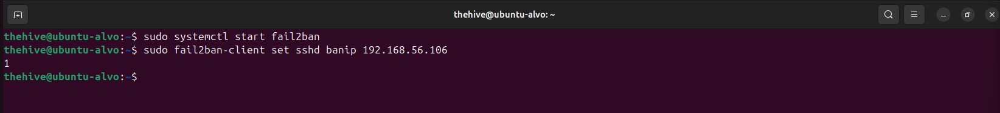
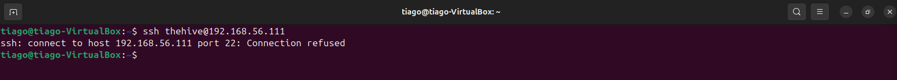
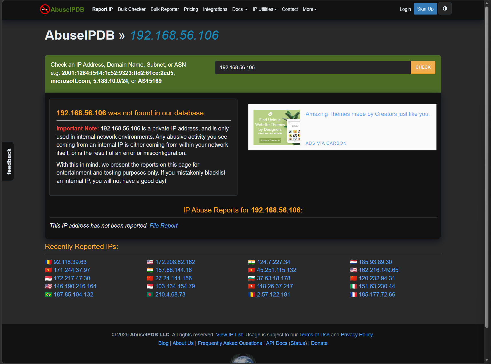
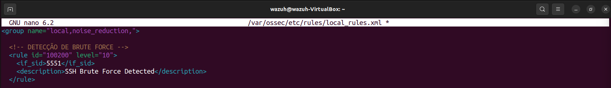

# 📄 README — LAB 24
## 📌 24 - Detecção e Resposta a Brute Force SSH com Wazuh, Wireshark e Fail2ban

---

## 🎯 Visão Geral

### Este laboratório simula um ataque de brute force SSH em ambiente controlado, com foco em:

- Detecção via logs e SIEM (Wazuh)
- Análise de tráfego de rede (Wireshark/tcpdump)
- Correlação de eventos
- Classificação SOC (TP/FP + severidade)
- Resposta automatizada (Fail2ban)
- Enriquecimento com threat intelligence

---

## 🧪 Ambiente
- Atacante: Ubuntu (192.168.56.106)
- Alvo: Ubuntu (192.168.56.111)
- SIEM: Wazuh
- Ferramentas:
  - Hydra
  - tcpdump
  - Wireshark
  - Fail2ban
 
---

## 🚨 Simulação do Ataque

### Ataque automatizado utilizando Hydra contra serviço SSH.


### O ataque gerou múltiplas tentativas de autenticação com diferentes usuários, simulando um cenário real de brute force.

---

## 🌐 Análise de Rede

### Captura de tráfego focada na porta 22 (SSH).


### 🔍 Evidências:
- Alto volume de conexões
- Mesmo IP origem
- Portas de origem variando
- Intervalos curtos

**👉 Padrão típico de ataque automatizado**

---

## 📊 Detecção no Wazuh

### Alerta gerado com base nos logs do sistema (/var/log/auth.log).


### 🔍 Informações relevantes:
- IP atacante identificado
- Serviço afetado: sshd
- Regra MITRE: T1110 (Brute Force)
- Múltiplas falhas de autenticação

---

## 🧾 Análise de Logs

### Investigação direta no auth.log.


### 🔍 Evidências:
- “Failed password” repetido
- Diversos usuários testados
- Mesmo IP atacante

**👉 Confirma tentativa de força bruta**

---

## 🔎 Validação de Comprometimento

### Verificação de logins bem-sucedidos:


```
sudo grep "Accepted password" /var/log/auth.log | grep "192.168.56.106" | wc -l
```


Resultado:
- 0 logins bem-sucedidos

**👉 Sistema não comprometido**

---

## 🧠 Classificação SOC
- Tipo: Brute Force SSH
- MITRE ATT&CK: T1110
- Classificação: True Positive (TP)
- Severidade: Média
- Impacto: Sem impacto direto, tentativa bloqueada antes de comprometimento  

---

## 🛡️ Resposta ao Incidente

### Bloqueio do IP atacante via Fail2ban.



### Ação executada:
```
sudo fail2ban-client set sshd banip 192.168.56.106
```

---

## 🚫 Validação do Bloqueio

### Teste de conexão após bloqueio:



### Resultado:
```Conexão recusada```

**👉 Mitigação efetiva**

---

## 🌍 Threat Intelligence

### Consulta do IP no AbuseIPDB:



### Resultado:
- IP privado (ambiente interno)
- Sem registros públicos

**👉 Cenário controlado (lab)**

---

## ⚙️ Detection Engineering (Wazuh)

### Criação de regra customizada para elevar severidade:



```
<rule id="100200" level="10">
  <if_sid>5551</if_sid>
  <description>SSH Brute Force Detected</description>
</rule>
```

### 📌 Objetivo:
- Reutilizar detecção existente (5551)
- Elevar prioridade para nível crítico
- Melhorar visibilidade no SOC

---

## 🔗 Timeline do Ataque
1. Início do brute force (Hydra)
2. Múltiplas tentativas SSH
3. Logs registrados (auth.log)
4. Detecção pelo Wazuh
5. Análise manual confirmando TP
6. Verificação de impacto (sem acesso)
7. Bloqueio do IP (Fail2ban)
8. Validação da mitigação

---

## 🎯 Conclusão

### Este laboratório demonstra um fluxo completo de operação SOC:

```Detecção → Análise → Correlação → Decisão → Resposta```

**O ataque foi corretamente identificado como True Positive, sem comprometimento do sistema, e mitigado com sucesso através de bloqueio automatizado.**

---

## 🧠 Habilidades Demonstradas
- Análise de logs Linux
- Investigação de tráfego de rede
- Correlação SIEM (Wazuh)
- Classificação de alertas SOC
- Resposta a incidentes
- Detection Engineering
- Uso de Threat Intelligence

--- 

## 📬 Contato

- LinkedIn: https://www.linkedin.com/in/tiago-krysiaki  
- Email: t.krysiaki91@gmail.com  

🎯 Buscando oportunidades em SOC / NOC (Segurança da Informação)


