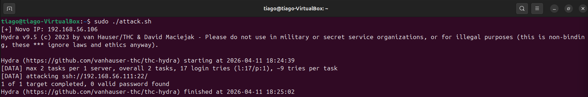
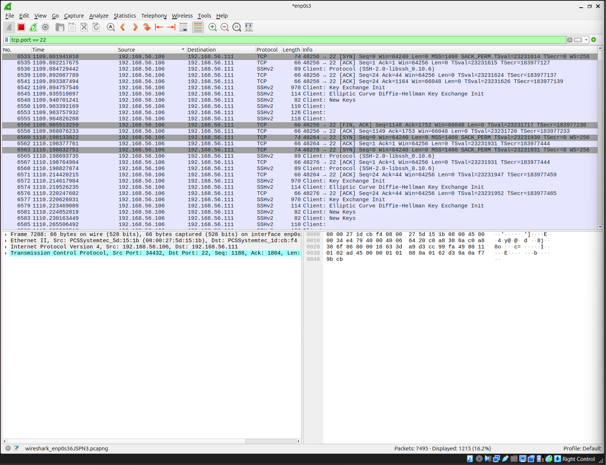
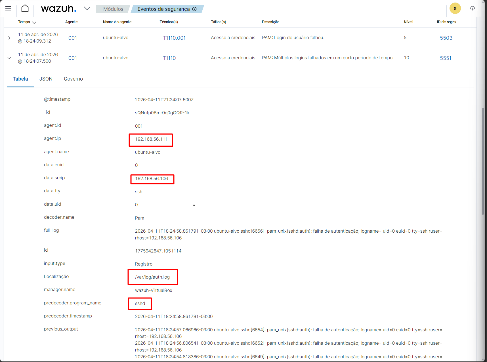
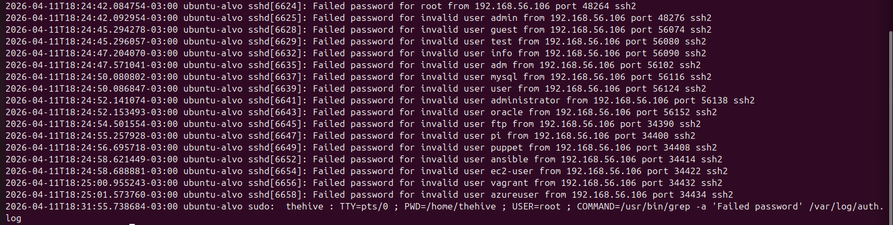
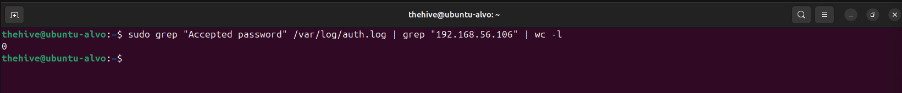

# 📄 README — LAB 24
## 📌 24 - Detecção e Resposta a Brute Force SSH com Wazuh, Wireshark e Fail2ban

---

## 🎯 Visão Geral

### Este laboratório simula um ataque de brute force SSH em ambiente controlado, com foco em:

- Detecção via logs e SIEM (Wazuh)
- Análise de tráfego de rede (Wireshark/tcpdump)
- Correlação de eventos
- Classificação SOC (TP/FP + severidade)
- Resposta automatizada (Fail2ban)
- Enriquecimento com threat intelligence

---

## 🧪 Ambiente
- Atacante: Ubuntu (192.168.56.106)
- Alvo: Ubuntu (192.168.56.111)
- SIEM: Wazuh
- Ferramentas:
  - Hydra
  - tcpdump
  - Wireshark
  - Fail2ban
 
---

## 🚨 Simulação do Ataque

### Ataque automatizado utilizando Hydra contra serviço SSH.



### O ataque gerou múltiplas tentativas de autenticação com diferentes usuários, simulando um cenário real de brute force.

---

## 🌐 Análise de Rede

### Captura de tráfego focada na porta 22 (SSH).



### 🔍 Evidências:
- Alto volume de conexões
- Mesmo IP origem
- Portas de origem variando
- Intervalos curtos

> 👉 Padrão típico de ataque automatizado

---

## 📊 Detecção no Wazuh

### Alerta gerado com base nos logs do sistema (/var/log/auth.log).



### 🔍 Informações relevantes:
- IP atacante identificado
- Serviço afetado: sshd
- Regra MITRE: T1110 (Brute Force)
- Múltiplas falhas de autenticação

---

## 🧾 Análise de Logs

### Investigação direta no auth.log.



### 🔍 Evidências:
- “Failed password” repetido
- Diversos usuários testados
- Mesmo IP atacante

> 👉 Confirma tentativa de força bruta

---

## 🔎 Validação de Comprometimento

### Verificação de logins bem-sucedidos:


```

sudo grep "Accepted password" /var/log/auth.log | grep "192.168.56.106" | wc -l

```

Resultado:
- 0 logins bem-sucedidos

> 👉 Sistema não comprometido

---


