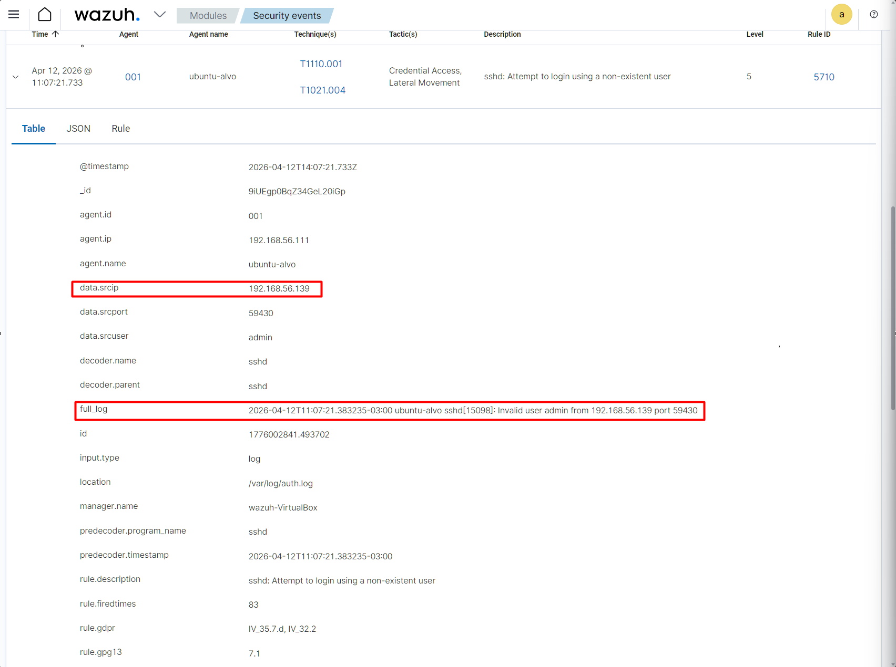
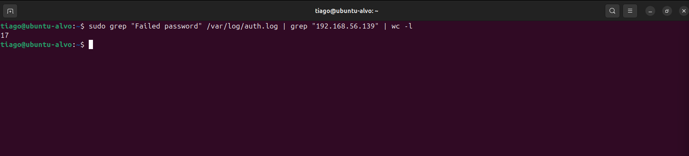
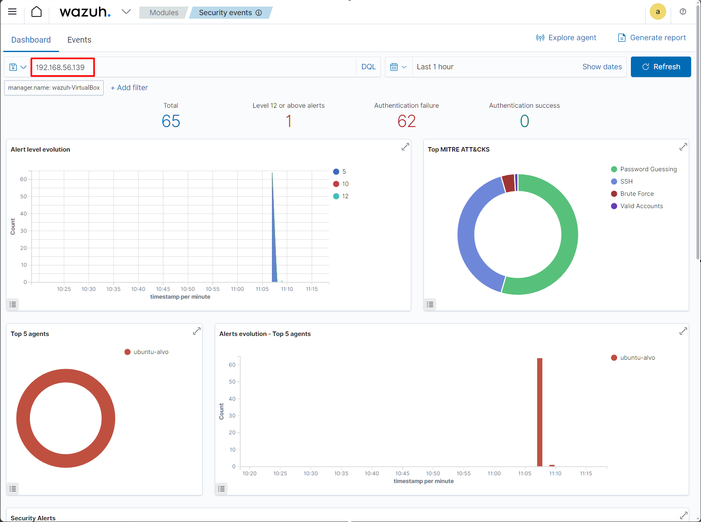
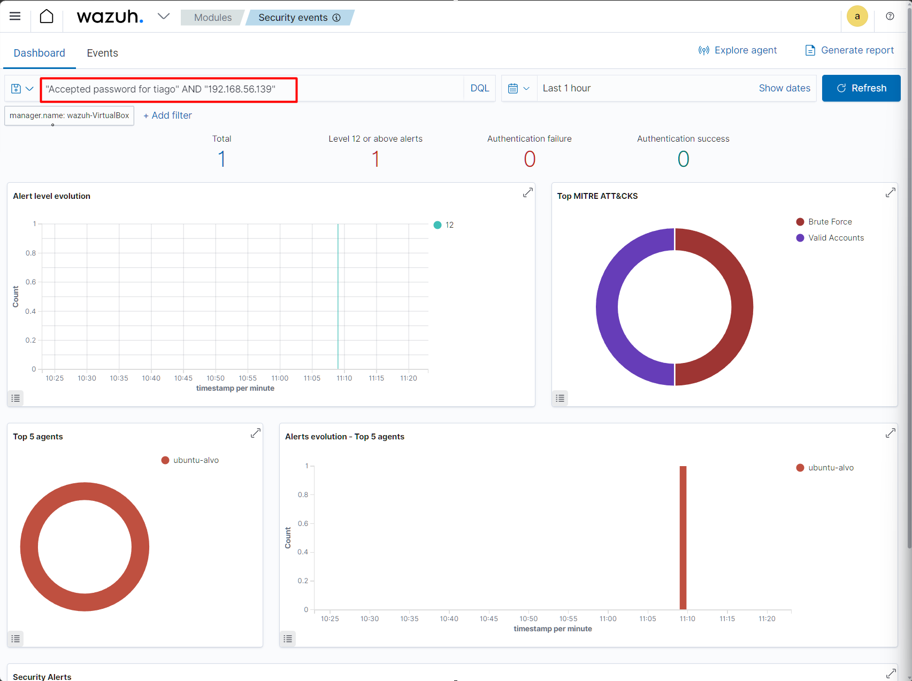

# 🚨 Detecção e Resposta a Brute Force SSH com Persistência (Wazuh + Fail2ban)
## 📌 Visão Geral

### Este laboratório simula um ataque de brute force SSH com sucesso, seguido de criação de persistência (backdoor) no sistema.
A análise foi conduzida como um cenário real de SOC, incluindo detecção, correlação, investigação, resposta e remediação.

---

## 🖥️ Ambiente
- Atacante: 192.168.56.139
- Alvo: Ubuntu (host: tiago)
- SIEM: Wazuh
- Defesa: Fail2ban

---

## 🎯 Simulação do Ataque

### O atacante executou múltiplas tentativas de login via SSH até obter sucesso.

 

---

## 🔍 Detecção e Correlação

### O Wazuh identificou comportamento suspeito e correlacionou eventos de falha com login bem-sucedido.

 

---

