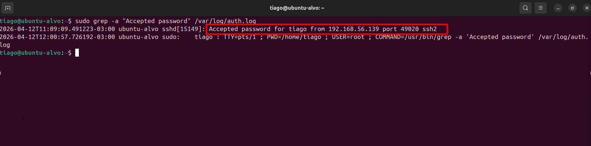
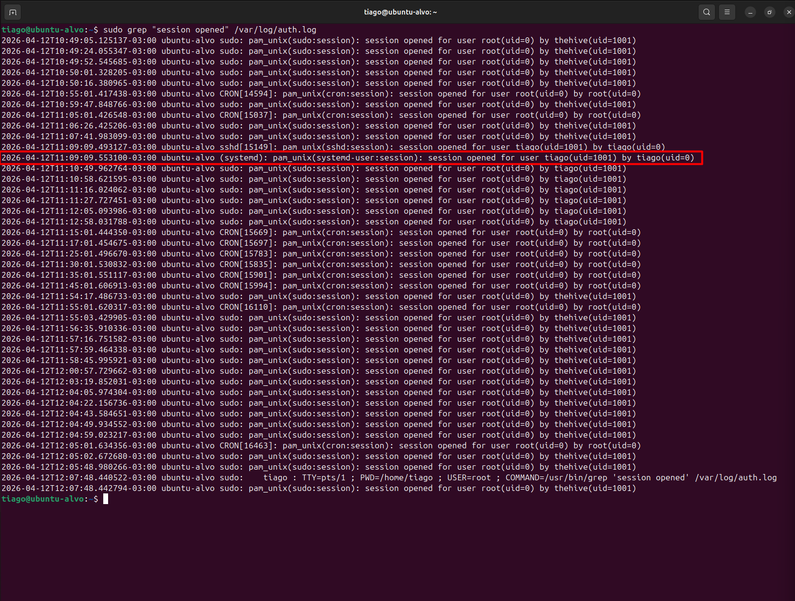
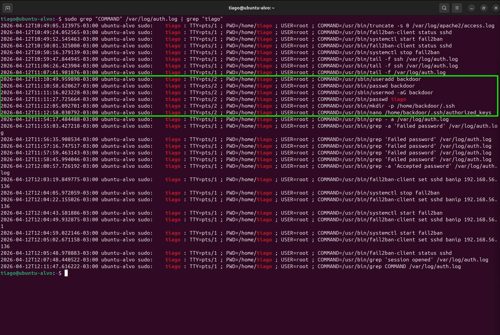
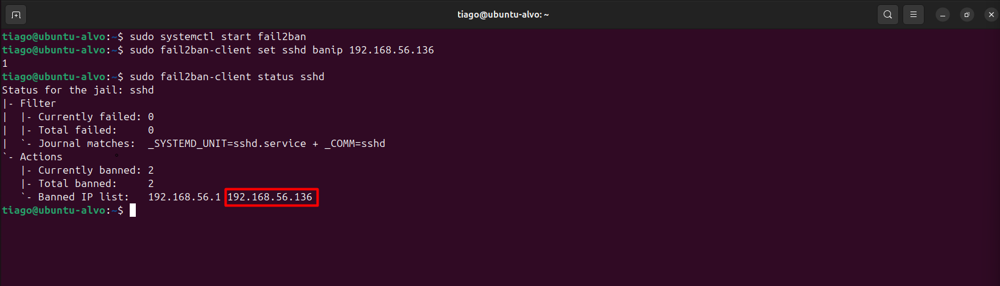
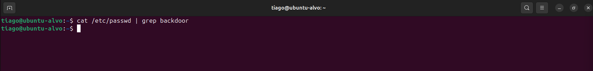
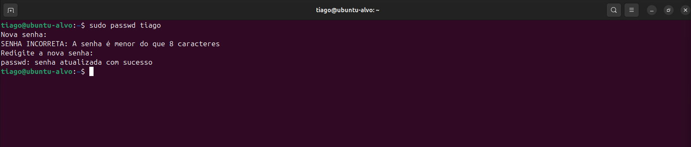
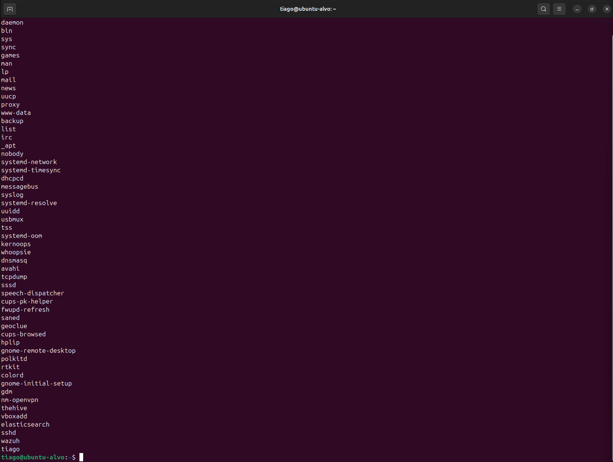
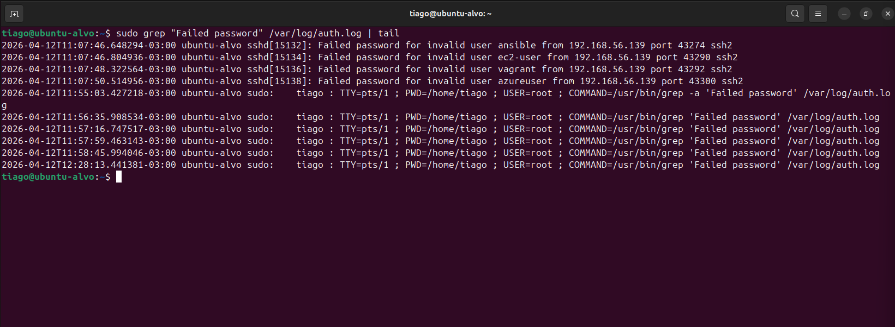
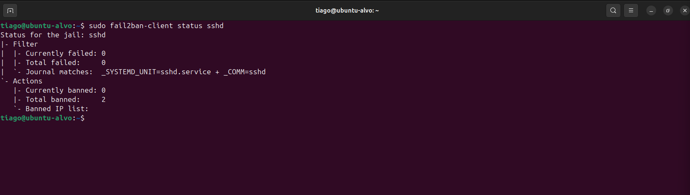

# 🚨 Detecção e Resposta a Brute Force SSH com Persistência (Wazuh + Fail2ban)
## 📌 Overview
Simulação de ataque SSH brute force com comprometimento e persistência via criação de usuário e SSH key. Detecção realizada com Wazuh e resposta com Fail2ban.

- Acesso: ✔ Sim
- Persistência: ✔ Sim
- Severidade: 🔴 Crítica

---

## 📄 Detailed Incident Report
➡️ [Ver relatório completo](./report.md)

---

## 🖥️ Ambiente
- Atacante: 192.168.56.139
- Alvo: Ubuntu (host: tiago)
- SIEM: Wazuh
- Defesa: Fail2ban

---

## 🎯 Simulação do Ataque

O atacante executou múltiplas tentativas de login via SSH até obter sucesso.

 

---

## 🔍 Detecção e Correlação

O Wazuh identificou comportamento suspeito e correlacionou eventos de falha com login bem-sucedido.

 

---

## 🚨 Confirmação do Comprometimento

Login bem-sucedido após brute force:

Sessão aberta no sistema:

---

## 💥 Ações do Atacante (Pós-Exploração)

Após o comprometimento inicial, foram identificadas ações de pós-exploração visando persistência no host:

- Criação de conta maliciosa (T1136)
- Escalada de privilégio via sudo
- Persistência via SSH Authorized Keys (T1098.004)

---

## 🧠 Análise SOC
- Ataque identificado como Brute Force SSH (T1110)
- Comprometimento confirmado via login válido
- Persistência estabelecida via SSH Authorized Keys (T1098.004)
- Uso de privilégios elevados (sudo) após comprometimento inicial, indicando controle total do host.

**👉 Classificação: True Positive (TP)**

**👉 Severidade: Crítica**

---

## 🧬 MITRE ATT&CK

- T1110 – Brute Force
- T1078 – Valid Accounts
- T1098.004 – SSH Authorized Keys
- T1136 – Create Account

---

## 🛡️ Resposta ao Incidente

Bloqueio do IP atacante via Fail2ban:

---

## 🧹 Remediação
- Remoção do usuário malicioso (backdoor)
- Exclusão de diretórios persistentes
- Reset de senha do usuário comprometido

 

---

## 🔎 Validação Pós-Incidente

Auditoria de usuários:

Monitoramento após mitigação:

Validação do Fail2ban:

---

## 🎯 Conclusão

O laboratório demonstrou um ciclo completo de atuação SOC:

- Detecção de ataque
- Correlação de eventos
- Confirmação de comprometimento
- Identificação de persistência
- Resposta imediata
- Remediação completa
- Validação pós-incidente

**👉 O ambiente foi restaurado com sucesso, eliminando acesso do atacante.**

---

## 🧠 Skills Desenvolvidas
- Análise de logs SSH
- Correlação de eventos (Wazuh)
- Investigação de incidentes
- Detecção de persistência
- Resposta com Fail2ban
- Remediação de acesso não autorizado

---

## 📞 Contato
- LinkedIn: https://www.linkedin.com/in/tiago-krysiaki
- Email: t.krysiaki91@gmail.com

## 🎯 Buscando oportunidades em SOC / NOC (Segurança da Informação)
