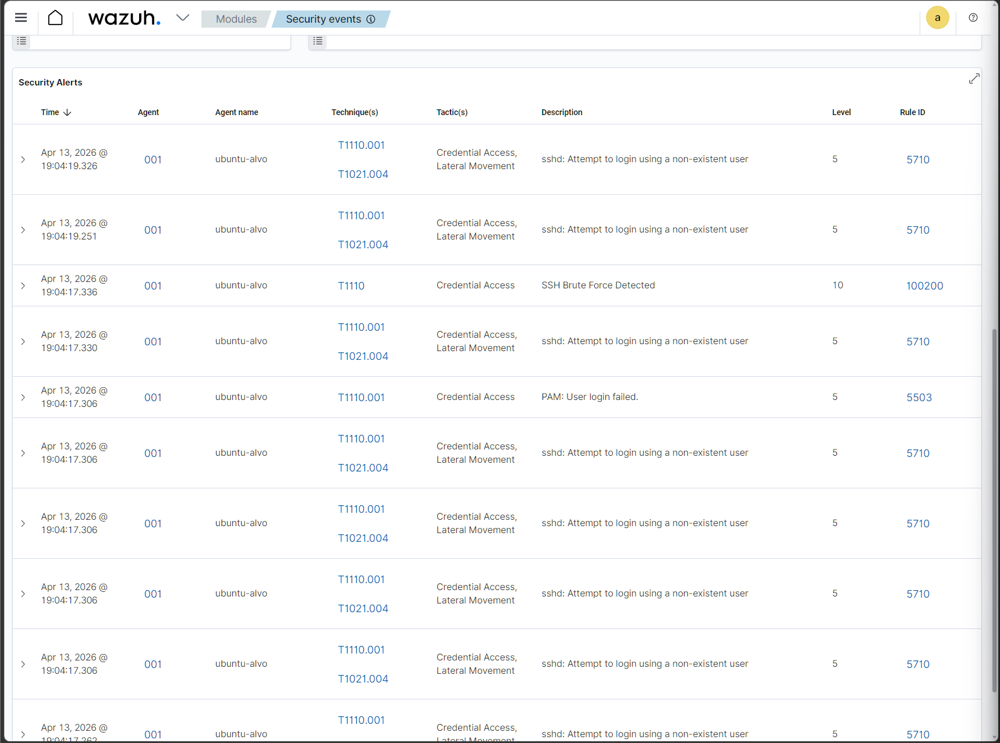
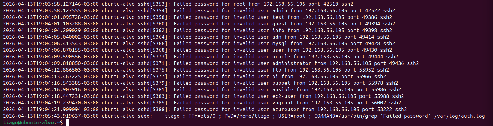
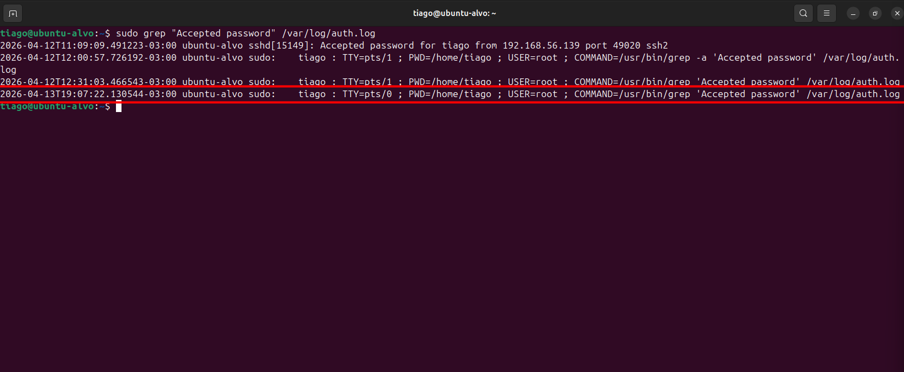
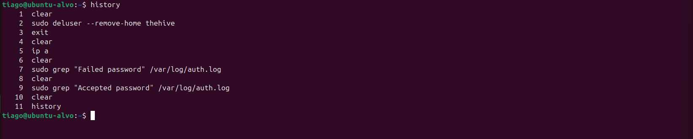
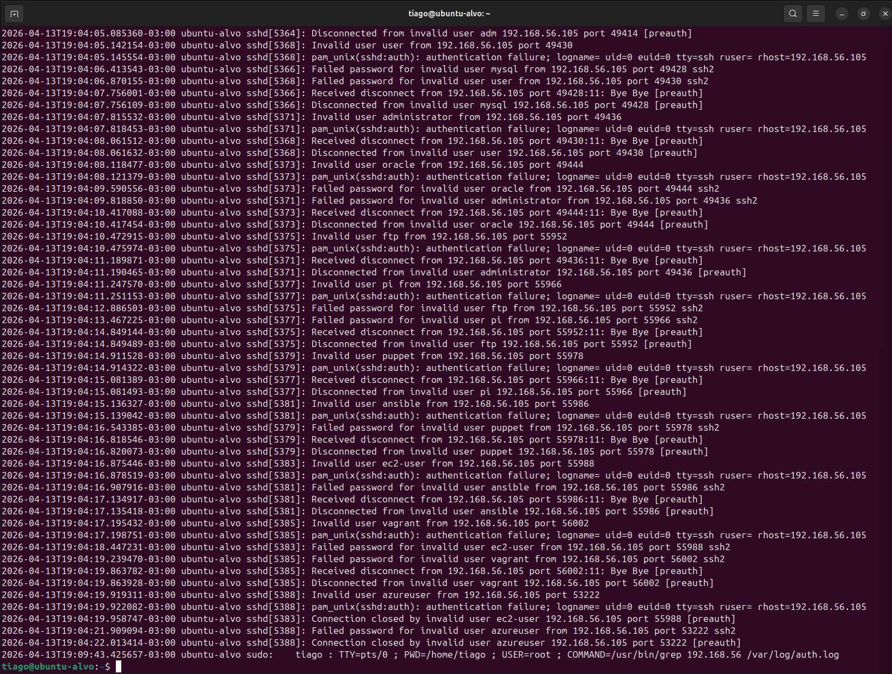
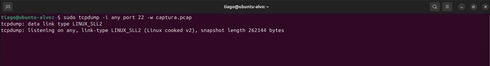
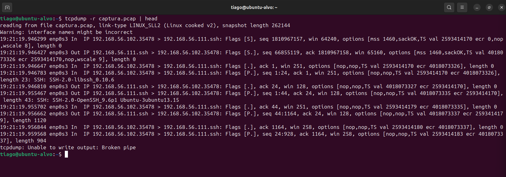

# 🚨 Lab 26 — Detecção e Resposta a Brute Force SSH com Correlação Completa
## 🎯 Visão Geral

Neste laboratório, simulei um ataque real de brute force SSH, conduzindo uma investigação completa no formato de um analista SOC.

O foco não foi apenas detectar o ataque, mas correlacionar eventos, confirmar comprometimento e tomar decisão.

---

## 🧪 Ambiente
- Atacante: Ubuntu
- Alvo: Ubuntu (SSH ativo)
- SIEM: Wazuh
- Ferramentas:
  - Hydra (ataque)
  - Logs Linux (auth.log)
  - tcpdump (rede)
 
---

## ⚔️ Simulação de Ataque

Ataque de brute force via SSH com múltiplos usuários e IPs.

---

## 🚨 Detecção (SIEM)

O Wazuh identificou atividade suspeita com regra de brute force:



- Regra de alta severidade
- Múltiplas tentativas de login
- Classificação MITRE: T1110

---

## 🔍 Investigação — Logs do Sistema

Análise do /var/log/auth.log revelou padrão claro de ataque:



- Vários usuários inválidos
- Alta frequência de tentativas
- Comportamento automatizado

---

## 🔓 Evidência de Comprometimento

Identificado login bem-sucedido:



- Accepted password for tiago
- Confirma acesso inicial obtido

---

## 💻 Pós-Comprometimento

Análise de comandos executados:



- Sem criação de usuários
- Sem persistência evidente
- Atividade limitada

---

## 🔗 Correlação de IP

Eventos agrupados por IP:



- 192.168.56.105 → brute force
- 192.168.56.139 → login bem-sucedido

---

## 🌐 Análise de Rede

Captura de tráfego durante o ataque:



- Monitoramento em tempo real
- Filtro aplicado para SSH

---

## 🔎 Tráfego SSH identificado



- Handshake SSH (SSH-2.0)
- Conexões repetitivas
- Padrão de ataque confirmado

---

## 🧠 Correlação (Timeline)
```
Brute force (192.168.56.105)
→ múltiplas falhas
→ ataque distribuído
→ sucesso (192.168.56.139)
→ acesso ao sistema
→ baixa atividade pós-login
```

---

## 🎯 MITRE ATT&CK
- T1110 — Brute Force
- T1078 — Valid Accounts

---

## 🛡️ Resposta

- Bloqueio dos IPs atacantes
- Implementação de Fail2ban
- Revisão de credenciais
- Monitoramento contínuo

---

## 🧾 Conclusão

Foi identificado um ataque de brute force SSH com múltiplas origens, culminando em um login bem-sucedido e comprometimento inicial do sistema.

Apesar da ausência de ações claras de pós-exploração, o acesso não autorizado representa risco elevado e exige resposta imediata.

---

## 📬 Contato

LinkedIn: https://www.linkedin.com/in/tiago-krysiaki

Email: t.krysiaki91@gmail.com


