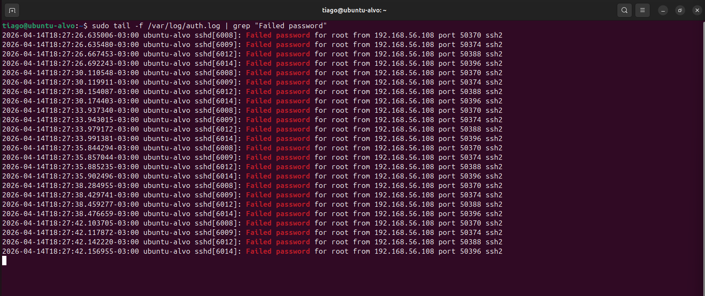
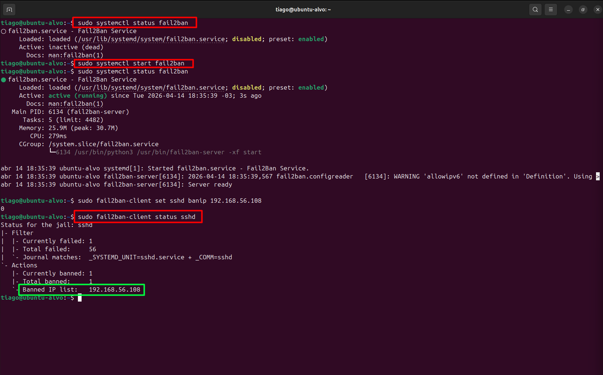
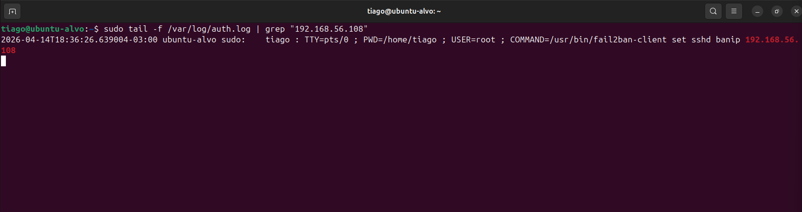

# 🚨 SOC Lab 27 — Detecção e Resposta a Brute Force (Sem SIEM)

## 🧠 Visão Geral
- **Objetivo do lab**:

  Simular a detecção e resposta a incidentes sem uso de SIEM, realizando análise manual de logs.
- **Tipo de ataque**:

  Brute Force SSH (sem sucesso)
- **Ferramentas utilizadas**:

    `/var/log/auth.log`, Fail2ban, VirusTotal
- **Resultado final**:

  Ataque identificado e contido com sucesso, sem evidência de comprometimento.


  ---

## 🌐 Ambiente
- Máquina atacante: Ubuntu Linux
- Máquina alvo: Ubuntu Linux (SSH habilitado)
- Rede: Ambiente interno (rede privada) via SSH (porta 22)

---

## ⚔️ Simulação de Ataque

Ataque caracterizado por múltiplas tentativas de autenticação SSH em curto intervalo de tempo, indicando brute force.

Alto volume de tentativas de login mal-sucedidas foi identificado em curto intervalo de tempo.


---

## 🔍 Detecção e Análise

A detecção foi realizada via análise manual do arquivo `/var/log/auth.log`.

```
sudo tail -f /var/log/auth.log | grep "Failed password"
```

**Foi identificado**:

- Múltiplas tentativas de login
- Mesmo IP (`192.168.56.108`)
- Tentativas contra usuário `root`



---

## 🔎 Verificação de Comprometimento

Nenhum login bem-sucedido identificado ("Accepted password").

Nenhuma evidência de sessão ativa ou execução de comandos após tentativa de acesso.

---

## 🛡️ Resposta ao Incidente

Mitigação realizada com Fail2ban, bloqueando o IP atacante.



---

## ✅ Validação da Mitigação
```
sudo tail -f /var/log/auth.log
```
Nenhuma nova tentativa identificada após bloqueio.



---

## 📊 Classificação do Incidente
- Tipo: Brute Force (SSH)
- Severidade: Média
- Status: Contido e encerrado
- MITRE ATT&CK: T1110

---

## 🧠 Skills Desenvolvidas

- Análise manual de logs (auth.log)
- Detecção de brute force sem SIEM
- Investigação de incidentes (SOC workflow)
- Correlação de eventos (log + comportamento)
- Resposta a incidentes (Fail2ban)
- Validação de mitigação
- Threat Intelligence (VirusTotal)
- Classificação de incidentes (TP / severidade)
- Mapeamento MITRE ATT&CK (T1110)

---

## 🧾 Conclusão

Este laboratório demonstrou a detecção e resposta a um ataque de brute force sem uso de SIEM, utilizando análise manual de logs como principal fonte de evidência.

O ataque foi identificado por múltiplas tentativas de login mal-sucedidas via SSH. A investigação confirmou que não houve autenticação bem-sucedida, descartando comprometimento.

A mitigação foi aplicada com Fail2ban, bloqueando o IP atacante e interrompendo o ataque. A validação confirmou a eficácia da resposta.

A análise de Threat Intelligence indicou tratar-se de um IP privado, e não foram identificadas evidências de pós-exploração.

O incidente foi tratado e encerrado com sucesso no nível N1.

---

## 📬 Contato

LinkedIn: https://www.linkedin.com/in/tiago-krysiaki

Email: t.krysiaki91@gmail.com


