# 🔴 INCIDENT REPORT — SSH Brute Force + Persistência + Resposta a Incidente

---

## 🎯 1. Visão Geral

Durante o monitoramento do ambiente, foi identificado um comportamento anômalo envolvendo múltiplas tentativas de autenticação no serviço SSH (porta 22), caracterizando um ataque de brute force.

A análise confirmou acesso não autorizado, execução de comandos com privilégio elevado e criação de persistência no sistema.

- **Alvo:** 192.168.122.102  
- **Atacante:** 192.168.122.50  
- **Serviço afetado:** SSH  
- **Severidade:** Alta  
- **Classificação:** True Positive (TP)  

---

## 🛰️ 2. Monitoramento

O ambiente apresentava exposição do serviço SSH, permitindo interação remota.

### 🔍 Descoberta de serviço

Identificação do serviço SSH ativo na máquina alvo.

**Comando utilizado:**
```
nmap -p 22 192.168.122.102
```

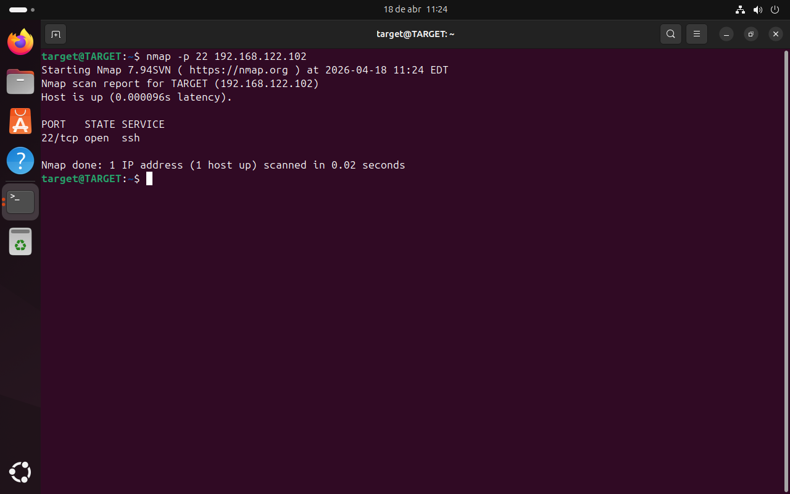

---

## ⚔️ 3. Vetor de Ataque

Foi identificado ataque de brute force contra o serviço SSH, explorando credenciais fracas.

### 💣 Execução do ataque

Múltiplas tentativas automatizadas de autenticação.

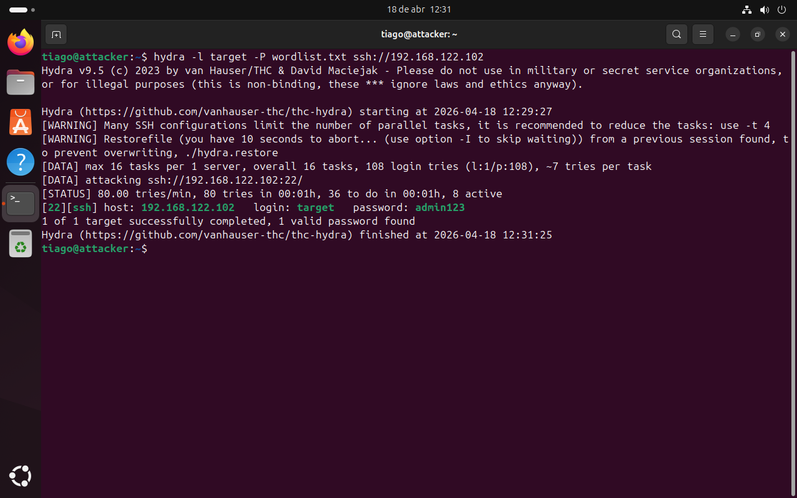

---

### 🔓 Acesso inicial

Confirmação de acesso ao sistema utilizando credencial comprometida.

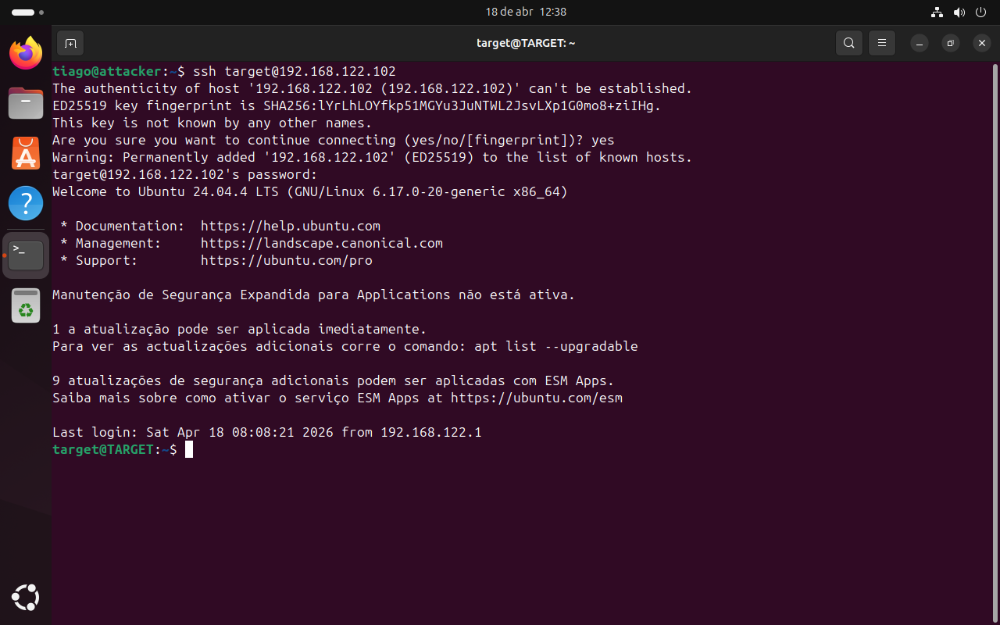

---

## 🔍 4. Detecção

A detecção foi realizada através da análise de logs do sistema.

---

### 📄 Tentativas falhadas

Indicam tentativa de brute force contra o serviço SSH.

**Comando utilizado:**

```
grep "Failed password" /var/log/auth.log
```

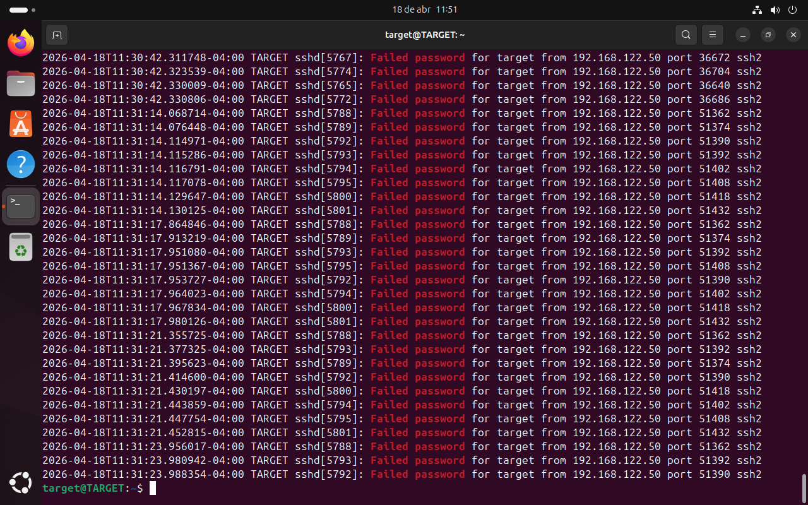

---

### 📄 Autenticação bem-sucedida

Confirma que o atacante conseguiu acesso ao sistema.

**Comando utilizado:**
```
grep "Accepted password" /var/log/auth.log
```

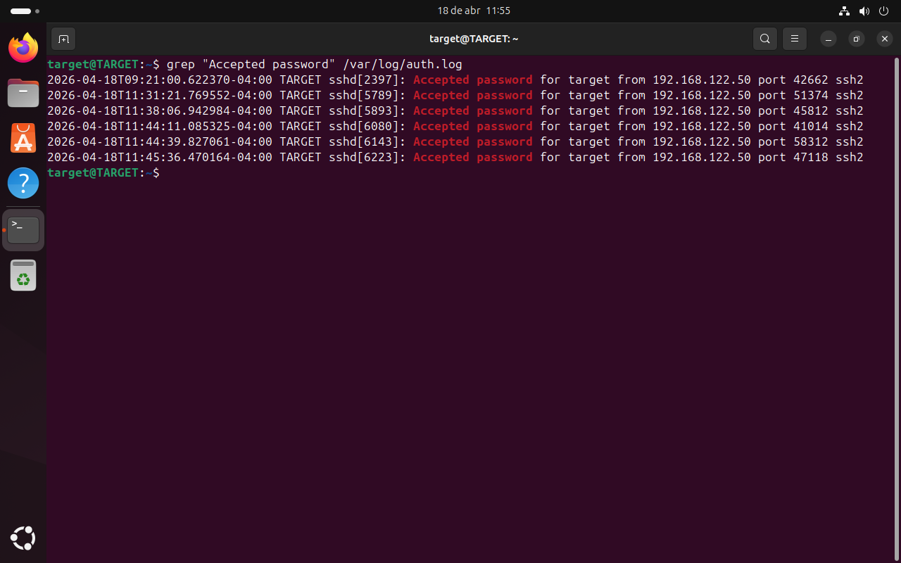

---

### 📊 Quantificação do ataque

Permite medir o volume de tentativas realizadas pelo atacante.

**Comando utilizado:**
```
grep "Failed password" /var/log/auth.log | grep "192.168.122.50" | wc -l
```

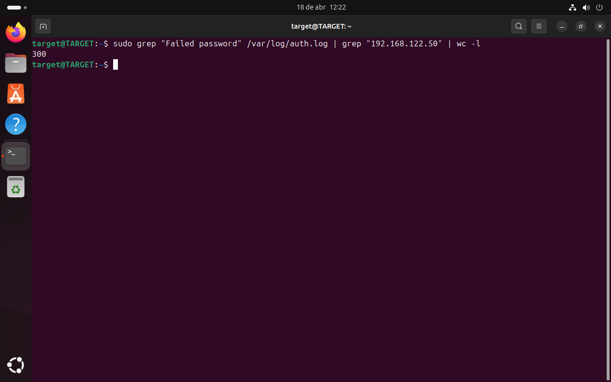

---

## 🧠 5. Investigação

Foram correlacionados eventos utilizando auditd para identificar ações após o comprometimento.

---

### 🔎 Execução de comandos

Indica atividades realizadas no sistema após o acesso.

**Comando utilizado:**
```
grep EXECVE /var/log/audit/audit.log
```

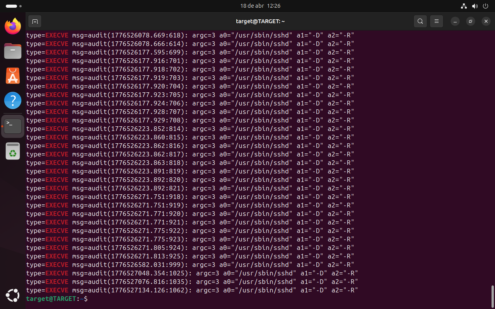

---

### 🔎 Uso de privilégios (sudo)

Evidencia execução de comandos com privilégio elevado.

**Comando utilizado:**
```
grep sudo /var/log/audit/audit.log
```

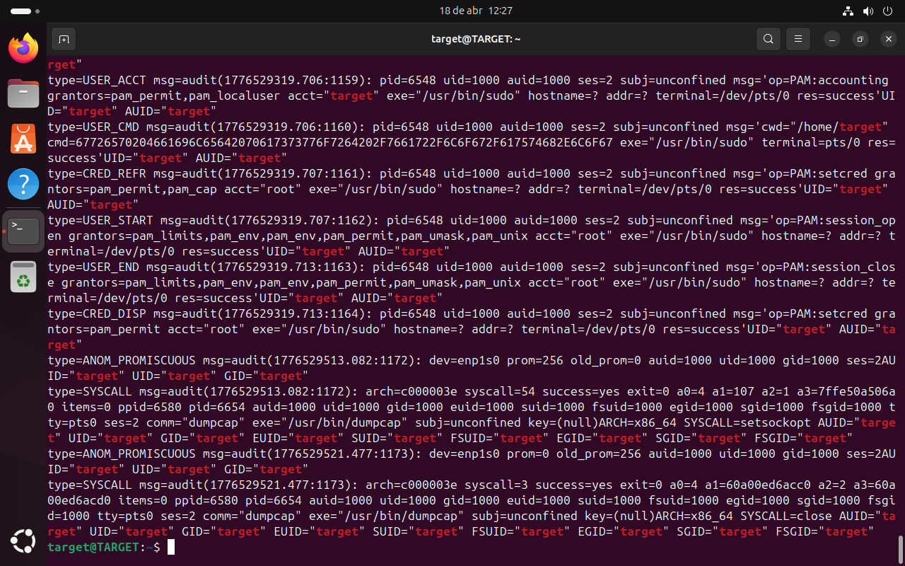

---

### 🔎 Alteração de senha

Indica manipulação de credenciais no sistema.

**Comando utilizado:**
```
grep passwd /var/log/audit/audit.log
```

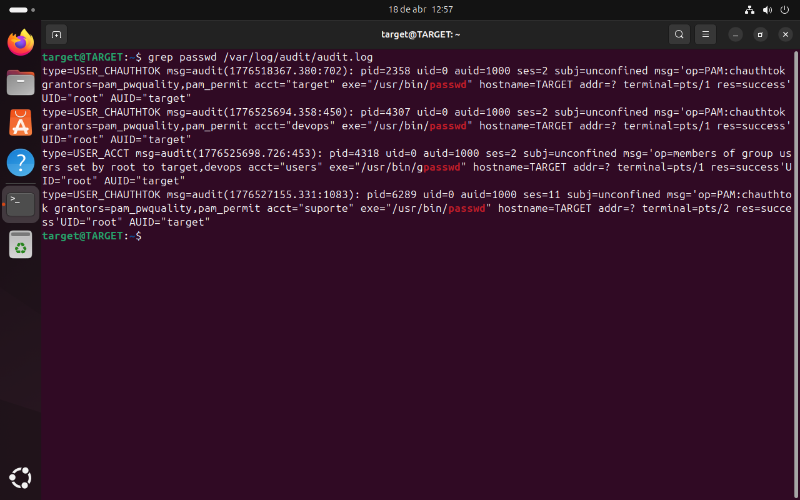

---

## 🧬 6. Persistência

Foi identificado que o atacante criou um novo usuário para manter acesso ao sistema.

**Comando utilizado:**
```
cat /etc/passwd | grep suporte
```

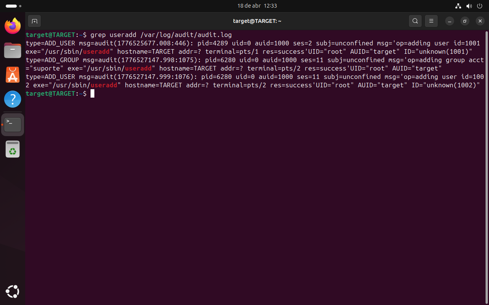

---

## 🌐 7. Threat Intelligence

Consulta do IP de origem em base externa.

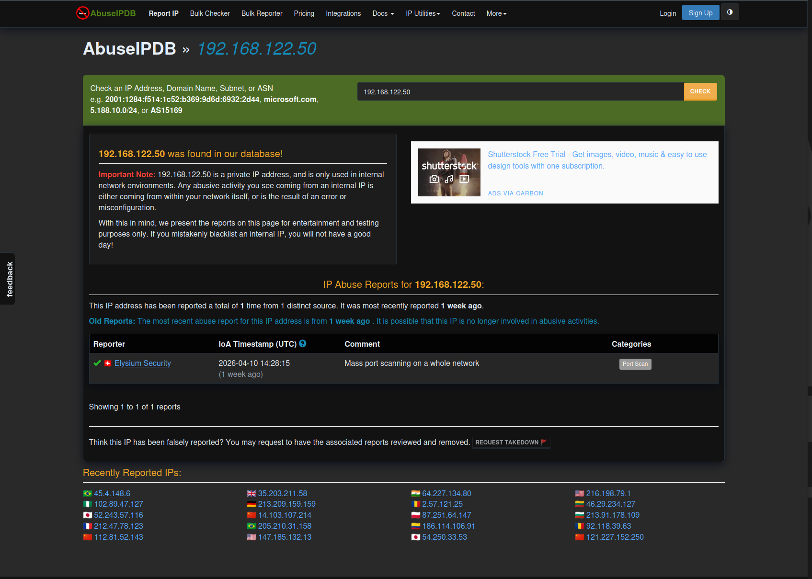

**Observação:**  
IP pertence à faixa privada (RFC1918), não aplicável para reputação externa.

---

## 🕒 8. Timeline do Incidente

- 10:01 — Início de tentativas falhadas  
- 10:03 — Aumento do volume (brute force)  
- 10:05 — Login bem-sucedido  
- 10:06 — Acesso ao sistema  
- 10:07 — Criação de usuário  
- 10:08 — Execução com sudo  
- 10:10 — Detecção  
- 10:12 — Contenção  
- 10:15 — Erradicação  
- 10:18 — Hardening  

---

## 🚨 9. Resposta ao Incidente

---

### 🔒 Contenção

Bloqueio do IP atacante para interromper o ataque.

**Comando utilizado:**
```
sudo fail2ban-client set sshd banip 192.168.122.50
```

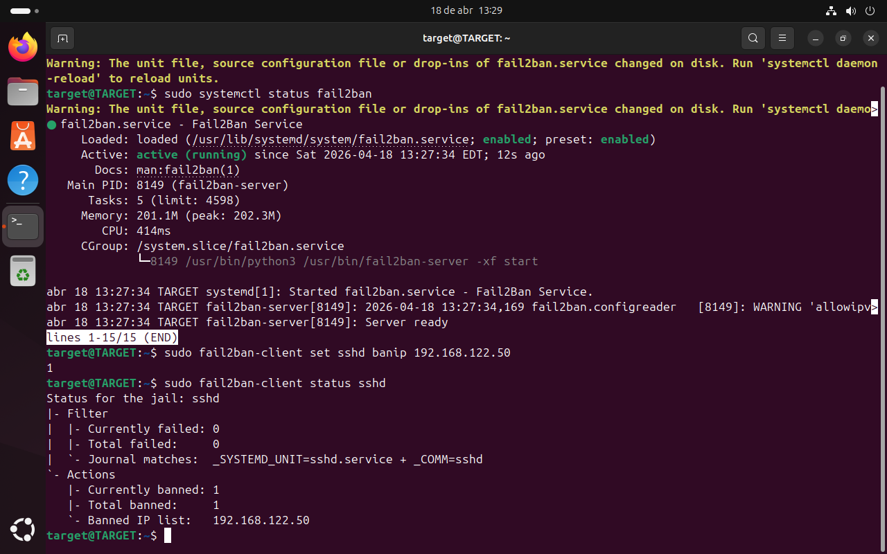

---

### 🧹 Erradicação

Remoção do usuário malicioso criado durante o ataque.

**Comando utilizado:**
```
sudo userdel -r suporte
```

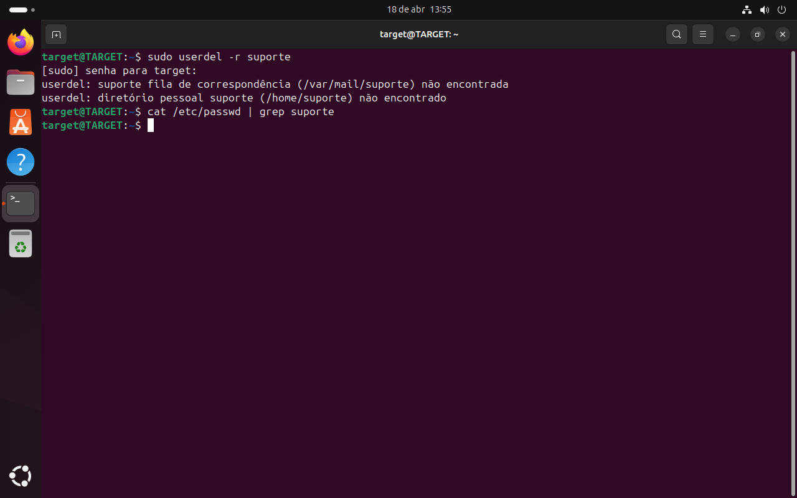

---

### 🛡️ Hardening

Aplicação de medidas para prevenir novos ataques.

**Configuração aplicada:**
```
PermitRootLogin no
PasswordAuthentication no
```

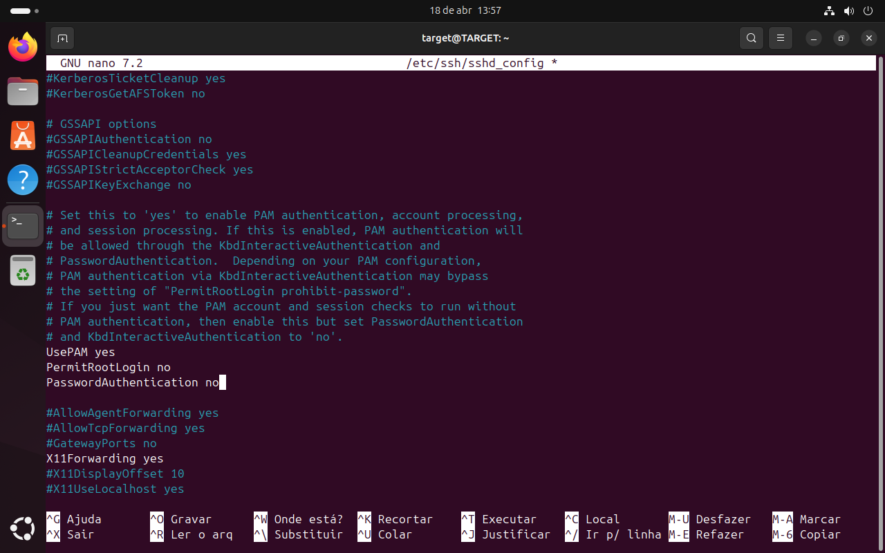

---

## ⚠️ 10. Impacto

- Acesso não autorizado  
- Execução de comandos privilegiados  
- Criação de persistência  
- Risco de movimentação lateral  
- Possível comprometimento de dados  

---

## 🔎 11. Causa Raiz

- Credenciais fracas  
- Autenticação por senha habilitada  
- Ausência de proteção contra brute force  
- Falta de hardening no serviço  

---

## 🧩 12. Frameworks

**MITRE ATT&CK**
- T1110 — Brute Force  

**NIST**
- Detect → Logs  
- Respond → Contenção  
- Recover → Hardening  

**CIS Controls**
- Control 5 — Account Management  
- Control 6 — Access Control  
- Control 8 — Audit Logs  

---

## 📊 13. Classificação

- Tipo: Brute Force  
- Severidade: Alta  
- Classificação: True Positive (TP)  

---

## 🧬 14. Pós-Exploração

- Criação de usuário (`suporte`)  
- Execução com privilégio elevado  
- Alteração de credenciais  

---

## 🧠 15. Conclusão

O incidente foi identificado, investigado e respondido com sucesso seguindo o fluxo de monitoramento, detecção, investigação e resposta.

Foram aplicadas medidas de contenção, erradicação e hardening, reduzindo a superfície de ataque e prevenindo recorrência.

---

## 🚀 16. Lições Aprendidas

- Monitoramento contínuo é essencial  
- Hardening reduz significativamente o risco  
- Correlação de logs é fundamental  
- Resposta estruturada melhora a eficiência do SOC

---

## 📬 Contato

Aberto a oportunidades como SOC Analyst / Cybersecurity.

- LinkedIn: [https://www.linkedin.com/in/SEU-USUARIO ](https://www.linkedin.com/in/tiago-krysiaki)
- GitHub: [https://github.com/SEU-USUARIO  ](https://github.com/TKrysiaki)

