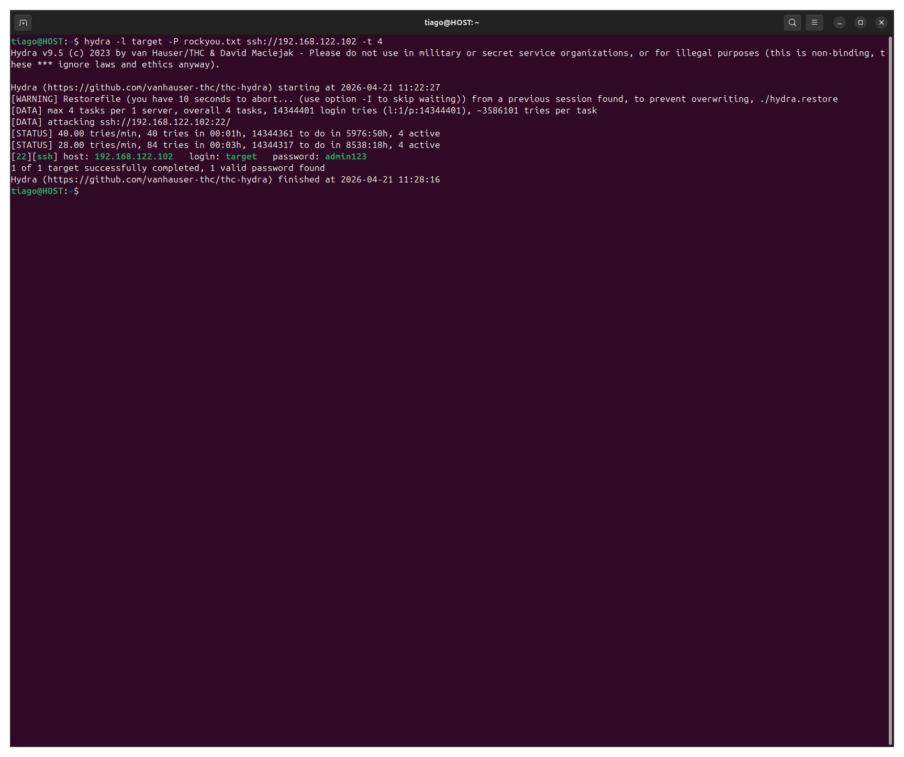
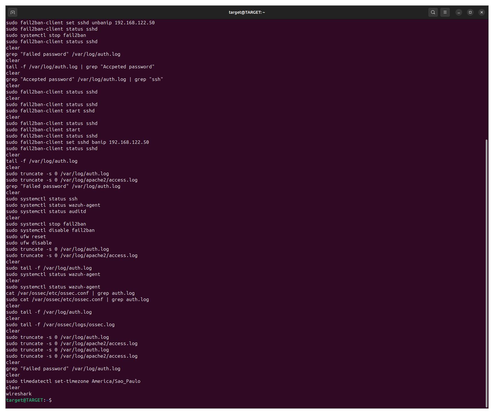
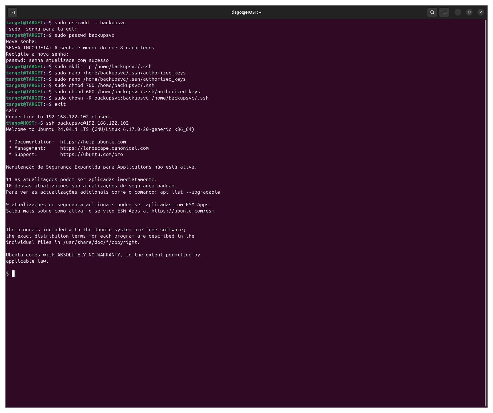
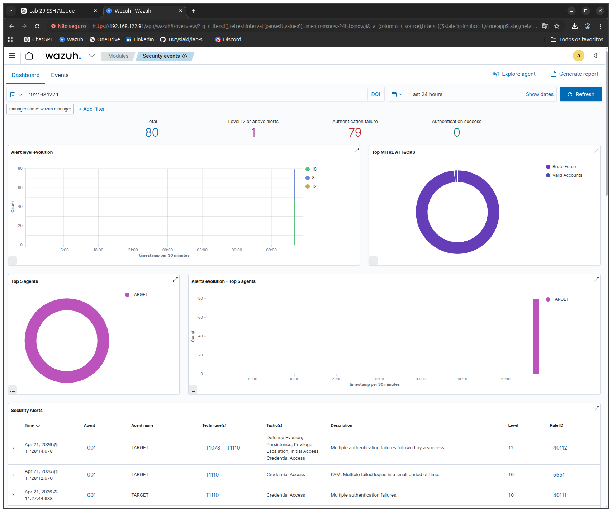
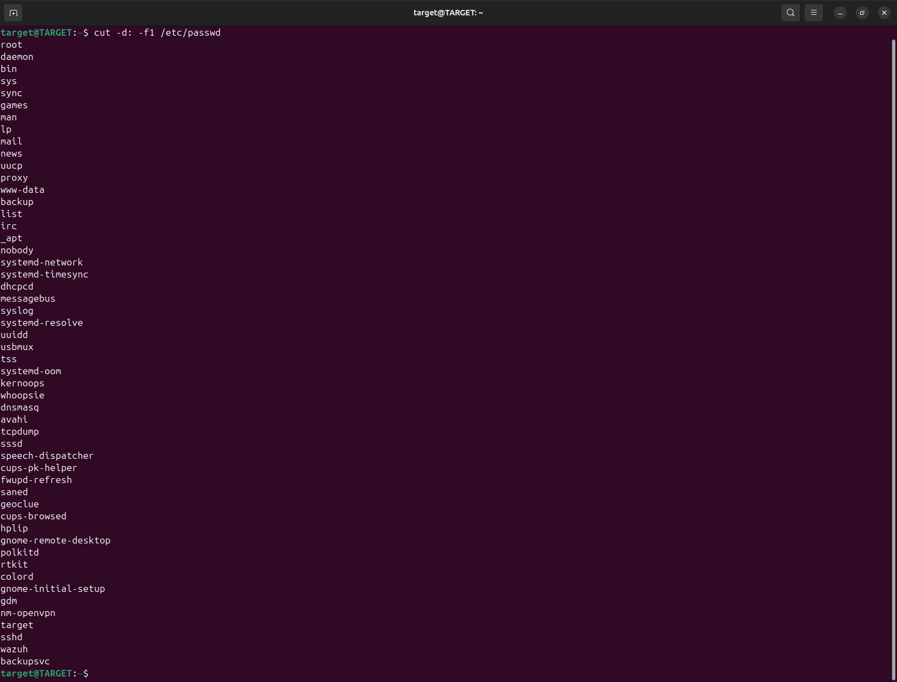
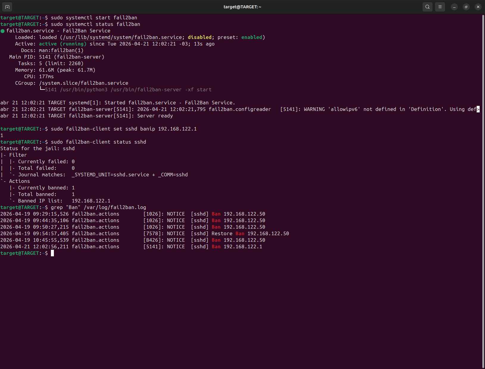
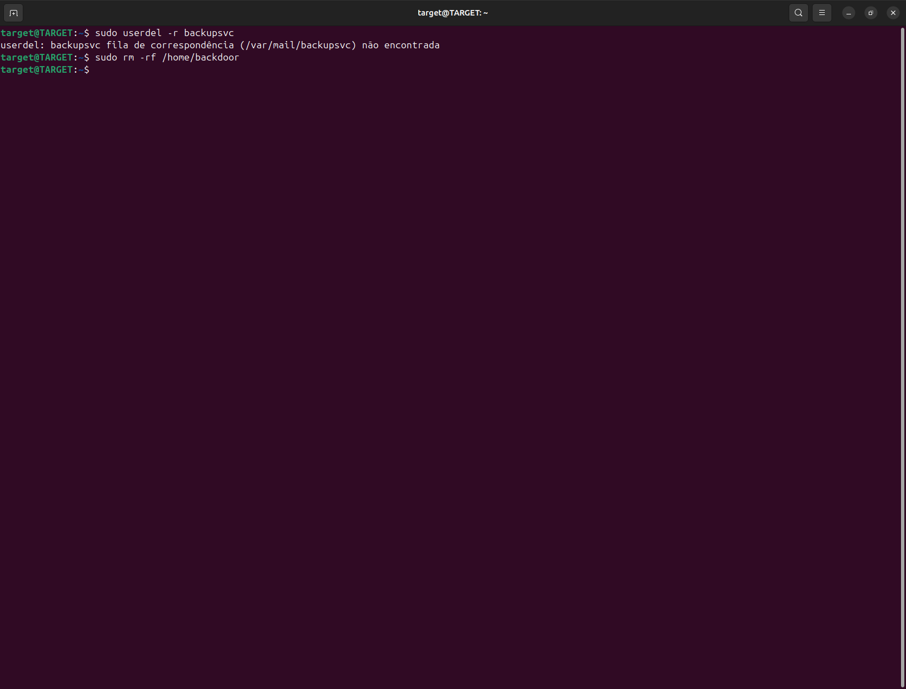
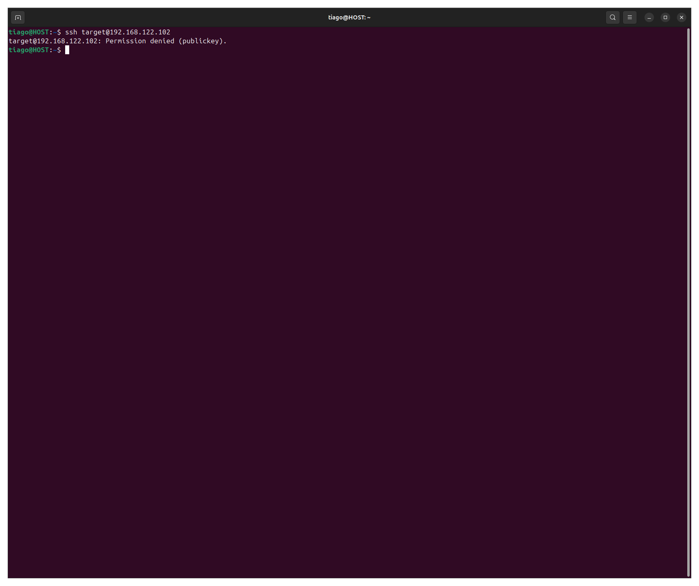
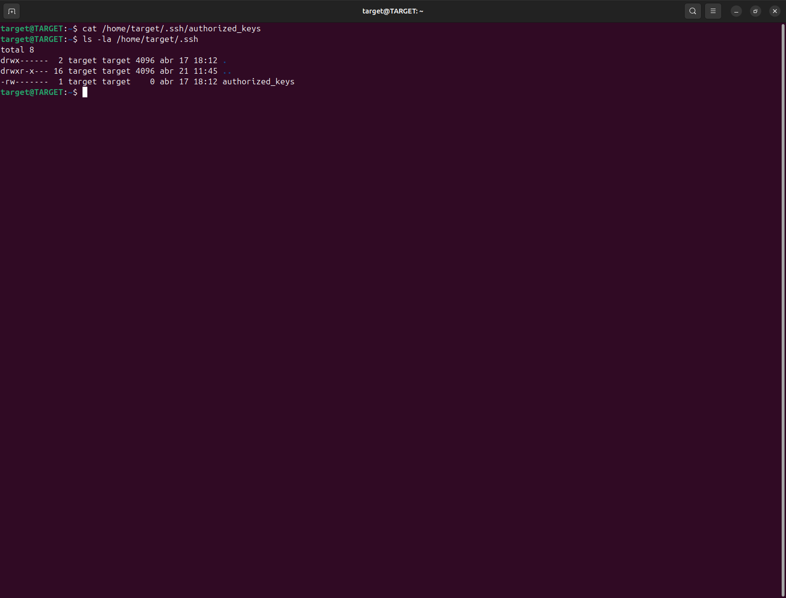

# 🚨 Detecção e Resposta a Brute Force SSH com Log Tampering (Wazuh + Fail2ban)

---

## 📌 Overview
Simulação de ataque SSH brute force com comprometimento, persistência e tentativa de evasão via manipulação de logs.

- Acesso: ✔ Sim  
- Persistência: ✔ Sim  
- Severidade: 🔴 Alta  

---

## 📄 Detailed Incident Report
➡️ [Ver relatório completo](./report.md)

---

## 🖥️ Ambiente
- Atacante: 192.168.122.1  
- Alvo: 192.168.122.102  
- SIEM: Wazuh  
- Defesa: Fail2ban  

---

## 🎯 Attack Scenario





---

## 🔍 Detection

### 📄 Evidências em logs
```
grep "Failed password" /var/log/auth.log
grep "Accepted password" /var/log/auth.log
```



---

## 🧠 Investigation
```
cat ~/.bash_history
cat /etc/passwd
```




---

## 🧬 Persistence
```
cat /etc/passwd | grep backupsvc
cat /home/backupsvc/.ssh/authorized_keys
```


- Criação de conta maliciosa (T1136)
- Persistência via SSH Authorized Keys (T1098.004)

---

## 🚨 Response
```
sudo fail2ban-client set sshd banip 192.168.122.1
```



---

## 🧹 Erradicação
```
sudo userdel -r backupsvc
```



---

## 🛡️ Hardening
```
PermitRootLogin no
PasswordAuthentication no
```



---

## 🔎 Validation

- Usuário malicioso removido  
- IP atacante bloqueado  
- Autenticação por senha desativada  
- authorized_keys limpo  



---

## 🧬 MITRE ATT&CK

- T1110 – Brute Force  
- T1078 – Valid Accounts  
- T1098.004 – SSH Authorized Keys  
- T1136 – Create Account  
- T1070 – Indicator Removal  

---

## 🎯 Conclusion

O incidente foi detectado, investigado e respondido com sucesso.  
A persistência foi removida e o ambiente foi protegido com hardening.

---

## 🧠 Skills Desenvolvidas

- Análise de logs SSH  
- Detecção de brute force  
- Correlação Wazuh  
- Identificação de persistência  
- Resposta com Fail2ban  
- Hardening de SSH  
- Detecção de log tampering  

---

## 📬 Contato

LinkedIn: https://www.linkedin.com/in/tiago-krysiaki  
GitHub: https://github.com/TKrysiaki
