# 🚨 Detecção e Resposta a SSH Brute Force com Comprometimento, Persistência e Log Tampering (Wazuh + Fail2Ban)

---

## 📌 Overview

Simulação de ataque SSH brute force com comprometimento completo, persistência, abuso de privilégio e tentativa de evasão via manipulação de logs.

- Acesso: ✔ Sim  
- Persistência: ✔ Sim  
- Evasão (Log Tampering): ✔ Sim  
- Severidade: 🔴 Crítica  

---

## 📄 Detailed Incident Report

➡️ Ver relatório completo: [report.md](./report.md)

---

## 🖥️ Ambiente

- Atacante: 192.168.122.1  
- Alvo: 192.168.122.102  
- SIEM: Wazuh  
- Defesa: Fail2Ban  

---

## 🎯 Attack Scenario

Ataque de brute force realizado contra o serviço SSH, resultando em acesso não autorizado ao sistema.

---

## 🔍 Detection

Atividade de brute force detectada no Wazuh após múltiplas tentativas de autenticação SSH:

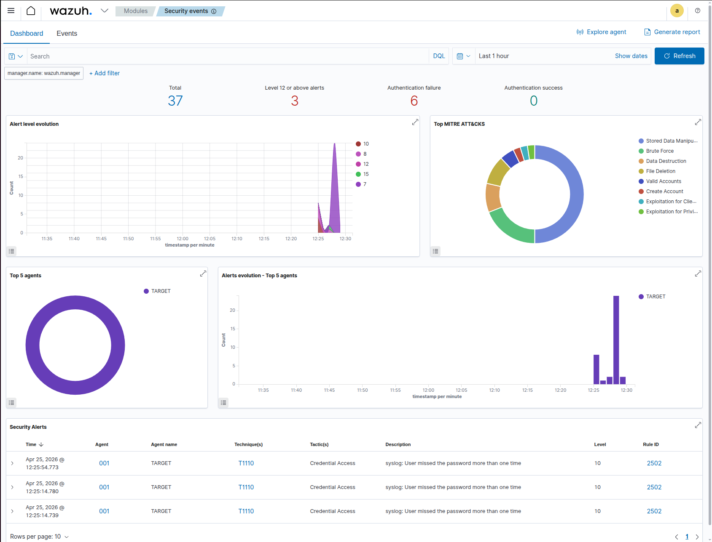

Múltiplas falhas de autenticação:

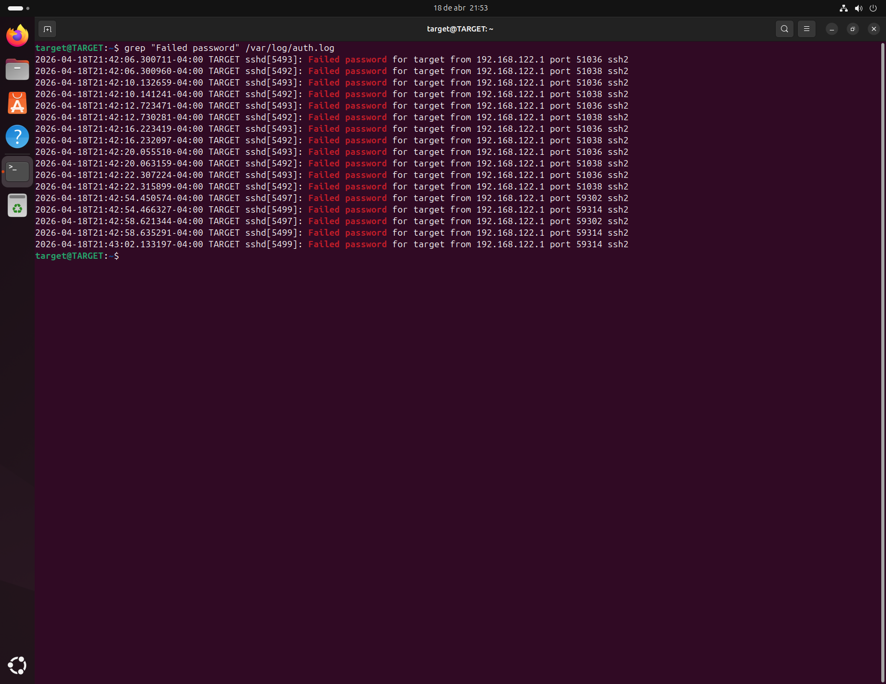

Login bem-sucedido após brute force:

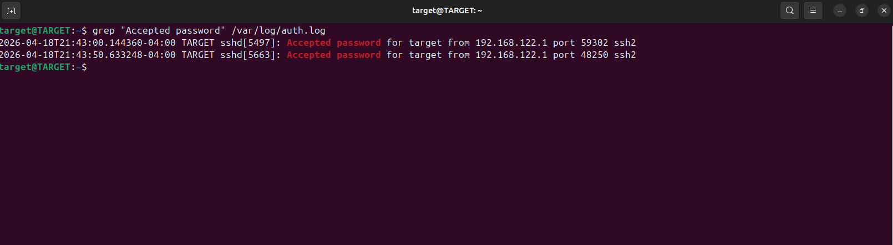

Correlação automática do ataque:

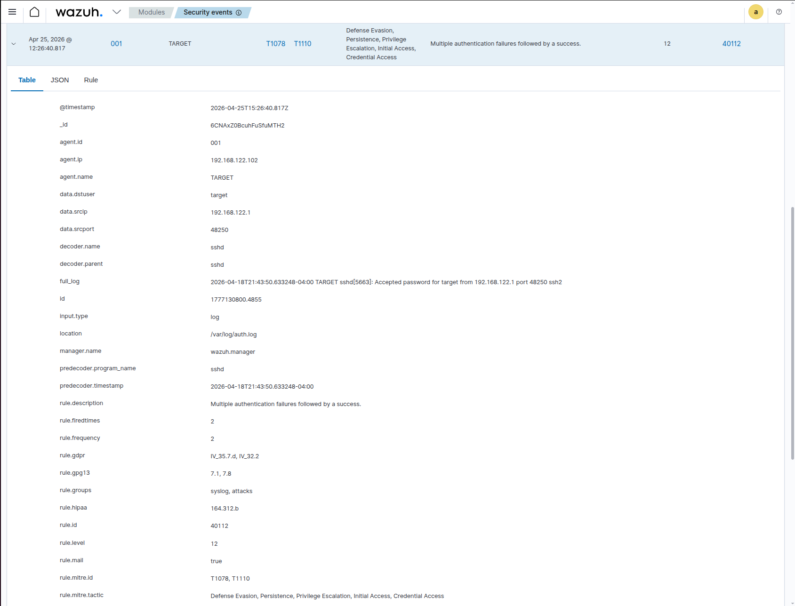

---

## 🧠 Investigation

Atividade pós-comprometimento identificada:

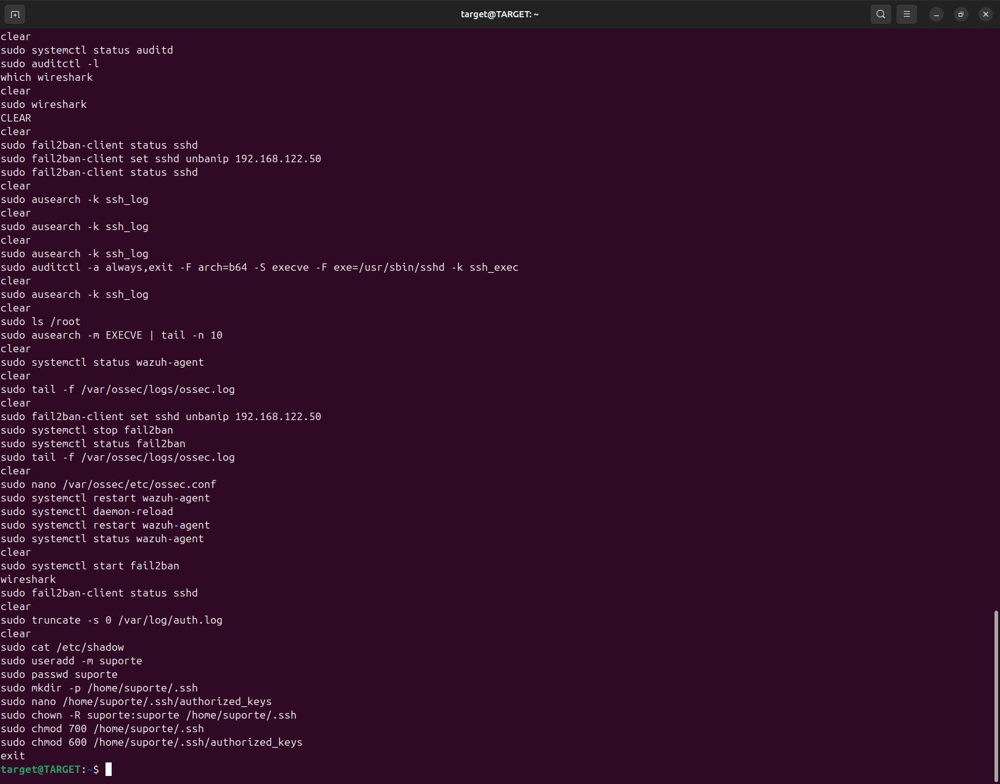

### Evidências:

- Usuário comprometido: `target`  
- IP de origem: `192.168.122.1`  
- Execução de comandos no sistema  
- Abuso de privilégio via sudo  

---

### 🧼 Log Tampering

Tentativa de remoção de evidências:

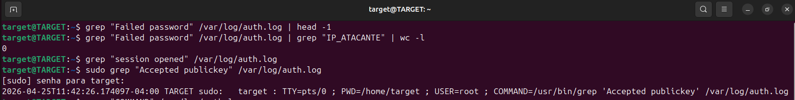

Mesmo após limpeza de logs, evidências mantidas via auditd:

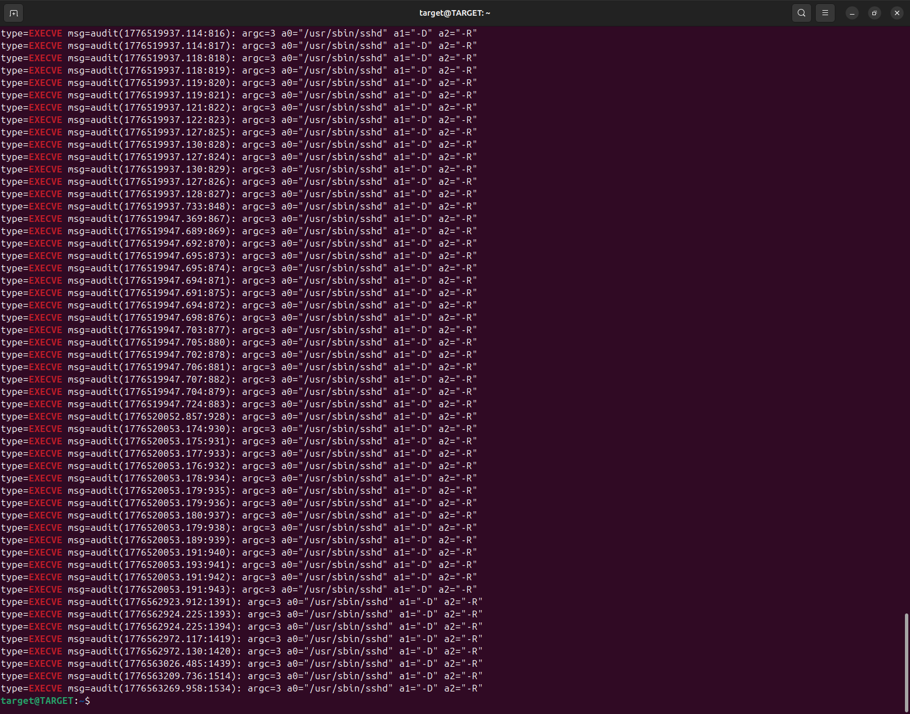

Execução privilegiada confirmada:

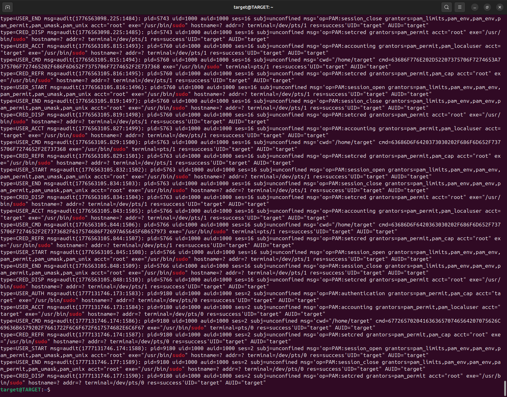

---

### 🔐 Persistência

Usuário malicioso criado:

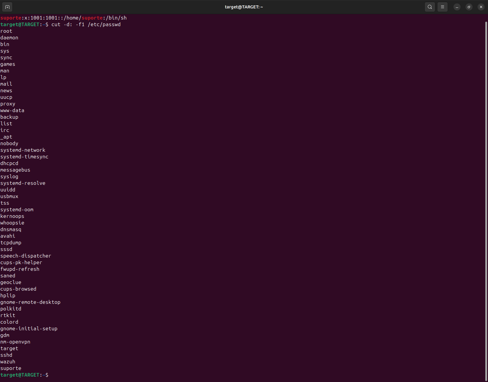

---

## 🚨 Classification

- Tipo: Acesso não autorizado + persistência  
- Severidade: 🔴 CRITICAL  
- Impacto: Comprometimento total do sistema  

---

## 🛡️ Response

### Containment

Bloqueio do IP atacante com Fail2Ban:

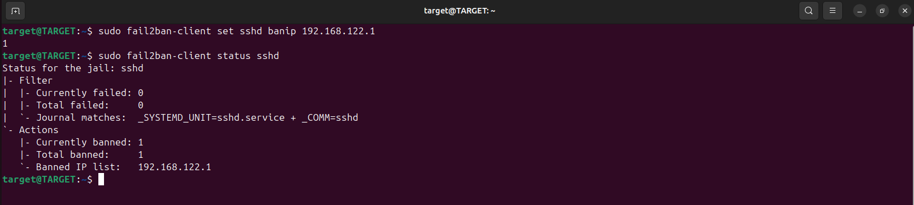

---

### Eradication

Remoção do usuário malicioso:

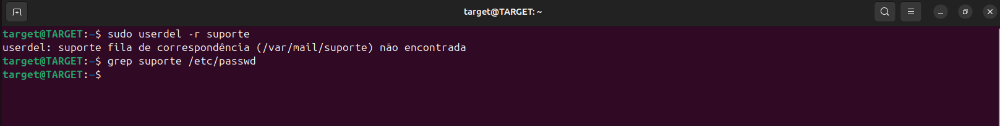

---

### Recovery

Reset de credenciais:

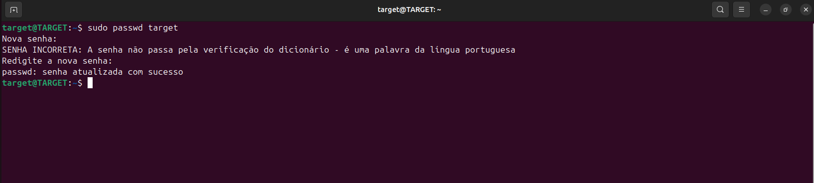

---

### 🔐 Hardening

Configuração de SSH reforçada:

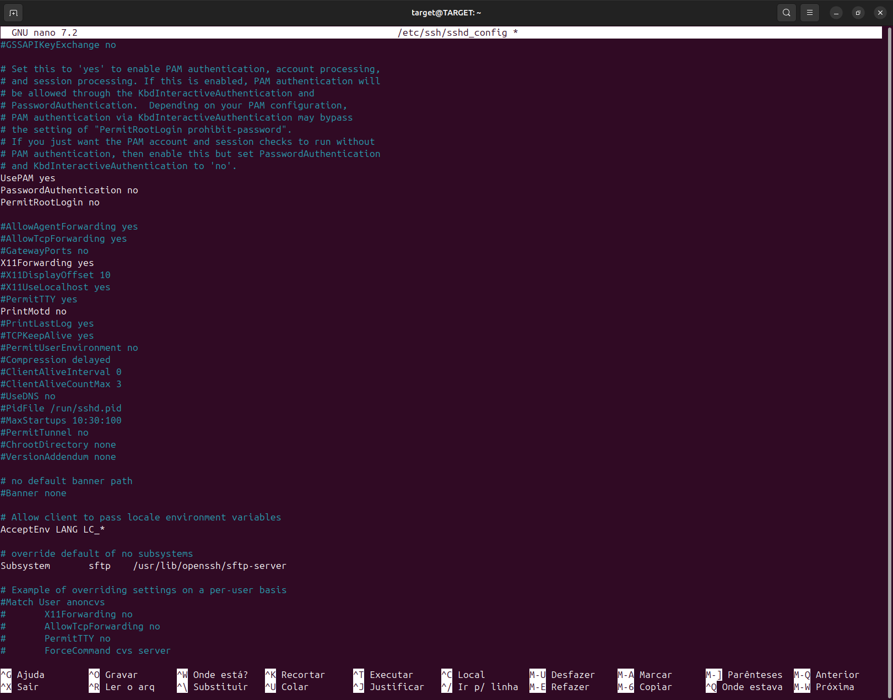

---

## 🧬 MITRE ATT&CK

- T1110 — Brute Force  
- T1078 — Valid Accounts  
- T1098 — Account Manipulation  
- T1070 — Indicator Removal  

---

## 🎯 Conclusion

O incidente foi detectado, investigado e respondido com sucesso.

O ataque evoluiu de brute force para comprometimento completo, incluindo persistência, execução privilegiada e evasão de logs.

A persistência foi removida e o ambiente protegido com hardening e controle de acesso.

---

## 🧠 Skills Desenvolvidas

- Análise de logs SSH  
- Detecção de brute force  
- Correlação com Wazuh  
- Identificação de persistência  
- Resposta com Fail2Ban  
- Hardening de SSH  
- Detecção de log tampering  

---

## 📞 Contato

LinkedIn: https://www.linkedin.com/in/tiago-krysiaki  
GitHub: https://github.com/TKrysiaki
