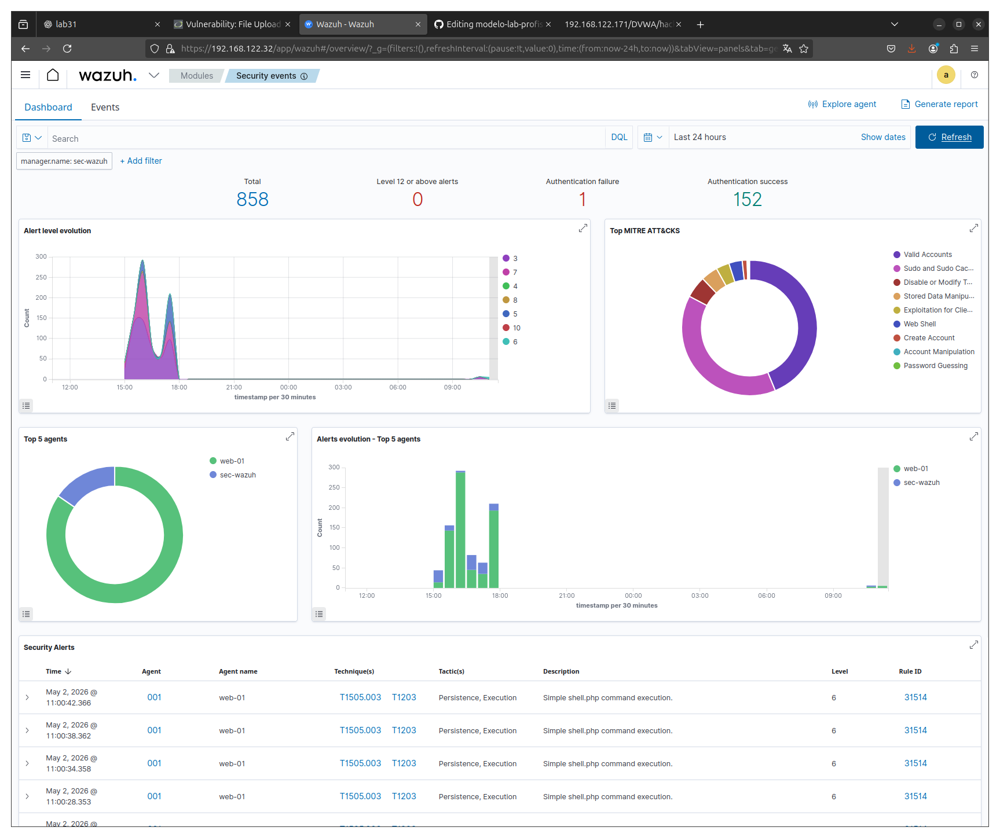
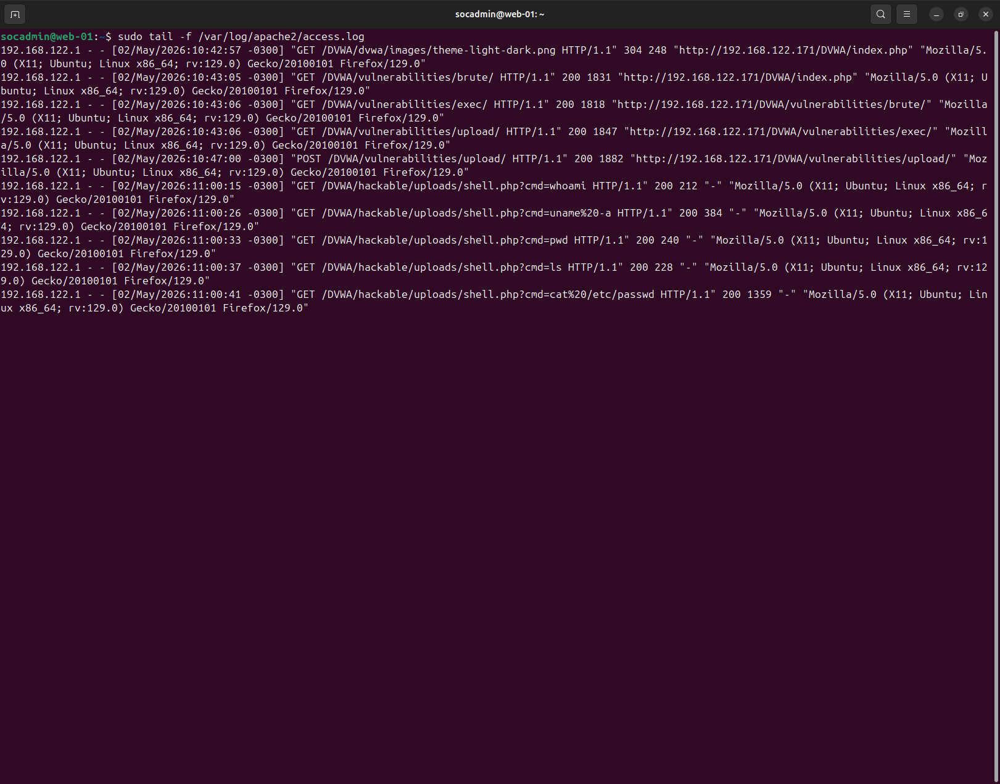
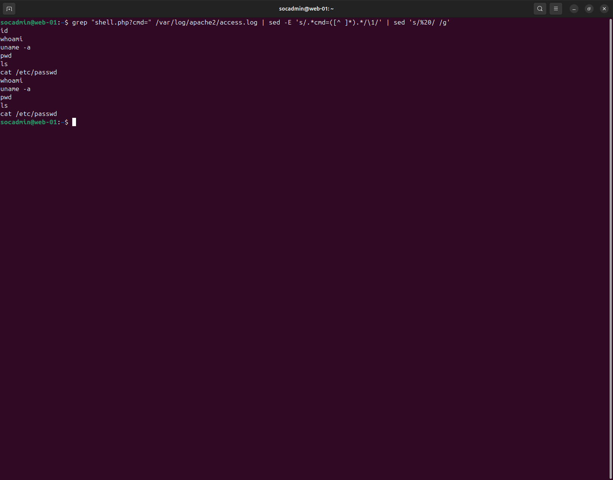
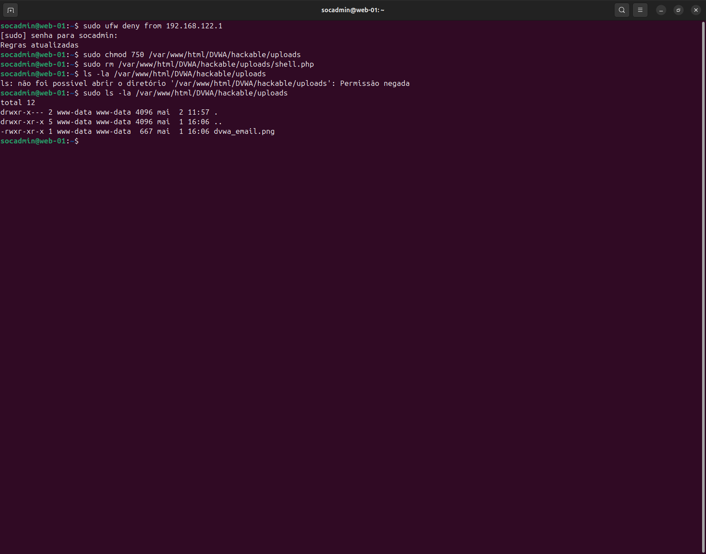
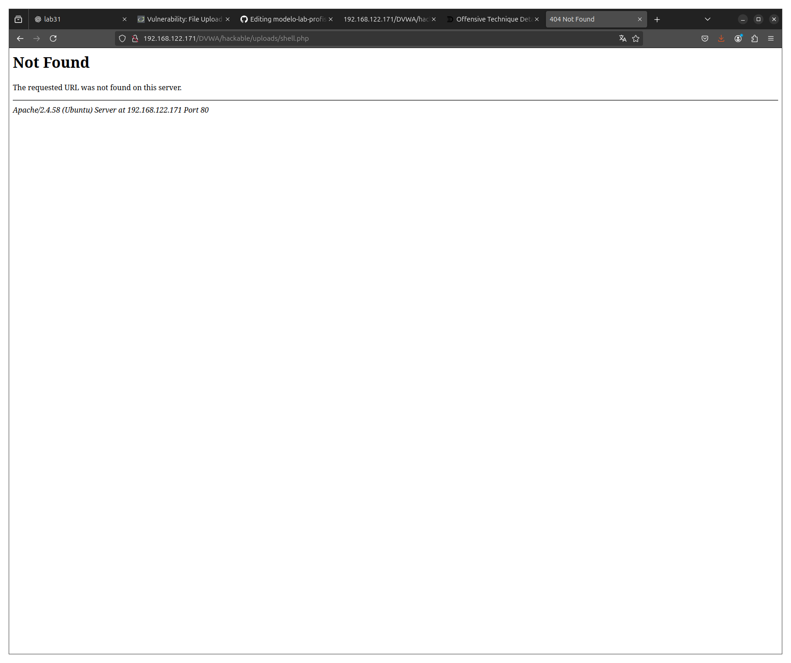

# 🚨 Detection and Response to Web Shell (RCE) Attack (Wazuh + Apache)

---

## 📌 Overview

Simulation of a web shell attack via file upload vulnerability, resulting in remote command execution on the target system.

- Access: ✔ Yes  
- Execution (RCE): ✔ Yes  
- Persistence: ❌ No  
- Evasion: ❌ No  
- Severity: 🔴 Critical  

---

## 📄 Detailed Incident Report

➡️ Full report: [report.md](./report.md)

---

## 🖥️ Environment

- Attacker: 192.168.122.1  
- Target: 192.168.122.171  
- SIEM: Wazuh  
- Web Server: Apache (DVWA)  

---

## 🎯 Attack Scenario

An attacker exploited a vulnerable file upload feature to upload a malicious PHP web shell (`shell.php`) and executed system commands via HTTP requests using the `cmd` parameter.

---

## 🔍 Detection

Suspicious command execution via web application detected by Wazuh:

---

## 🧠 Investigation

Apache logs revealed multiple command executions via HTTP:

### Evidence:

- Source IP: `192.168.122.1`  
- Endpoint: `/DVWA/hackable/uploads/shell.php`  
- Parameter: `cmd=`  
- Execution confirmed via HTTP requests  

---

## 🔎 Indicators of Compromise (IoCs)

### 🌐 Network
- Source IP: 192.168.122.1  
- Target IP: 192.168.122.171  
- HTTP requests to web shell  

### 🌍 Application
- Endpoint: `/DVWA/hackable/uploads/shell.php`  
- Parameter abuse: `cmd=`  

### 🖥️ Host
- Malicious file: `/var/www/html/DVWA/hackable/uploads/shell.php`  
- Execution context: `www-data`  

### ⚙️ Behavior
- Remote command execution via HTTP  
- Repeated requests (interactive attacker behavior)  
- Access to sensitive file (`/etc/passwd`)  

---

## 🔎 Command Execution Evidence

Commands extracted from logs:

- id  
- whoami  
- uname -a  
- pwd  
- ls  
- cat /etc/passwd  

---

## ⚠️ Impact Assessment

- **Access Level:** Remote command execution via web application  
- **Privilege Level:** www-data (web server context)  
- **Scope:** Single host (192.168.122.171)  
- **Exposure:** System enumeration and file access  

### 🔴 Severity: CRITICAL

**Justification:**
- Remote command execution confirmed  
- Ability to execute arbitrary commands  
- Access to sensitive system files  

→ Indicates compromise of the web application context.

---

## 🛡️ Response

### Containment

Attacker IP blocked via firewall:

---

### Eradication

- Malicious file (`shell.php`) removed  
- Upload directory access restricted  
- Directory reviewed for additional artifacts  

---

### Recovery

- Web shell no longer accessible (404):

---

### 🔐 Hardening

- File upload restrictions (block `.php`)  
- MIME type validation  
- Least privilege on web directories  

---

### ✅ Defense Validation

- Web shell access blocked (404)  
- No further command execution observed  
- No additional malicious files detected  

→ Environment considered secure after remediation.

---

## 🧬 MITRE ATT&CK

- T1190 — Exploit Public-Facing Application  
- T1505.003 — Web Shell  
- T1059 — Command Execution  

---

## 🎯 Conclusion

The incident followed the full lifecycle:  
**Detection → Investigation → Classification → Response**

Evidence confirms exploitation of a web application leading to remote command execution.

All malicious artifacts were removed, access was blocked, and defensive measures were validated.

---

## 🧠 Skills Developed

- Web log analysis (Apache)  
- RCE detection via application logs  
- Wazuh alert analysis  
- IoC extraction and structuring  
- Incident response (containment + eradication + validation)  
- Web security hardening  

---

## 📞 Contact

LinkedIn: https://www.linkedin.com/in/tiago-krysiaki  
GitHub: https://github.com/TKrysiaki
