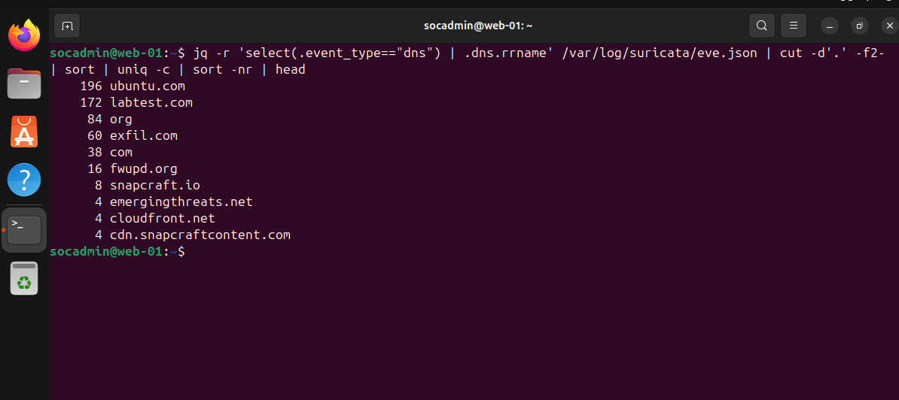
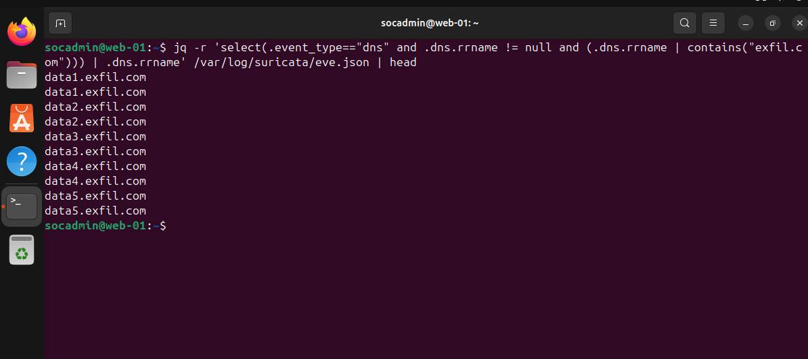
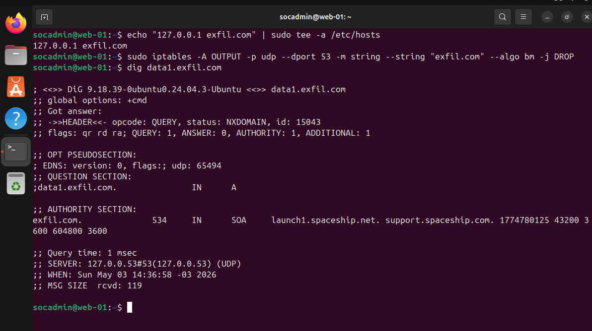
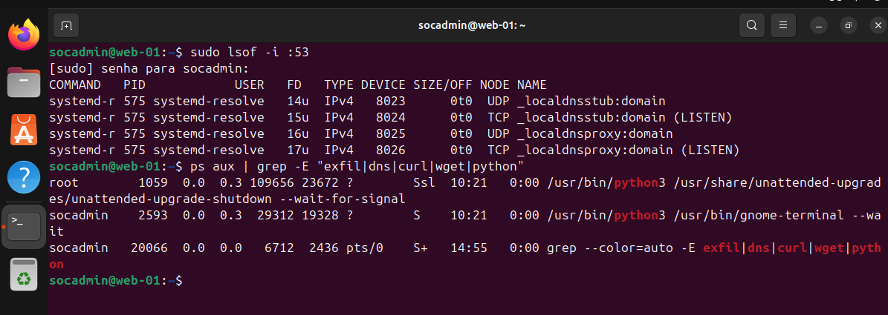
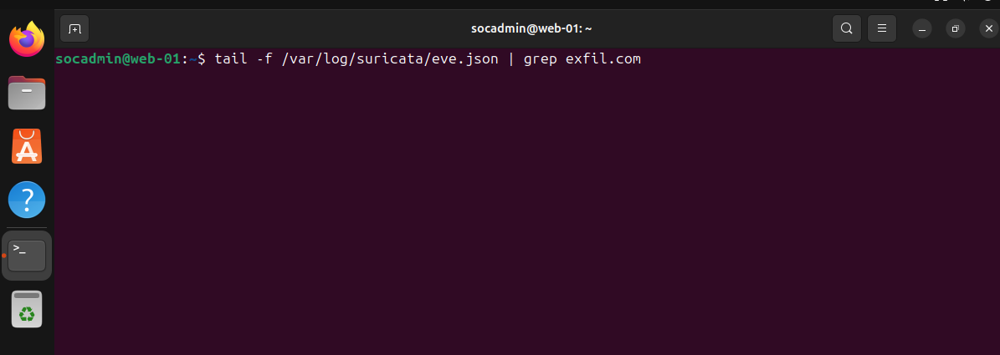

# Incident Report — DNS Data Exfiltration via DNS Tunneling

---

## 1. Summary

Detection of suspicious DNS activity indicating potential data exfiltration from host **web-01** using DNS queries.

- Attack vector: DNS queries to external domain (`exfil.com`)
- Technique: DNS Tunneling / Exfiltration
- Impact: Potential data exposure via covert DNS channel

---

## 2. Timeline

| Time (UTC-3) | Event | Source |
|-------------|------|--------|
| 14:29 | High frequency DNS queries detected | Suricata (eve.json) |
| 14:30 | Suspicious domain identified (`exfil.com`) | Analysis |
| 14:31 | Sequential subdomains observed (`data1`, `data2`, ...) | Suricata |
| 14:36 | Containment initiated (iptables rule applied) | auth.log / Wazuh |
| 14:37 | DNS resolution blocked (NXDOMAIN) | dig validation |
| 14:38 | No further DNS activity detected | Suricata (real-time) |

---

## 3. Detection

**SIEM:** Wazuh (supporting)  
**Primary Detection:** Suricata (eve.json)

- Rule: N/A (Threat Hunting)
- Rule ID: N/A
- Level: N/A

### Evidence

- High frequency DNS queries
- Repeated access to `exfil.com`
- Abnormal query patterns

---

### Detection Gap

- No automated detection rule was in place to identify abnormal DNS behavior such as high-frequency queries or suspicious subdomain patterns.

**Root Cause:**  
Lack of DNS behavioral monitoring and absence of SIEM correlation rules for anomaly-based detection.

**Root Cause:**  
Lack of correlation rules and DNS anomaly detection in Wazuh.

---

### Recommendations

- Implement DNS anomaly detection rules in SIEM
- Monitor subdomain length and frequency
- Restrict outbound DNS traffic
- Integrate Suricata alerts with Wazuh rules

---

## 4. Investigation

### Log Sources

- Suricata (`/var/log/suricata/eve.json`)
- Wazuh (`/var/log/auth.log`)

---

### Analyst Hypothesis

Host **web-01** was performing DNS queries with structured subdomains to exfiltrate data in small chunks via DNS protocol.

---

### Evidence

- `data1.exfil.com`
- `data2.exfil.com`
- Sequential and repetitive pattern
- Total: 60 DNS queries

---

### Execution Context

- User: `socadmin`
- Privilege level: user

---

### Key Findings

- Confirmed DNS-based exfiltration behavior
- No persistence mechanism detected
- No malicious process running

---

## 5. Impact Assessment

### Severity
Severity: 6/10 (Medium)

### Scope
- Affected systems: web-01
- Lateral movement: Not observed

### Compromise

- Initial Access: Not identified (simulated)
- Execution: DNS queries
- Privilege Level: user
- Persistence: Not observed
- Data Exposure: Possible (not confirmed)

### Summary

Data exfiltration was successfully simulated through DNS queries using subdomain encoding. The activity was limited to a single host and no persistence or lateral movement was identified.

DNS tunneling provides a covert channel that can be used for continuous data exfiltration or command-and-control communication if not detected.

---

## 6. MITRE ATT&CK Mapping

- T1048.003 — Exfiltration Over Unencrypted Non-C2 Protocol (DNS)
- T1071.004 — Application Layer Protocol: DNS

---

## 7. CIS Controls

- CIS Control 13 — Network Monitoring and Defense
- CIS Control 8 — Audit Log Management

---

## 8. Classification

- Incident Type: Data Exfiltration (DNS)
- Severity: Medium

---

## 9. NIST Incident Response

- Detection: Suricata anomaly detection
- Analysis: Log correlation and pattern analysis
- Containment: DNS blocking via iptables
- Eradication: No malicious artifacts found
- Recovery: Normal DNS behavior restored

---

## 10. ISO 27001

- A.12.4 — Logging and Monitoring
- A.13.1 — Network Security Controls

---

## 11. Response Actions

### Containment

- Blocked DNS queries to `exfil.com` using iptables
- Outbound DNS traffic restricted to prevent communication with unauthorized domains

---

### Eradication

- No malicious processes found
- No persistence mechanisms identified

---

### Validation

- DNS queries to `exfil.com` no longer observed
- NXDOMAIN response confirmed

---

### Outcome

- Exfiltration activity successfully contained
- System stable and clean

---

## 12. Lessons Learned

- DNS can be abused as covert channel
- SIEM rules are essential for detection
- Egress filtering is critical
- Behavioral detection is effective

---

## 13. Indicators of Compromise (IoCs)

| Category | Indicator | Description | MITRE |
|----------|----------|------------|-------|
| Network | exfil.com | Malicious domain | T1048.003 |
| Network | data*.exfil.com | Data chunking via subdomains | T1048.003 |
| Behavior | High DNS frequency | Repetitive queries | T1048.003 |
| Detection | Suricata logs | Primary detection source | - |

---

## 14. Conclusion

Detection → Investigation → Response

DNS-based exfiltration activity was identified through behavioral analysis, investigated using Suricata logs, and successfully contained via egress filtering. No persistence or further compromise was observed.
