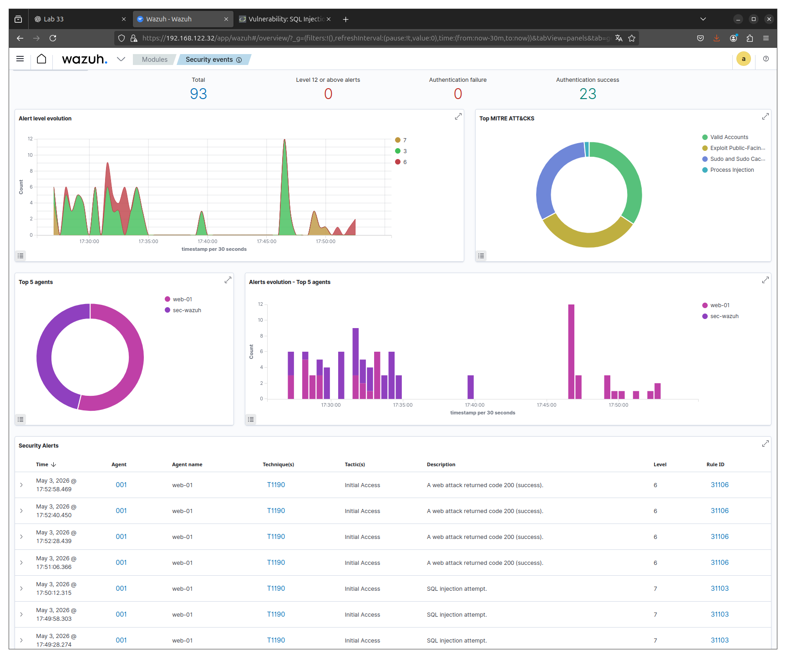
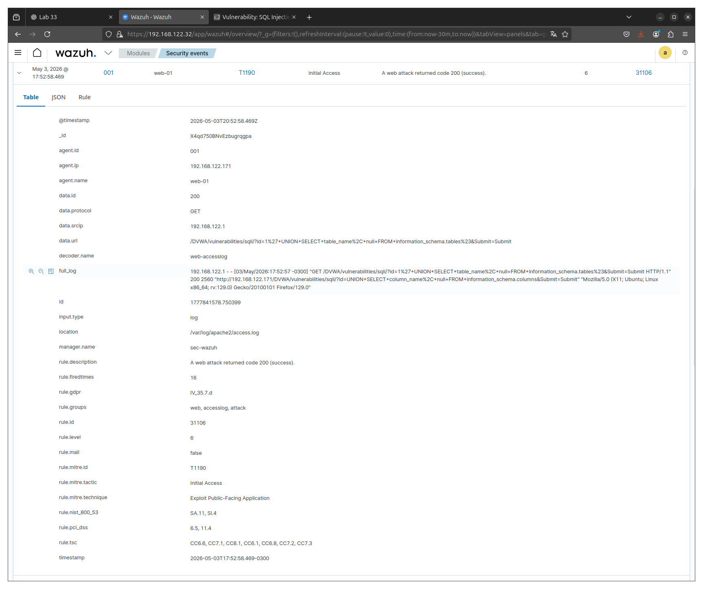
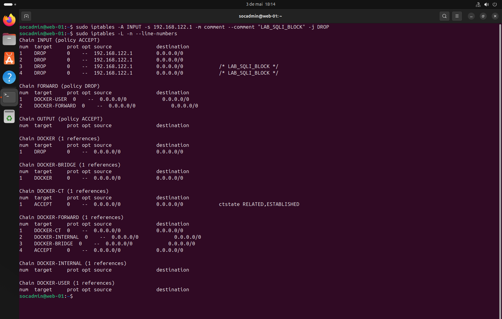

# 🚨 Detection and Response to SQL Injection (Wazuh + Apache + DVWA)

---

## 📌 Overview

Simulation of a **SQL Injection attack**, resulting in **data exposure and database enumeration**.

- Access: ✔  
- Execution: ✔  
- Persistence: ❌  
- Evasion: ✔  
- Severity: 🔴 9/10 (High)  

---

## 📄 Detailed Incident Report

➡️ Full report: [report.md](./report.md)

---

## 🖥️ Environment

- Attacker: 192.168.122.1  
- Target: 192.168.122.171  
- SIEM: Wazuh  
- Service: Apache (DVWA)  

---

## 🎯 Attack Scenario

An attacker exploited a vulnerable parameter in the DVWA application using SQL Injection techniques.  
The attack evolved from authentication bypass (`OR 1=1`) to **data extraction** and **database enumeration** using `UNION SELECT`.

---

## 🔍 Detection

Brief explanation of how detection occurred.

- Rule ID: 31103 / 31106  
- Detection logic: SQL keywords (`UNION`, `OR 1=1`) in HTTP requests  

---

## 🧠 Investigation

### Evidence:

- Source IP: `192.168.122.1`  
- Endpoint / Service: `/DVWA/vulnerabilities/sqli`  
- Parameter / Vector: `id=`  
- Behavior observed: SQL Injection attempts with payload escalation  

---

## 🔎 Indicators of Compromise (IoCs)

| Category | Indicator | Description | MITRE |
|----------|----------|------------|-------|
| Network | 192.168.122.1 | Attacker IP | T1190 |
| Application | /DVWA/vulnerabilities/sqli | Attack vector | T1190 |
| Application | id= | Injection parameter | T1190 |
| Application | UNION SELECT | Data extraction pattern | T1190 |
| Application | information_schema | DB enumeration | T1190 |
| Detection | Rule 31103 | SQLi detection | T1190 |

---

## 🔎 Command / Activity Evidence

- `UNION SELECT user,password FROM users`  
- `UNION SELECT table_name FROM information_schema.tables`  
- `UNION SELECT column_name FROM information_schema.columns`  

---

## ⚠️ Impact Assessment

- **Access Level:** Application-level access  
- **Privilege Level:** Database read access  
- **Scope:** Web application (DVWA)  
- **Exposure:** User credentials and database structure  

### Severity: 🔴 9/10 (High)

**Justification:**
- Successful SQL Injection execution  
- Sensitive data exposure (credentials)  
- Full database enumeration  
- Adaptive attacker behavior observed  

→ **Confirmed database compromise at logical level**

---

## 🛡️ Response

### Containment

- Malicious IP blocked via iptables  

---

### Eradication

- Attack source removed (network-level block)  
- No persistence observed  

---

### Recovery

- Connection attempts blocked successfully  

---

### 🔐 Hardening

- Temporary network blocking (iptables)  
- Input validation awareness (lab context)  
- Monitoring via Wazuh maintained  

---

### ✅ Defense Validation

- Attack blocked ✔  
- No recurrence ✔  
- Environment stable ✔  

---

## 🧬 MITRE ATT&CK

| Technique ID | Technique Name | Description |
|-------------|--------------|------------|
| T1190 | Exploit Public-Facing Application | SQL Injection attack on DVWA |
| T1055 | Process Injection (mapped by rule) | Detection context (Wazuh mapping) |

---

## 🎯 Conclusion

Detection → Investigation → Classification → Response  

A SQL Injection attack was successfully detected and investigated using Wazuh.  
The attacker achieved data extraction and database enumeration, confirming impact.  
Containment was applied via firewall rules, and effectiveness was validated.

---

## 🧠 Skills Developed

- Log analysis (Apache access.log)  
- SIEM detection (Wazuh rules)  
- Threat investigation (timeline + payload analysis)  
- Incident response (containment + validation)  
- MITRE ATT&CK mapping  
- Web attack analysis (SQL Injection)  

---

## 📞 Contact

LinkedIn: https://www.linkedin.com/in/tiagokrysiaki/  
GitHub: https://github.com/TKrysiaki  
