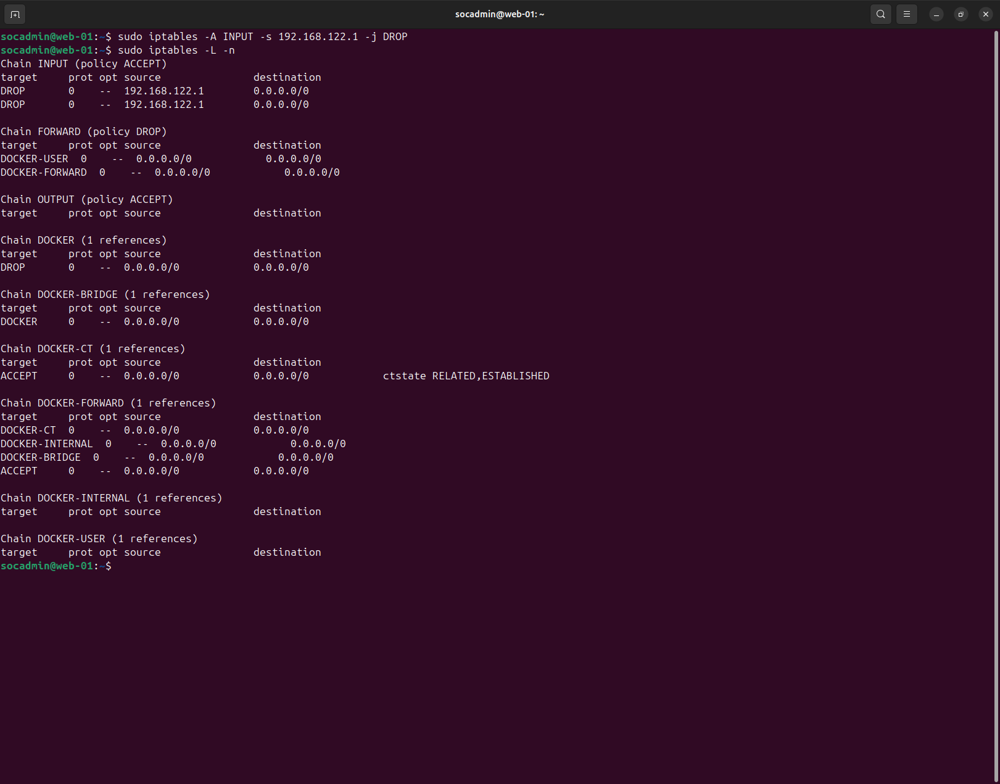

# Incident Report — SQL Injection Data Exfiltration

---

## 1. Summary

SQL Injection attack targeting DVWA application, resulting in database enumeration and credential exposure.

- Attack vector: HTTP parameter (`id`)
- Technique: SQL Injection (UNION-based)
- Impact: Data exposure (users table + DB structure)

---

## 2. Timeline

| Time (UTC-3) | Event | Source |
|-------------|------|--------|
| 17:28:19 | Initial SQL Injection attempt (`OR 1=1`) | Wazuh / access.log |
| 17:33:00 | Payload escalation with UNION SELECT | access.log |
| 17:52:58 | Database enumeration (information_schema) | access.log |
| 18:13:00 | Containment applied (iptables block) | System |

---

## 3. Detection

**SIEM:** Wazuh

- Rule: SQL Injection detection  
- Rule ID: 31103 / 31106  
- Level: 6–7  

### Evidence

- Repeated SQL Injection alerts
- HTTP 200 responses confirming successful execution

---

### Detection Gap

- No blocking mechanism initially
- Detection only after multiple attempts

**Root Cause:**  
Lack of input validation and absence of preventive controls (WAF / filtering)

---

### Recommendations

- Implement input validation (server-side)
- Deploy WAF or ModSecurity
- Create correlation rules for burst detection
- Block repeated malicious IPs automatically

---

## 4. Investigation

### Log Sources

- /var/log/apache2/access.log
- /var/ossec/logs/alerts/alerts.json

---

### Analyst Hypothesis

Attacker exploited vulnerable parameter via SQL Injection to extract data and enumerate database structure.

---

### Evidence

- Payloads containing:
  - `OR 1=1`
  - `UNION SELECT`
  - `information_schema`

---

### Execution Context

- User: www-data (web context)  
- Privilege level: Application-level (DB read)

---

### Key Findings

- ✔ Successful SQL Injection execution  
- ✔ Database enumeration confirmed  
- ✔ Credential extraction attempts observed  
- ❌ No command execution (RCE not observed)  
- ❌ No persistence mechanisms  

---

## 5. Impact Assessment

### Severity
Severity: 9/10 (High)

### Scope
- Affected systems: DVWA web application  
- Lateral movement: Not observed  

### Compromise

- Initial Access: ✔  
- Execution: ✔  
- Privilege Level: Low (application context)  
- Persistence: ❌  
- Data Exposure: ✔ (users + schema)

---

### Summary

Attack resulted in **logical compromise of the database**, exposing sensitive information and internal structure.

---

## 6. MITRE ATT&CK Mapping

- [T1190](https://attack.mitre.org/techniques/T1190/) — Exploit Public-Facing Application  
- [T1055](https://attack.mitre.org/techniques/T1055/) — Process Injection (rule context)

---

## 7. CIS Controls

- CIS Control 3 — Data Protection  
- CIS Control 8 — Audit Log Management  
- CIS Control 16 — Application Software Security  

---

## 8. Classification

- Incident Type: Web Application Attack (SQL Injection)  
- Severity: High  

---

## 9. NIST Incident Response

- Detection: Wazuh alerts triggered  
- Analysis: Log correlation + payload inspection  
- Containment: IP blocked via iptables  
- Eradication: Not required (no persistence)  
- Recovery: Service validated and stable  

---

## 10. ISO 27001

- A.12.4 — Logging and Monitoring  
- A.14.2 — Secure Development Practices  

---

## 11. Response Actions

### Containment

- Blocked attacker IP using iptables

---

### Eradication

- No artifacts to remove (attack was application-level)

---

### Validation

- Connection attempts blocked (timeout observed)

---

### Outcome

- Attack successfully stopped  
- No further malicious activity observed  

---

## 12. Lessons Learned

- Detection without response is insufficient  
- Input validation is critical  
- SIEM correlation improves visibility  
- Network-level blocking is effective for containment  

---

## 13. Indicators of Compromise (IoCs)

| Category | Indicator | Description | MITRE |
|----------|----------|------------|-------|
| Network | 192.168.122.1 | Attacker IP | [T1190](https://attack.mitre.org/techniques/T1190/) |
| Application | /DVWA/vulnerabilities/sqli | Attack vector | [T1190](https://attack.mitre.org/techniques/T1190/) |
| Application | id= | Injection parameter | [T1190](https://attack.mitre.org/techniques/T1190/) |
| Application | OR 1=1 | Authentication bypass | [T1190](https://attack.mitre.org/techniques/T1190/) |
| Application | UNION SELECT | Data extraction | [T1190](https://attack.mitre.org/techniques/T1190/) |
| Application | information_schema | DB enumeration | [T1190](https://attack.mitre.org/techniques/T1190/) |
| Behavior | Burst requests | Repeated attack attempts | [T1190](https://attack.mitre.org/techniques/T1190/) |
| Host | access.log | Evidence source | N/A |
| Detection | Rule 31103 | SQLi detection | [T1190](https://attack.mitre.org/techniques/T1190/) |
| Response | iptables DROP | Containment | N/A |

---

## 14. Conclusion

Detection → Investigation → Response  

SQL Injection attack was successfully detected and investigated using Wazuh and Apache logs.  
The attacker achieved data extraction and enumeration, confirming impact.  
Containment was applied via firewall rules, and effectiveness validated through connection blocking.
