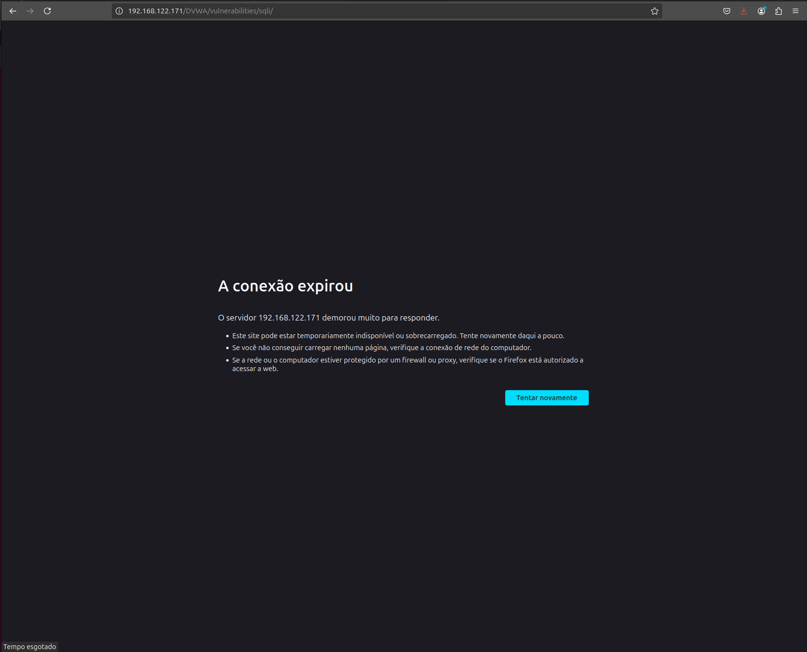

# Incident Report — SQL Injection Data Exfiltration

---

## 1. Summary

SQL Injection attack targeting DVWA application, resulting in database enumeration and credential exposure.

### Business Impact

- Early detection and containment limited further data exposure  
- Reduced risk of broader data breach and regulatory impact (e.g., LGPD)  
- Prevented escalation to full database extraction  
- Maintained service availability and operational stability  

- Attack vector: HTTP parameter (`id`)
- Technique: SQL Injection (UNION-based)
- Impact: Data exposure (users table + database structure)

---

## 2. Timeline

| Time (UTC-3) | Event | Source |
|-------------|------|--------|
| 17:28:19 | Initial SQL Injection attempt (`OR 1=1`) | Wazuh / access.log |
| 17:33:00 | Payload escalation (UNION SELECT) | access.log |
| 17:52:58 | Database enumeration (information_schema) | access.log |
| 18:13:00 | Containment applied (iptables block) | System |

---

## 3. Detection

**SIEM:** Wazuh

- Rule: SQL Injection detection  
- Rule ID: 31103 / 31106  
- Level: 6–7  

### Evidence

- Repeated SQL Injection alerts  
- HTTP 200 responses indicating successful execution  

---

### Detection Gap

- No preventive control to block malicious requests  
- Detection occurred only after multiple attempts  

**Root Cause:**  
Lack of input validation and absence of preventive controls

---

### Recommendations

- Implement server-side input validation  
- Improve detection with correlation rules (burst SQLi)  
- Apply preventive controls (WAF / filtering)  
- Implement automated response (IP blocking)

---

## 4. Investigation

### Log Sources

- /var/log/apache2/access.log  
- /var/ossec/logs/alerts/alerts.json  

---

### Analyst Hypothesis

Attacker exploited a vulnerable parameter using SQL Injection to extract data and enumerate the database structure.

---

### Evidence

- Payloads identified:
  - `OR 1=1`
  - `UNION SELECT`
  - `information_schema`

---

### Execution Context

- User: www-data  
- Privilege level: Low (web application context)  
- Privilege Escalation: Not observed  

---

### Key Findings

- ✔ Successful SQL Injection execution  
- ✔ Credential exposure confirmed (users table)  
- ✔ Database enumeration confirmed  
- ❌ No command execution (RCE not observed)  
- ❌ No persistence mechanisms  
- ❌ No privilege escalation attempts observed  

---

## 5. Impact Assessment

### Severity
Severity: 9/10 (High)

### Scope
- Affected systems: DVWA web application  
- Lateral movement: Not observed  

### Compromise

- Initial Access: ✔  
- Execution: ✔  
- Privilege Level: Low (application context)  
- Persistence: ❌  
- Data Exposure: ✔  

---

### Summary

The attack resulted in **logical compromise of the database**, exposing sensitive information and internal structure, without impacting system-level access.

---

## 6. MITRE ATT&CK Mapping

- [T1190](https://attack.mitre.org/techniques/T1190/) — Exploit Public-Facing Application  

---

## 7. CIS Controls

- CIS Control 3 — Data Protection  
- CIS Control 8 — Audit Log Management  
- CIS Control 16 — Application Software Security  

---

## 8. Classification

- Incident Type: Web Application Attack (SQL Injection)  
- Severity: High  

---

## 9. NIST Incident Response

- Detection: Wazuh alerts triggered  
- Analysis: Log correlation and payload analysis  
- Containment: IP blocked via iptables  
- Eradication: Not performed (no persistent artifacts)  
- Recovery: Service remained operational and stable  

---

## 10. ISO 27001

- A.12.4 — Logging and Monitoring  
- A.14.2 — Secure Development  

---

## 11. Response Actions

### Containment

- Malicious IP blocked using iptables  

---

### Eradication

- Not required (no persistence or system compromise observed)

---

### Validation

- Connection attempts blocked successfully  

---

### Outcome

- Attack successfully contained  
- No further malicious activity observed  

---

## 12. Lessons Learned

- Detection without prevention allows repeated exploitation  
- Input validation is critical for web security  
- Log analysis is essential to confirm attack progression  
- Network-level blocking is effective for containment  

---

## 13. Indicators of Compromise (IoCs)

| Category | Indicator | Description | MITRE |
|----------|----------|------------|-------|
| Network | 192.168.122.1 | Attacker IP | [T1190](https://attack.mitre.org/techniques/T1190/) |
| Application | /DVWA/vulnerabilities/sqli | Attack vector | [T1190](https://attack.mitre.org/techniques/T1190/) |
| Application | id= | Injection parameter | [T1190](https://attack.mitre.org/techniques/T1190/) |
| Application | OR 1=1 | Authentication bypass pattern | [T1190](https://attack.mitre.org/techniques/T1190/) |
| Application | UNION SELECT | Data extraction technique | [T1190](https://attack.mitre.org/techniques/T1190/) |
| Application | information_schema | Database enumeration | [T1190](https://attack.mitre.org/techniques/T1190/) |
| Behavior | Burst requests | Repeated attack attempts | [T1190](https://attack.mitre.org/techniques/T1190/) |
| Host | /var/log/apache2/access.log | Evidence source | N/A |
| Detection | Rule 31103 | SQLi detection | [T1190](https://attack.mitre.org/techniques/T1190/) |
| Response | iptables DROP | Containment action | N/A |

---

## 14. Conclusion

Detection → Investigation → Response  

SQL Injection attack was successfully detected and investigated using Wazuh and Apache logs.  
The attacker achieved data exposure and database enumeration, confirming impact.  
Containment was applied via firewall rules and validated through connection blocking, stopping further activity.
