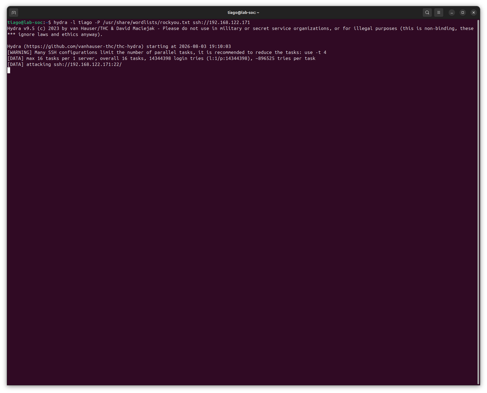
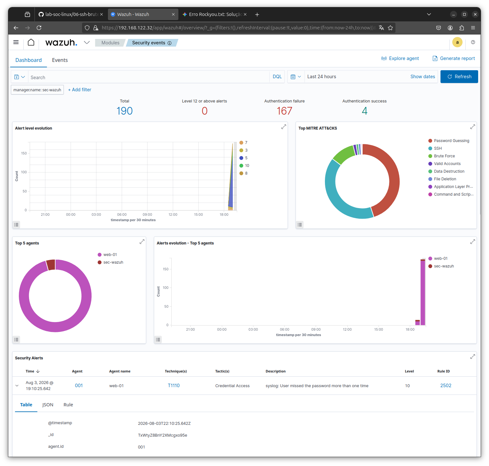
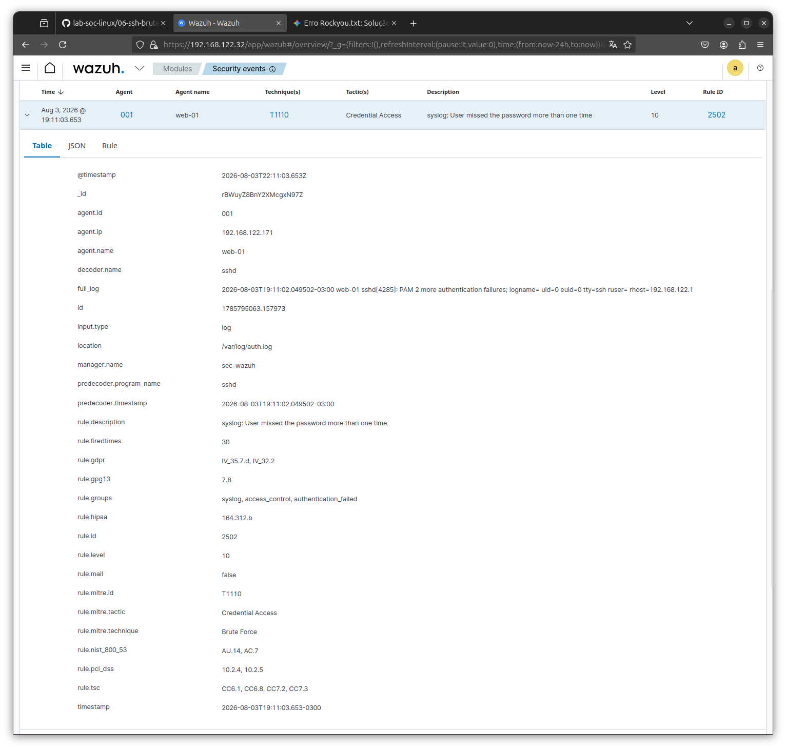
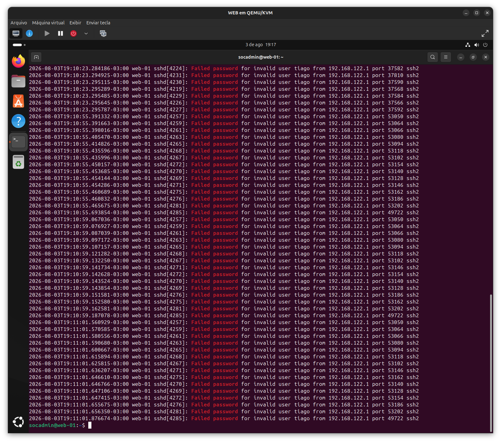
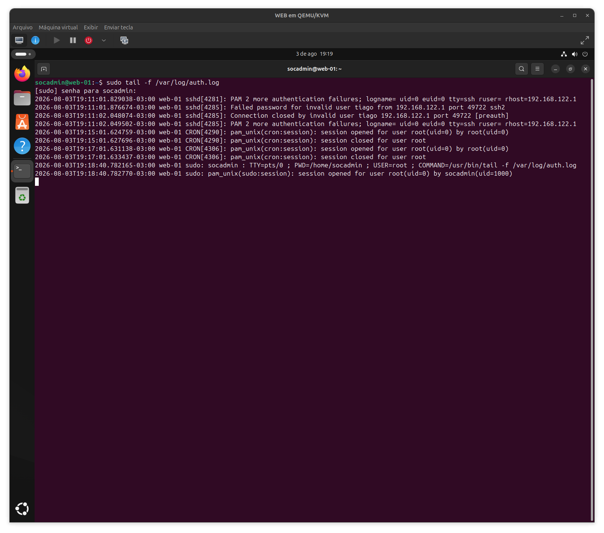
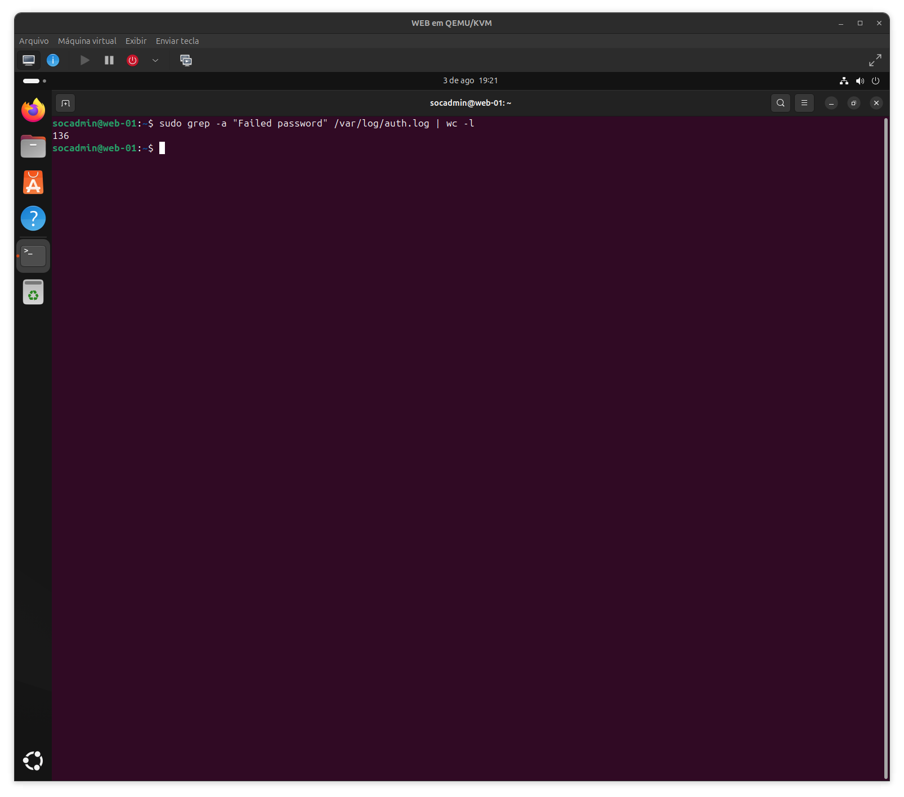
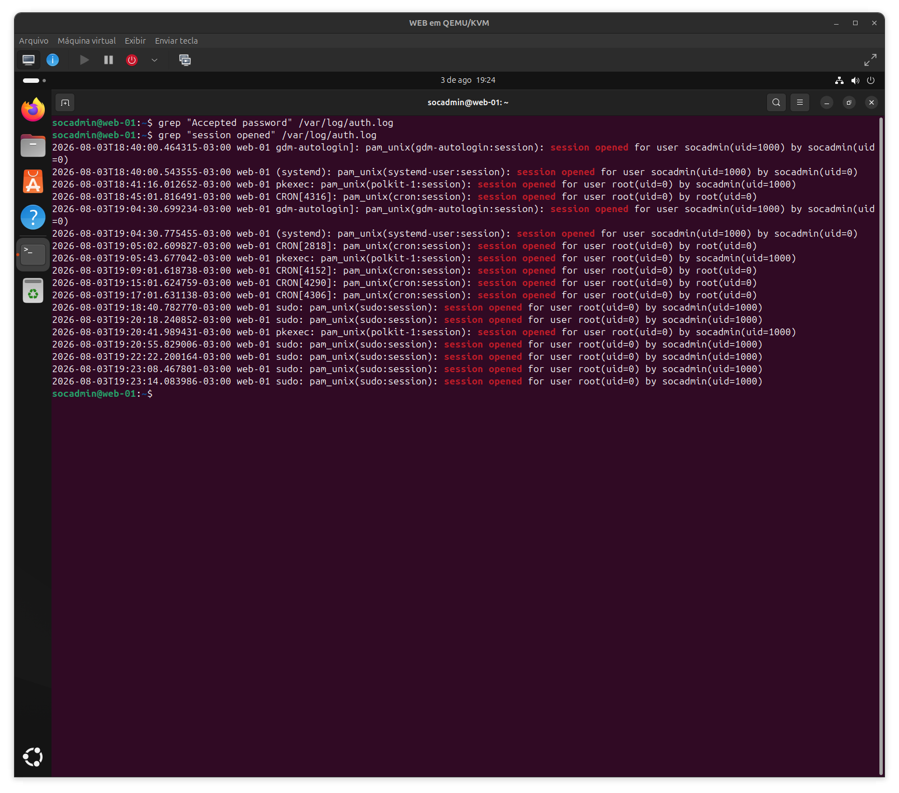
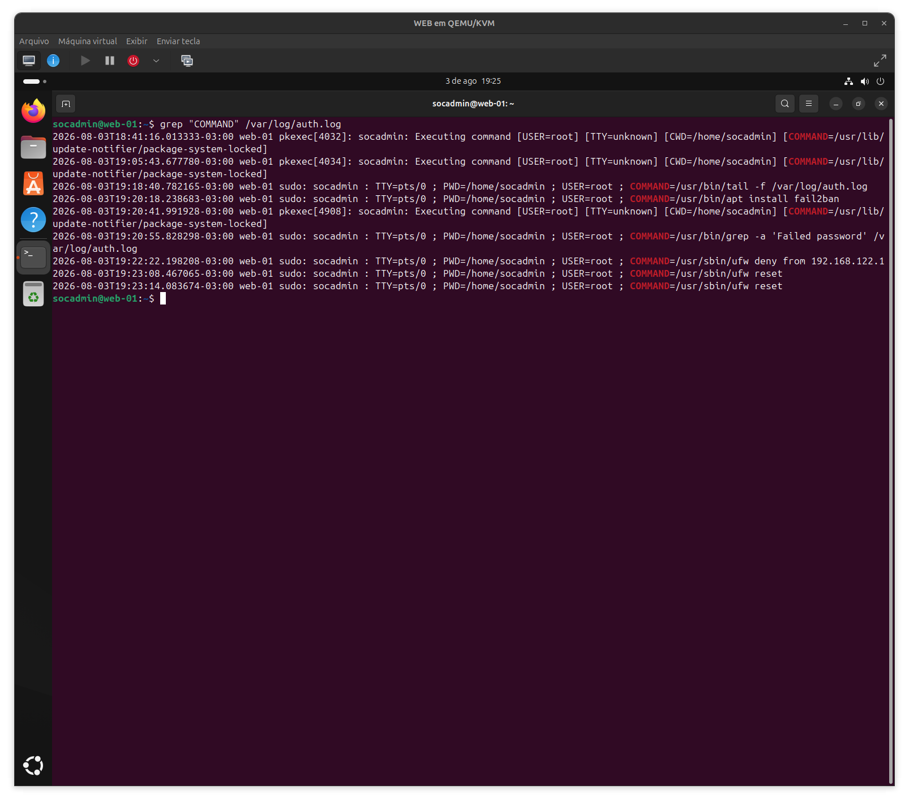
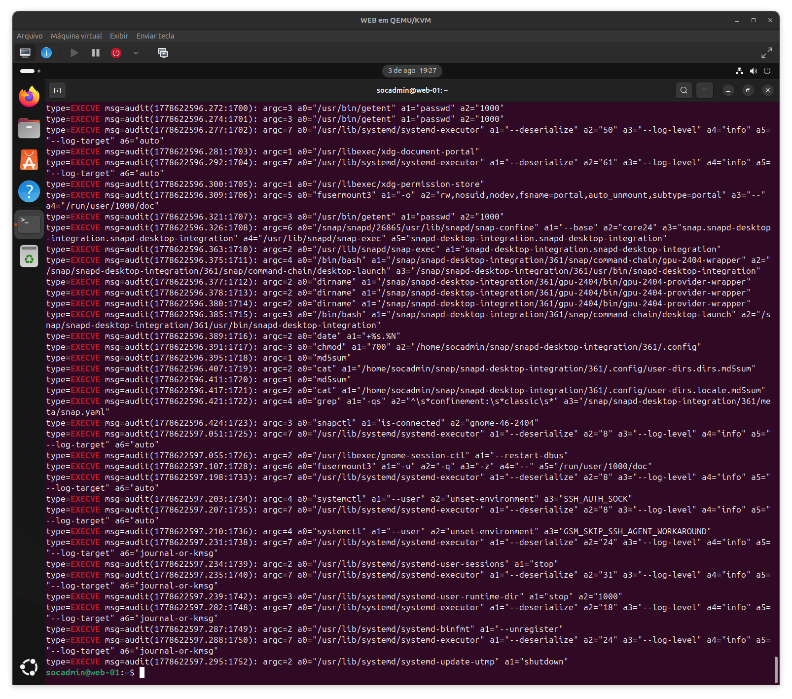
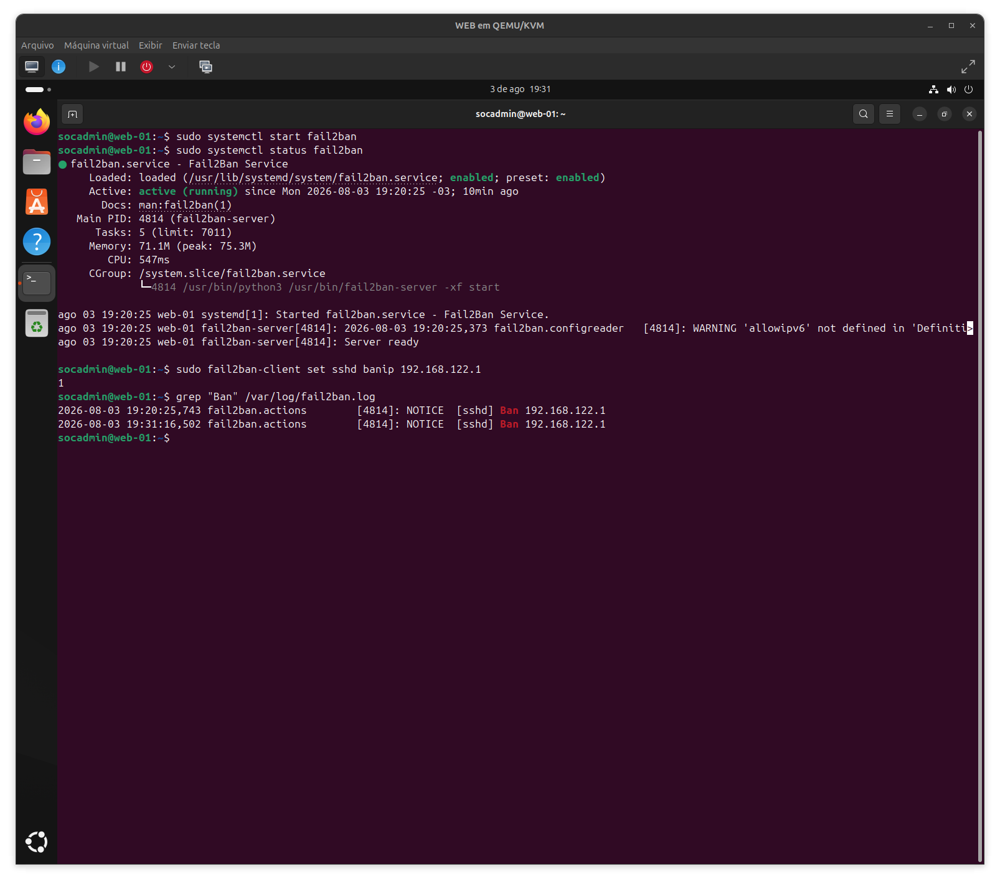

# 🚨 Detection and Response to SSH Brute Force Attack (Wazuh + Fail2ban + Auth.log)

---

## 📌 Overview 

Simulation of an SSH brute force attack against a Linux target, telemetry validation via Wazuh, log analysis, and active remediation using Fail2ban.

- Access: ✔ 
- Attack Type: Brute Force (Hydra)  
- Severity: 🔴 7/10 (High)

---

## 🖥️ Environment

- Attacker: `192.168.122.1` (tiago@lab-soc)
- Target: `WEB-01` (`192.168.122.171`)
- SIEM: `Wazuh`
- Mitigation: `Fail2ban` / `UFW`
- Operating System: `Ubuntu Linux`

---

## 🎯 Attack Scenario

A simulated brute-force attack was launched against the SSH service of target `WEB-01` using Hydra with the wordlist `rockyou.txt` targeting the user `tiago`.

---

## 🚀 Attack Execution

Hydra initiated an SSH brute-force password attack against `192.168.122.171` using the user `tiago` and `rockyou.txt`.

---

## 📊 SIEM Telemetry & Wazuh Dashboard

Wazuh dashboard captured authentication failures and categorized the activity under Credential Access (MITRE ATT&CK T1110).

---

## 🔍 Alert Details

Detailed view of the Wazuh alert showing Rule ID `2502` triggered by multiple failed password attempts from the attacker IP.

---

## 📜 Log Analysis (`/var/log/auth.log`)

### Failed Attempts

Filtering authentication logs exposed continuous failed password attempts from IP `192.168.122.1` targeting the invalid user `tiago`.

---

### Real-time Monitoring

Monitoring `/var/log/auth.log` in real time using `tail -f` to observe incoming brute-force attempts.

---

### Total Attempts Count

Quantifying failed attempts using `grep` combined with `wc -l`, confirming 136 recorded failures.

---

### Session and Command Audit

Reviewing established sessions and system access logs.

---

Auditing administrative command executions via `sudo` and `pkexec`.

---

### Process Execution (Auditd / Execve)

Reviewing kernel-level process execution logs (`EXECVE`) for system activity validation.

---

## 🛡️ Remediation and Mitigation

### Fail2ban Configuration & Ban Verification

- `fail2ban` service started and verified as active.
- Manual ban triggered for attacker IP `192.168.122.1` via `fail2ban-client`.
- Log verification confirmed successful IP block actions.

---

# 🧬 MITRE ATT&CK

| Technique ID | Technique Name | Description |
|-------------|--------------|------------|
| [T1110](https://attack.mitre.org/techniques/T1110/) | Brute Force | SSH Password Guessing via Hydra |

---

# 🎯 Conclusion

Detection → Investigation → Mitigation

This lab simulated a standard SSH brute-force attack, validated SIEM event ingestion via Wazuh, audited logs on `auth.log`, and successfully mitigated the threat using Fail2ban.
