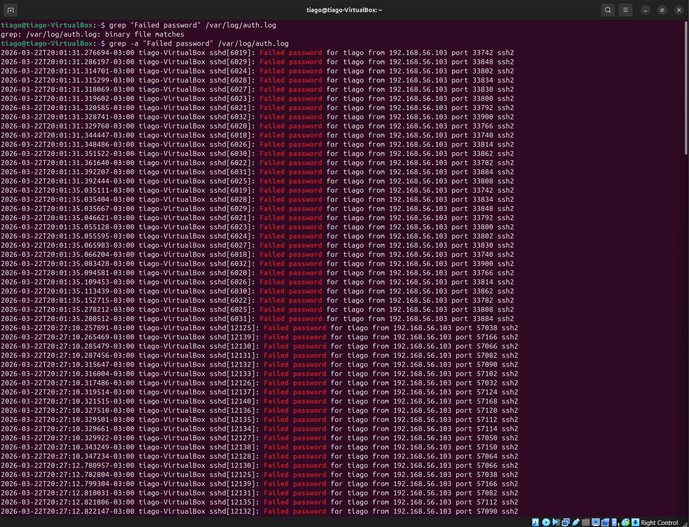

# 🛡️ SOC Analyst Lab Portfolio

🚨 Portfólio prático focado em **detecção de ameaças, resposta a incidentes e análise forense em ambientes Linux**.

---

# ⭐ Projeto em Destaque

## 🔥 SSH Brute Force Incident Response

👉 [Acessar Lab 16](./16-ssh-brute-force-incident-response-wazuh)

### 🧠 Cenário

- 133 tentativas de login falhadas em poucos segundos  
- Ataque automatizado via SSH  
- Possível comprometimento de integridade do sistema  

---

### 🔍 O que foi feito

- Análise de logs (`auth.log`)  
- Correlação de eventos no SIEM (Wazuh)  
- Detecção de arquivo comprometido  
- Implementação de defesa com Fail2ban  
- Análise forense com auditd  

---

### 🚨 Decisão do SOC

- Classificação: **True Positive**  
- Severidade: **Alta**  
- Ação: bloqueio do atacante + monitoramento do host  

---

# 🎯 Objetivo

Demonstrar habilidades práticas em:

- Threat Detection  
- Log Analysis  
- Incident Response  
- SIEM Analysis  
- Hardening  
- Forense  

---

# 🧪 Labs Desenvolvidos

## 🔰 Fundamentos
- [01 - Log Analysis Base](./01-log-analysis-base)  
- [02 - SSH Bruteforce Investigation](./02-ssh-bruteforce-investigation)  
- [03 - Log Analysis Investigation](./03-log-analysis-investigation)  
- [04 - SSH Bruteforce Detection](./04-ssh-bruteforce-detection)  
- [05 - SSH Hardening](./05-ssh-hardening)  

---

## 🔍 Investigação
- [06 - SSH Bruteforce Incident Investigation](./06-ssh-bruteforce-incident-investigation)  
- [07 - Suspicious Privilege Escalation Investigation](./07-suspicious-privilege-escalation-investigation)  
- [08 - Wazuh SIEM Detection](./08-wazuh-siem-bruteforce-detection)  
- [09 - Suspicious SSH Login Investigation](./09-suspicious-ssh-login-investigation)  
- [10 - Unauthorized File Access Investigation](./10-unauthorized-file-access-investigation)  

---

## 🔥 Avançado
- [11 - Suspicious File Modification](./11-Suspicious-File-Modification-Investigation)  
- [12 - Attack Chain Analysis](./12-ssh-compromise-attack-chain-analysis)  
- [13 - Detection & Response (Wazuh + Fail2ban)](./13-ssh-bruteforce-detection-response-wazuh-fail2ban)  
- [14 - File Monitoring (auditd)](./14-file-access-monitoring-investigation-auditd)  

---

## 🚨 SOC Real
- [15 - Detection & Hardening](./15-ssh-bruteforce-detection-hardening)  
- [16 - Incident Response (Wazuh + Fail2ban + auditd)](./16-ssh-brute-force-incident-response-wazuh)  

---

# 🧠 Skills

- Investigação de incidentes  
- Correlação de eventos  
- Análise de logs  
- SIEM (Wazuh)  
- Hardening  
- Forense  

---

# 🛠️ Stack

- Linux (Ubuntu / Kali)  
- Wazuh  
- Fail2ban  
- auditd  
- Hydra  

---

# 📈 Evolução

- Básico → Logs  
- Intermediário → Detecção  
- Avançado → Resposta  
- SOC → Investigação completa  

---

# 🚀 Próximos Labs

- Multi-log (SSH + Web + Firewall)  
- Ruído real  
- Threat Intelligence  
- Cenário corporativo  

---

# 📌 Sobre mim

Focado em **SOC / Blue Team**

🎯 Buscando oportunidade como:
SOC Analyst / NOC  

---

# 🔗 Contato

LinkedIn: [https://www.linkedin.com/  ](https://www.linkedin.com/in/tiago-krysiaki-b3322b2a7/)
Email: t.krysiaki91@gmail.com
